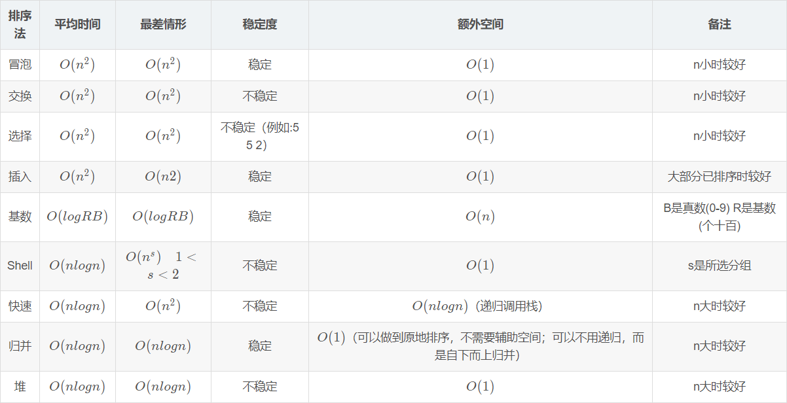

# Algorithm

## Master Theorem

$$
f(n)=d,若n=1\\
=af(n/c)+bn^x,若n\ge2
$$

的解是
$$
f(n)=bn^xlog_cn+dn^x,若a=c^x\\
f(n)=(d+\frac{bc^x}{a-c^x})n^{log_ca}-(\frac{bc^x}{a-c^x})n^x,若a
\ne c^x
$$


## Linked list

```python
class ListNode:
    def __init__(self, x):
        self.val = x
        self.next = None
```

## Sort



### bubbleSort

```c++
void bubbleSort(vector<int>& nums) {
	for (int p = nums.size() - 1; p >= 0; p--) {
	bool hasChanged = false;
	for (int i = 0; i < p; ++i) {
		if (nums[i] > nums[i + 1]) {
			swap(nums[i], nums[i + 1]);
	        hasChanged = true;
        }
    }
    if (hasChanged == false) // 早停
 		break;
    }
}
```

### insertSort

```c++
void insertSort(vector<int>& nums) {
	for (int p = 1; p < nums.size(); ++p) {
	    int temp = nums[p];
    	int i;
    	for (i = p; i > 0 && nums[i - 1] > temp; --i) {
 			nums[i] = nums[i - 1]; 
    	}
    	nums[i] = temp; // 将牌放到正确的位置（注意这里是i不是i-1）
	}
}
```

### selectSort

```c++
void selectSort(vector<int>& nums) {
	for (int p = 0; p < nums.size(); ++p) {
	    int minIndex = p;
    	for (int i = p; i < nums.size(); ++i) {
			if (nums[i] < nums[minIndex])  {
        		minIndex = i;
        	}
    	}
    	swap(nums[p], nums[minIndex]);
	}
}
```

### shellSort

```c++
void shellSort(vector<int>& nums) {
	for (int D = nums.size() / 2; D > 0; D /= 2) {
 		for (int p = D; p < nums.size(); p++) {
	    	int temp = nums[p];
	    	int i;
			for (i = p; i >=D && nums[i - D] > temp; i -= D) {
		    	nums[i] = nums[i - D];
			}
        	nums[i] = temp;
        }
	}
}
```

### mergeSort

```c++
void mergeArray(vector<int>& nums, vector<int>& tempNums, int lstart,
				int rstart, int rend) { // 合并两个相邻的有序子序列
	int lend = rstart - 1;
    int numSubArray = rend - lstart + 1;
    int temp = lstart; // 存放结果数组的初始位置
    while (lstart <= lend && rstart <= rend) {
  		if (nums[lstart] <= nums[rstart]) {
	        tempNums[temp++] = nums[lstart++];
   		} else {
		    tempNums[temp++] = nums[rstart++];
		}
	}
    while (lstart <= lend) // 直接复制左边剩下的
		tempNums[temp++] = nums[lstart++];
 	while (rstart <= rend) // 直接复制右边剩下的
		tempNums[temp++] = nums[rstart++];
	for (int i = rend; i >= rend - numSubArray + 1; --i)
    	nums[i] = tempNums[i];
}

void mSort(vector<int>& nums, vector<int>& tempNums, int lstart, int rend) {
	if (lstart < rend) { // 当子列只有一个数值，说明已经是有序的了
    	int center = (lstart + rend) / 2;
    	mSort(nums, tempNums, lstart, center); // 归并排序做子列
    	mSort(nums, tempNums, center + 1, rend); // 归并排序右子列
    	mergeArray(nums, tempNums, lstart, center+1, rend); // 主要这里是center+1
    }
}

void mergeSort(vector<int>& nums) {
    vector<int> tempNums(nums);
    mSort(nums, tempNums, 0, nums.size() - 1);
}
```

### heapSort

```c++
void downAdjust(vector<int>& nums, int low, int high) {
    int i = low, j = 2 * i + 1; // i是待调整结点,j是它的左节点
	while (j <= high) { // 存在孩子结点
	    if (j + 1 <= high && nums[j + 1] > nums[j]) {
		    j = j + 1;
		}
		if (nums[i] < nums[j]) {
   	    	swap(nums[i], nums[j]);
			i = j; // i变更为待调整结点
			j = 2 * i + 1;
		} else  {
			break;
		}
	}
}

void heapSort(vector<int>& nums) {
	for (int i = nums.size() / 2 - 1; i >= 0; --i) {
		downAdjust(nums, i, nums.size() - 1); // 最后一个结点是nums.size() - 1
	}
	for (int i = nums.size() - 1; i > 0; --i) {
		swap(nums[0], nums[i]); // 交换第一个和最后一个无序的数字
		downAdjust(nums, 0, i - 1); // 要调整的是0到i-1
    }
}
```

### quickSort

```c++
void qSort(vector<int>& nums, int left, int right) {
    if (left < right) {
		int begin = left, end = right; // 存储子序列的首尾位置
		int pos = round(1.0*rand() / RAND_MAX * (right - left)) + left;
		swap(nums[pos], nums[left]);
		int temp = nums[left]; // 选取left处的值作为主元，用一个临时变量存储
		while (left < right) { // 直至左右指针相遇
			while (left<right && nums[right]>temp)
				right--; // 只要右指针的值比主元大，就移动右指针
			nums[left] = nums[right];
			while (left < right && nums[left] <= temp) 
				left++; // 只要左指针的值比主元小，就移动左指针
			nums[right] = nums[left];
		}
		nums[left] = temp; // 将主元放到正确的位置
		qSort(nums, begin, left - 1);
		qSort(nums, left + 1, end);
	}
}

void quickSort(vector<int>& nums) {
	srand((unsigned)time(NULL));
	qSort(nums, 0, nums.size() - 1); // 注意这里的右边界是nums.size()-1
}
```

## Binary tree

```python
class TreeNode:
    def __init__(self, val=0, left=None, right=None):
        self.val = val
        self.left = left
        self.right = right
```

```c++
#include <iostream>
#include <vector>
#include <stack>
using namespace std;

struct TreeNode {
	int val;
	TreeNode* left;
	TreeNode* right;
	TreeNode(int x) :val(x), left(nullptr), right(nullptr) {}
};

void insertNode(TreeNode*& root, int x) {
	if (root == nullptr) {
		root = new TreeNode(x);
		return;
	}
	if (x == root->val) // 刚好相等，说明结点已在树中
		return; // 什么都不做
	else if (x < root->val) // 递归往左插入
		insertNode(root->left, x);
	else // 递归往右插入
		insertNode(root->right, x);
}

TreeNode* createBST(vector<int> nums) {
	TreeNode* root = nullptr;
	for (int i = 0; i < nums.size(); ++i) {
		insertNode(root, nums[i]);
	}
	return root;
}

void preOrderRecursive(TreeNode* root) {
	if (root == nullptr)
		return;
	cout << root->val << " ";
	preOrderRecursive(root->left);
	preOrderRecursive(root->right);
}

void preOrderNoRecursive(TreeNode* root) {
	stack<TreeNode*> s;
	TreeNode* cur = root;
	while (!s.empty() || cur != nullptr) {
		while (cur != nullptr) {
			cout << cur->val << " ";
			s.push(cur);
			cur = cur->left;
		}
		if (!s.empty()) {
			cur = s.top();
			s.pop();
			cur = cur->right;
		}
	}
}

void inOrderRecursive(TreeNode* root) {
	if (root == nullptr)
		return;
	inOrderRecursive(root->left);
	cout << root->val << " ";
	inOrderRecursive(root->right);
}

void inOrderNoRecursive(TreeNode* root) {
	stack<TreeNode*> s;
	TreeNode* cur = root;
	while (cur != nullptr || !s.empty()) {
		while (cur != nullptr) {
			s.push(cur);
			cur = cur->left;
		}
		if (!s.empty()) {
			cur = s.top();
			s.pop();
			cout << cur->val << " ";
			cur = cur->right;
		}
	}
}

void postOrderRecursive(TreeNode* root) {
	if (root == nullptr)
		return;
	postOrderRecursive(root->left);
	postOrderRecursive(root->right);
	cout << root->val << " ";
}

void postOrderNoRecursive(TreeNode* root) {
	stack<TreeNode*> s;
	TreeNode* cur = root; // 当前节点
	TreeNode* pre = nullptr; // 前一次访问的节点
	s.push(cur);
	while (!s.empty()) {
		cur = s.top(); // 此时不要将s.top()出栈，因为还没有决定是否要访问这个节点
		if (cur->left == nullptr && cur->right == nullptr){
			cout << cur->val << " ";
			s.pop(); // 将访问了的节点出栈
			pre = cur; // 设置访问节点为这个被访问的节点
		} else if ((pre == cur->left || pre == cur->right) && pre != nullptr) {
			cout << cur->val << " ";
			s.pop();
			pre = cur;
		} else {
			if (cur->right != nullptr)
				s.push(cur->right);
			if (cur->left != nullptr)
				s.push(cur->left);
		}
	}
}

void dfs(TreeNode* root) {
    stack<pair<TreeNode*, bool> > s;
    s.push(make_pair(root, false));
    while(s.size() != 0) {
        TreeNode* p = s.top().first;
        bool visit = s.top().second;
        s.pop();
        if (p == NULL) continue;
        if (visit) {
            cout << p->val << endl;
        } else {
            s.push(make_pair(p->right, false));
            s.push(make_pair(p, true));
            s.push(make_pair(p->left, false));
        }
    }
}

vector<vector<int>> levelOrder(TreeNode* root) {
    vector <vector <int>> ret;
    if (!root) {
        return ret;
    }
    queue <TreeNode*> q;
    q.push(root);
    while (!q.empty()) {
        int currentLevelSize = q.size();
        ret.push_back(vector <int> ());
        for (int i = 1; i <= currentLevelSize; ++i) {
            auto node = q.front(); q.pop();
            ret.back().push_back(node->val);
            if (node->left) q.push(node->left);
            if (node->right) q.push(node->right);
        }
    }
    return ret;
}
```

