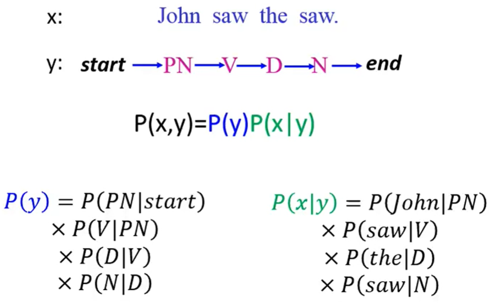
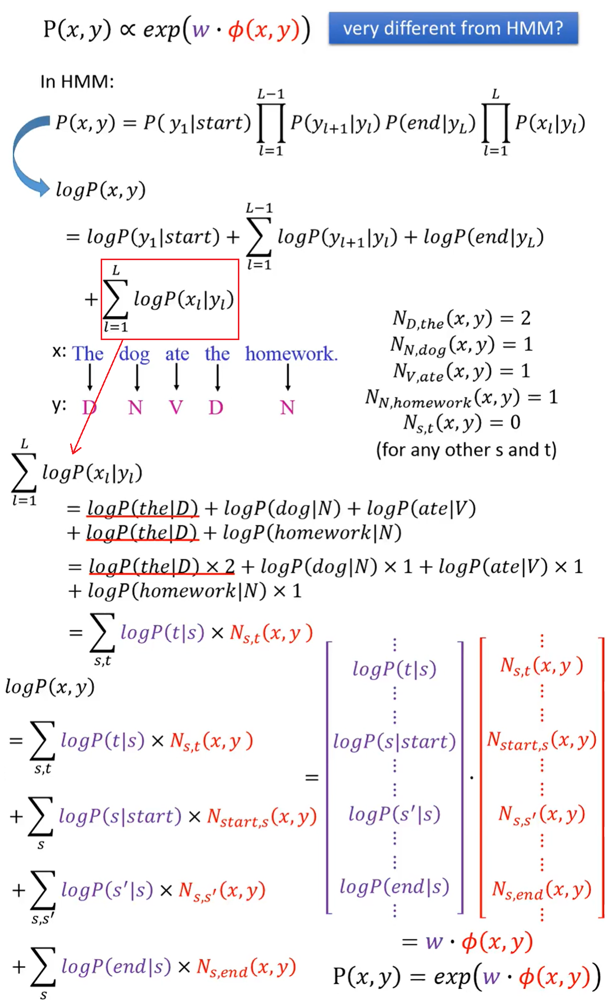
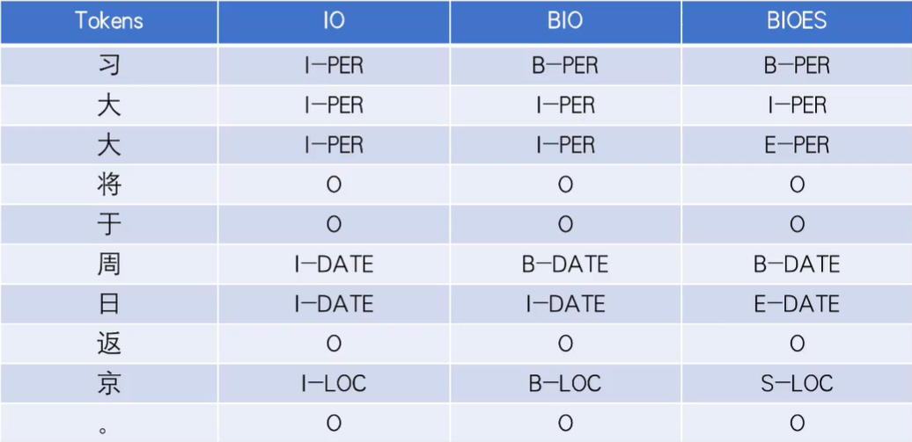

# 序列标注

## 隐马尔可夫模型进行词性标注

隐马尔可夫模型(HMM，Hidden Markov Model)



p(y)和p(x|y)可由给定的标注文本统计出结果。

### Inference

现给定一个x，寻找y，$y=arg\ max_{y\in Y}P(x,y)$。

假设y的序列长度为L，穷举y的话有$|S|^L$种可能，使用**Viterbi算法**可以获得$O(L|S|^2)$的时间复杂度。

## 条件随机场进行词性标注

条件随机场(CRF，Conditional Random Field)
$$
P(x,y)\propto exp(w·\phi(x,y))
$$
其中$\phi(x,y)$是特征函数，$w$是要学习的权重向量。
$$
p(y|x)=\frac{P(x,y)}{\sum_{y'}P(x,y')}=\frac{exp(w·\phi(x,y))}{\sum_{y'}exp(w·\phi(x,y'))}=\frac{exp(w·\phi(x,y))}{Z(x)}
$$
$\phi(x,y)$包括两个部分

1. 标记和单词之间的关系(对应HMM的p(x|y))
2. 标记之间的关系(对应HMM的p(y))

通过HMM推导CRF：




### 训练方法

对于给定的训练数据：$\{(x^1,\hat y^1),(x^2,\hat y^2),\dots(x^N,\hat y^N)\}$

寻找一个权重向量$w^*$使得目标函数$O(w)$最大
$$
w^*=arg\ max_w O(w)\\O(w)=\sum_{n=1}^NlogP(\hat y^n|x^n)=\sum_{n=1}^NO^n(w)\\logP(\hat y^n|x^n)=logP(x^n,\hat y^n)-log\sum_{y'}P(x^n,y')\\\frac{\partial O^n(w)}{\partial w_{s,t}}=N_{s,t}(x^n,\hat y^n)-\sum_{y'}P(y'|x^n)N_{s,t}(x^n,y')
$$
如果训练集中有单词t被标注为词性s，则增加$w_{s,t}$，否则减少$w_{s,t}$。

通过梯度下降法求出$w$
$$
\nabla O(w)=\phi(x^n,\hat y^n)-\sum_{y'}P(y'|x^n)\phi(x^n,y')
\\w\rightarrow w+\eta(\nabla O(w))
$$

### Inference

$y=arg\ max_{y\in Y}P(y|x)=arg\ max_{y\in Y}w·\phi(x,y)$，同样可使用Viterbi算法找出y。


序列标注的标签体系



IO不能区分连续实体

## Bi-LSTM+CRF

为什么加CRF

转移分数来自CRF层可以学习到的转移矩阵，在训练中得到更新。

```
https://www.bilibili.com/video/BV1K54y117yD
```

