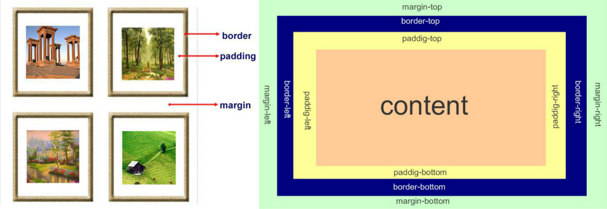
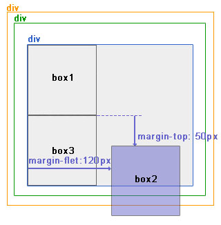

# CSS

```
https://www.cnblogs.com/yuanchenqi/articls/5977825.html
```

## 四种引入方式

### 行内式

行内式是在标记的style属性中设定CSS样式。这种方式没有体现出CSS的优势，不推荐使用。

```html
<p style="background-color: rebeccapurple">hello yuan</p>
```

### 嵌入式

嵌入式是将CSS样式集中写在网页的`<head></head>`标签对的`<style></style>`标签对中。

```html
<head>
  <meta charset="UTF-8">
  <title>Title</title>
  <style>
    p{
      background-color: #2b99ff;
    }
  </style>
</head>
```

 ### 链接式

将一个.css文件引入到HTML文件中

```html
<link href="mystyle.css" rel="stylesheet" type="text/css"/>
```

### 导入式

将一个独立的.css文件引入HTML文件中，导入式使用CSS规则引入外部CSS文件，`<style>`标记也是写在`<head>`标记中。

```
<style type="text/css">
  @import"mystyle.css"; 此处要注意.css文件的路径
</style>　
```

导入式会在整个网页装载完后再装载CSS文件，因此这就导致了一个问题，如果网页比较大则会儿出现先显示无样式的页面，闪烁一下之后，再出现网页的样式。这是导入式固有的一个缺陷。使用链接式时与导入式不同的是它会以网页文件主体装载前装载CSS文件，因此显示出来的网页从一开始就是带样式的效果的，它不会象导入式那样先显示无样式的网页，然后再显示有样式的网页，这是链接式的优点。

## 选择器

“选择器”指明了{}中的“样式”的作用对象，也就是“样式”作用于网页中的哪些元素。

### 基础选择器

```
＊: 通用元素选择器，匹配任何元素 *{ margin:0; padding:0; }
E: 标签选择器，匹配所有使用E标签的元素 p{ color:green; }
#info和E#info: id选择器，匹配所有id属性等于footer的元素
.info和E.info: class选择器，匹配所有class属性中包含info的元素 .info{ackground:#ff0;}
```

### 组合选择器

```
 E,F 多元素选择器，同时匹配所有E元素或F元素，E和F之间用逗号分隔 div,p {color:#f00;}
 E F 后代元素选择器，匹配所有属于E元素后代的F元素，E和F之间用空格分隔 li a {color:#f00;}
 E>F 子元素选择器，匹配所有E元素的子元素F div>p {color:#f00;}
 E+F 毗邻元素选择器，匹配所有紧随E元素之后的同级元素F div+p {color:#f00;}  
```

**嵌套规则**：

1. 块级元素可以包含内联元素或**某些**块级元素，但内联元素不能包含块级元素，它只能包含其它内联元素。
2. **有几个特殊的块级元素只能包含内联元素，不能包含块级元素**。如`h1,h2,h3,h4,h5,h6,p,dt`
3. `li`内可以包含`div`
4. 块级元素与块级元素并列、内联元素与内联元素并列。

### 属性选择器

```
E在此处可以省略，比如“[cheacked]”。
E[att] 匹配所有具有att属性的E元素，不考虑它的值。
E[att=val] 匹配所有att属性等于“val”的E元素。
E[att~=val] 匹配所有att属性具有多个空格分隔的值、其中一个值等于“val”的E元素。
E[attr^=val] 匹配属性值以指定值开头的每个元素。
E[attr$=val] 匹配属性值以指定值结尾的每个元素。
E[attr*=val] 匹配属性值中包含指定值的每个元素。class="div1 div2" [class*="v1"]
```

### 伪类

```
a:link（没有接触过的链接）,用于定义了链接的常规状态。
a:hover（鼠标放在链接上的状态）,用于产生视觉效果。
a:visited（访问过的链接）,用于阅读文章，能清楚的判断已经访问过的链接。
a:active（在链接上按下鼠标时的状态）,用于表现鼠标按下时的链接状态。

:before    p:before       在每个<p>元素之前插入内容
:after     p:after        在每个<p>元素之后插入内容
p:before{content:"hello";color:red}
p:after{ content:"hello"；color:red}
```

### 常用属性

#### 颜色属性

```
<div style="color:blueviolet">ppppp</div>
<div style="color:#ffee33">ppppp</div>
<div style="color:rgb(255,0,0)">ppppp</div>
<div style="color:rgba(255,0,0,0.5)">ppppp</div>
```

#### 字体属性

```
font-size: 20px/50%/larger
font-family:'Lucida Bright'、"Times New Roman"
font-weight: lighter/bold/border/ 100-900
font-style: oblique、italic
```

#### 背景属性

```
background-color: cornflowerblue
background-image: url('1.jpg');
background-repeat: no-repeat;(repeat:平铺满)(repeat-x:x方向平铺满)
background-position: right top;(横向：left center right)(纵向：top center bottom)
background-size: 20px 20px;
简写：
<body style="background: 20px 20px no-repeat #ff4 url('1.jpg')">
<div style="width: 300px;height: 300px;background: 20px 20px no-repeat #ff4 url('1.jpg')"> 
```

#### 文本属性

```
font-size: 10px;
text-align: center;   横向排列
line-height: 200px;   文本行高 50%:基于字体大小的百分比
vertical-align:－4px  设置元素内容的垂直对齐方式 ,只对行内元素有效，对块级元素无效
text-indent: 150px;   首行缩进
letter-spacing: 10px;
word-spacing: 20px;
text-transform: capitalize;
```

#### 边框属性

```
border-style: solid;
border-color: chartreuse;
border-width: 20px;
简写：border: 30px rebeccapurple solid;
```

#### 列表属性

```css
ul,ol{   list-style: decimal-leading-zero;
         list-style: none;
         list-style: circle;
         list-style: upper-alpha;
         list-style: disc;
}
```

#### display属性

```
none
block
inline
#outer{border: 3px dashed;word-spacing: -5px;}
```

#### 外边距和内边



+ margin: 用于控制元素与元素之间的距离；margin的最基本用途就是控制元素周围空间的间隔，从视觉角度上达到相互隔开的目的。
+ padding: 用于控制内容与边框之间的距离；
+ Border(边框): 围绕在内边距和内容外的边框。
+ Content(内容): 盒子的内容，显示文本和图像。

```
margin:10px 5px 15px 20px;-----------上 右 下 左
margin:10px 5px 15px;----------------上 右左 下
margin:10px 5px;---------------------上下  右左
margin:10px;-------------------------上右下左
```

浏览器会给`<body>`设定margin

元素宽度$ = width(content) +(padding+border+margin)\times2$

#### float属性

1. block元素通常被现实为独立的一块，独占一行，多个block元素会各自新起一行，默认block元素宽度自动填满其父元素宽度。block元素可以设置width、height、margin、padding属性；
   + 常见的块级元素有 `div`、`form`、`table`、`p`、`pre`、`h1～h6`、`dl`、`ol`、`ul` 等。

2. inline元素不会独占一行，多个相邻的行内元素会排列在同一行里，直到一行排列不下，才会新换一行，其宽度随元素的内容而变化。inline元素设置width、height属性无效。inline元素的margin和padding属性。水平方向的padding-left, padding-right, margin-left, margin-right都产生边距效果；但竖直方向的padding-top, padding-bottom, margin-top, margin-bottom不会产生边距效果。
   + 常见的内联元素有`span`、`a`、`strong`、`em`、`label`、`input`、`select`、`textarea`、`img`、`br`等

**所谓的文档流**，指的是元素排版布局过程中，元素会自动从左往右，从上往下的流式排列。

**脱离文档流**，也就是将元素从普通的布局排版中拿走，其他盒子在定位的时候，**会当做脱离文档流的元素不存在而进行定位**。

浮动的框可以向左或向右移动，直到它的外边缘碰到包含框或另一个浮动框的边框为止。由于浮动框不在文档的普通流中，所以文档的普通流中的浮动框之后的块框表现得就像浮动框不存在一样。（注意这里是块框而不是内联元素；浮动框只对它后面的元素造成影响）

**注意 当初float被设计的时候就是用来完成文本环绕的效果，所以文本不会被挡住，这是float的特性，即float是一种不彻底的脱离文档流方式。**无论多么复杂的布局，其基本出发点均是：“**如何在一行显示多个div元素**”。

现象1:

假如某个div元素A是浮动的，如果A元素上一个元素也是浮动的，那么A元素会跟随在上一个元素的后边(如果一行放不下这两个元素，那么A元素会被挤到下一行)；如果A元素上一个元素是标准流中的元素，那么A的相对垂直位置不会改变，也就是说A的顶部总是和上一个元素的底部对齐。此外，浮动的框之后的block元素元素会认为这个框不存在，但其中的文本依然会为这个元素让出位置。 浮动的框之后的inline元素，会为这个框空出位置，然后按顺序排列。

现象2:

(1)左右结构div盒子重叠现象，一般是由于相邻两个DIV一个使用浮动一个没有使用浮动。如上面的例1：相邻的两个盒子box2向左浮动、box3未浮动。一个使用浮动一个没有导致DIV不是在同个“平面”上，但内容不会照成覆盖现象，只有DIV形成覆盖现象。解决方法：要么都不使用浮动；要么都使用float浮动；要么对没有使用float浮动的DIV设置margin样式。

(2)上下结构div盒子重叠现象

**清除浮动**

```html
clear语法：
clear : none | left | right | both

取值：
none : 默认值。允许两边都可以有浮动对象
left : 不允许左边有浮动对象
right : 不允许右边有浮动对象
both : 不允许有浮动对象

但是需要注意的是：clear属性只会对自身起作用，而不会影响其他元素。如果一个元素的右侧有一浮动对象，而这个元素设置了不允许右边有浮动对象，即clear：right，则这个元素会自动下移一格，达到本元素右边没有浮动对象的目的。
<style>
    .clearfix:after {
        content:'.';
        display:block;
        clear:both;
        visivility:hidden;
        height:0;
    }
</style>
<div class='clearfix'>
    <div class='float'></div>
</div>
```

#### position

1. static 默认值，无定位，不能当作绝对定位的参照物，并且设置标签对象的left、top等值是不起作用的的。

2. position: relative／absolute

relative: 相对定位。相对定位是相对于该元素在文档流中的原始位置，即以自己原始位置为参照物。有趣的是，即使设定了元素的相对定位以及偏移值，元素还占有着原来的位置，即占据文档流空间。对象遵循正常文档流，但将依据top，right，bottom，left等属性在正常文档流中偏移位置。而其层叠通过z-index属性定义。

absolute绝对定位: 设置为绝对定位的元素框从文档流完全删除，并相对于最近的已定位祖先元素定位，如果元素没有已定位的祖先元素，那么它的位置相对于最初的包含块（即body元素）。元素原先在正常文档流中所占的空间会关闭，就好像该元素原来不存在一样。元素定位后生成一个块级框，而不论原来它在正常流中生成何种类型的框。

重点：如果父级设置了position属性，例如position:relative;，那么子元素就会以父级的左上角为原始点进行定位。这样能很好的解决自适应网站的标签偏离问题，即父级为自适应的，那我子元素就设置position:absolute;父元素设置position:relative;，然后Top、Right、Bottom、Left用百分比宽度表示。

另外，对象脱离正常文档流，使用top，right，bottom，left等属性进行绝对定位。而其层叠通过z-index属性定义。

总结：参照物用相对定位，子元素用绝对定位，并且保证相对定位参照物不会偏移即可。

3. position:fixed

​    fixed：对象脱离正常文档流，使用top，right，bottom，left等属性以窗口为参考点进行定位，当出现滚动条时，对象不会随着滚动。而其层叠通过z-index属性 定义。 注意点： 一个元素若设置了 position:absolute | fixed; 则该元素就不能设置float。这 是一个常识性的知识点，因为这是两个不同的流，一个是浮动流，另一个是“定位流”。但是 relative 却可以。因为它原本所占的空间仍然占据文档流。

​    在理论上，被设置为fixed的元素会被定位于浏览器窗口的一个指定坐标，不论窗口是否滚动，它都会固定在这个位置。

4. 仅使用margin属性布局绝对定位元素

此情况，margin-bottom 和margin-right的值不再对文档流中的元素产生影响，因为该元素已经脱离了文档流。另外，不管它的祖先元素有没有定位，都是以文档流中原来所在的位置上偏移参照物。 
　　层级关系为：

```
<div ——————————— position:relative;
<div—————————-没有设置为定位元素，不是参照物
<div———————-没有设置为定位元素，不是参照物
<div box1
<div box2 ——–position:absolute; margin-top:50px; margin-left:120px;
<div box3
```

