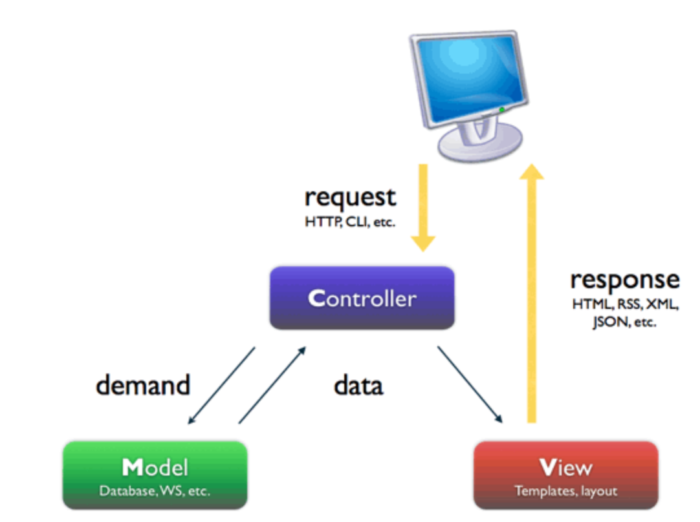
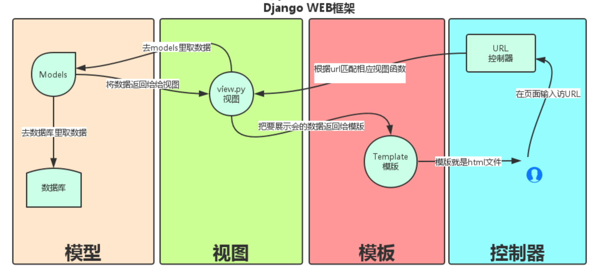

# Django

```
https://www.cnblogs.com/yuanchenqi/articls/6083427.html
```

## 自己搭一个简单Web框架

index.html

```html
<!DOCTYPE html>
<html lang="en">
<head>
    <meta charset="UTF-8">
    <title>Title</title>
</head>
<body>
    <h1> current_time {cur_time} </h1>
</body>
</html>
```

```python
from wsgiref.simple_server import make_server
import time

def f1(request):
    return [b'<h1>Hello, web!</h1>']

def current_time(request):
    f = open("index.html", "rb")
    data = f.read()
    cur_time = time.ctime(time.time())
    data = str(data, "utf8").replace("{cur_time}", str(cur_time))
    return [data.encode("utf8")]

def routers():
    urlpatterns = (
        ('/web', f1),
        ('/current_time', current_time)
    )
    return urlpatterns

def application(environ, start_response):
    # environ封装了请求信息，字典
    print("environ:", environ)
    # 第二个参数列表中元组是键值对，用于设置响应头
    start_response('200 OK', [('Content-Type', 'text/html')])
    path = environ["PATH_INFO"]

    urlpatterns = routers()
    func = None
    for item in urlpatterns:
        if item[0] == path:
            func = item[1]
            break
    if func:
        return func(environ)
    else:
        # 返回响应体
        return [b'<h1>404</h1>']

if __name__ == '__main__':
    httpd = make_server('', 8080, application)
    print('Serving HTTP on port 8080...')
    # 开始监听HTTP请求:
    httpd.serve_forever()
```

## MVC和MTV模式

把web应用分为模型(M),控制器(C),视图(V)三层；他们之间以一种插件似的，松耦合的方式连接在一起。

模型负责业务对象与数据库的对象(ORM),视图负责与用户的交互(页面)，控制器(C)接受用户的输入调用模型和视图完成用户的请求。



Django的MTV分别代表：

+ Model(模型)：负责业务对象与数据库的对象(ORM)

+ Template(模版)：负责如何把页面展示给用户

+ View(视图)：负责业务逻辑，并在适当的时候调用Model和Template

此外，Django还有一个url分发器，它的作用是将一个个URL的页面请求分发给不同的view处理，view再调用相应的Model和Template



## django的流程和命令行工具

### **django**实现流程

`url`->`urls.py`中对应的views中的函数->models中的数据库以及render到templates中的html(HttpResponse)或redirect

### 命令行工具

1. 创建project `django-admin startproject mysite`
2. 创建APP `python manage.py startapp app_name`
3. 启动项目 `python manage.py runserver 127.0.0.1:8090`
4. 生成数据库 `python manage.py makemigrations`
5. 同步数据库 `python manage.py migrate`
6. 清空数据库 `python manage.py flush`

## URL路由系统

```python
urlpatterns = [    url(正则表达式, views视图函数，参数，别名),]
```

```python
urlpatterns = [
    # url能用正则，path貌似不行
    path('admin/', admin.site.urls),
    # url给视图函数传参数，括号里的作为一个参数传给函数
    url(r'^year/([0-9]{4})/$', year_achieve),
    # 后端的形参需要与有名分组的一致，还可以传其他参数，放在一个字典里
    # 同名时使用字典中的参数
    # 可以起别名，在form中使用别名
    # <form action= method="post">
    url(r'^year/(?P<month>[0-9]{2})/$', month_achieve, {'name': 'month: '}, name="year"),
]
def year_achieve(req, year):
    return HttpResponse(year)
def month_achieve(req, month, name):
    return HttpResponse(name + month)
```

## Views

http请求中产生两个核心对象：

+ http请求：HttpRequest对象

+ http响应：HttpResponse对象

### HttpRequest属性和方法

```python
# path：       请求页面的全路径，不包括域名
# method：     请求中使用的HTTP方法的字符串表示。"GET"、"POST"
# GET:         包含所有HTTP GET参数的类字典对象
# POST：       包含所有HTTP POST参数的类字典对象
# COOKIES:     包含所有cookies的标准Python字典对象；keys和values都是字符串。
# FILES：      包含所有上传文件的类字典对象；FILES中的每一个Key都是<input type="file" name="" />标签中name属性的值，FILES中的每一个value同时也是一个标准的python字典对象，包含下面三个Keys：
#             filename：      上传文件名，用字符串表示
#             content_type:   上传文件的Content Type
#             content：       上传文件的原始内容
# user：       是一个django.contrib.auth.models.User对象，代表当前登陆的用户。如果访问用户当前没有登陆，user将被初始化为django.contrib.auth.models.AnonymousUser的实例。你可以通过user的is_authenticated()方法来辨别用户是否登陆：
#              if req.user.is_authenticated();只有激活Django中的AuthenticationMiddleware时该属性才可用
# session：    唯一可读写的属性，代表当前会话的字典对象；自己有激活Django中的session支持时该属性才可用。

#方法
get_full_path()
request.POST.getlist('')
```

### HttpResponse

对于HttpRequest对象来说，是由django自动创建的，但是，HttpResponse对象就必须我们自己创建。每个view请求处理方法必须返回一个HttpResponse对象。

 HttpResponse类在django.http.HttpResponse

 在HttpResponse对象上扩展的常用方法：

+ 页面渲染: `render(req, view_file_name)`、`render_to_response(view_file_name)`
+ 页面跳转: `redirect("路径")`redirect相当于在浏览器地址栏输入地址并访问，render直接返回静态html文件。
+ 可以直接将本函数中所有的变量传给模板，不用自己写字典了: `locals()`-> `render_to_response(view_file_name, locals())`

## Template

### 模板组成

html+逻辑控制语句

### 逻辑控制代码

#### 变量

`{{var_name}}`

```
>>> python manange.py shell  (进入该django项目的环境)>>> from django.template import Context, Template>>> t = Template('My name is {{ name }}.')>>> c = Context({'name': 'Stephane'})>>> t.render(c)'My name is Stephane.'
```

`.`

遍历复杂数据结构的关键是句点字符

+ 访问列表索引：`{{ items.2 }}`
+ 访问字典：`{{ dic.key }}`
+ 访问类的属性（如d = datetime.date()）：`{{ d.year }}`
+ 访问类的方法（如str = "hello"）：`{{ str.upper }}`

`{{ obj|filter:param }}`

+ upper: 字母变大写
+ lower: 字母变小写
+ first: 第一个数据

+ add: 给变量加上相应的值

+ addslashes: 给变量中的引号前加上斜线

+ capfirst: 首字母大写

+ cut: 从字符串中移除指定的字符

+ date: 格式化日期字符串

+ default: 如果值是False,就替换成设置的默认值，否则就是用本来的值

+ default_if_none:  如果值是None，就替换成设置的默认值，否则就使用本来的值 

实例

```
#value='<a href="#">跳转</a>'
{{ value }}
 #使浏览器渲染字符串
  {{ value }}

{{ value|safe }}
{{ value|striptags }}
#value='1234'
{{ value|filesizeformat }}<br>
{{ value|first }}<br>
{{ value|length }}<br>
{{ value|slice:":-1" }}<br>
```

#### 标签

``

```html

    
        <p>num大于200</p>
    
        <p>num大于100小于200</p>
    

    <p>num小于100</p>

    <p>num等于100</p>

```

``

```html

    <li>{{ obj.name }}</li>

# 标签内置了一个forloop模板变量，这个变量可以提供一些关于循环的信息
1. forloop.counter表示循环的次数，它从1开始计数，第一次循环设为1:
    
        <p>{{ forloop.counter }}: {{ item }}</p>
    
2. forloop.counter0 类似于forloop.counter，但它是从0开始计数，第一次循环设为0
3. forloop.revcounter
4. forloop.revcounter0
5. forloop.first当第一次循环时值为True，在特别情况下很有用：
       
         
             <li class="first">
         
             <li>
            
         {{ object }}   
         </li>  
    
# 富有魔力的forloop变量只能在循环中得到，当模板解析器到达时forloop就消失了。如果你的模板context已经包含一个叫forloop的变量，Django会用标签替代它，Django会在for标签的块中覆盖你定义的forloop变量的值，在其他非循环的地方，你的forloop变量仍然可用。
```

``

用于生成csrf_token的标签，用于防治跨站攻击验证。这里是会生成一个input标签，和其他表单标签一起提交给后台的。render_to_respon不能用

`` 引用路由配置的地址

```html
<form action="" >
          <input type="text">
          <input type="submit"value="提交">
          
</form>
```

` `引用路由配置的地址

```html
 {{ total }} 
```

`` 禁止render

#### 自定义simple_tag

1. 在app中创建templatetags模块
2. 创建.py文件

```python
from django import template

register = template.Library()

# simple_tag不能用于if语句
@register.simple_tag
def my_add100(v1):
    return v1 + 100
```

3. 在html中引入

```html


<!DOCTYPE html>
<html lang="en">
<head>
    <meta charset="UTF-8">
    <title>Title</title>
</head>
<body>
    
</body>
</html>
```

#### 自定义filter

```python
# filter最多两个参数
@register.filter
def my_add101(v1, v2):
    return v1 + 101 + v2

@register.filter
def my_add102(v1):
    return v1 + 102
```

```


<!DOCTYPE html>
<html lang="en">
<head>
    <meta charset="UTF-8">
    <title>Title</title>
</head>
<body>
    {{ num|my_add101:8 }}
    {{ num|my_add102 }}
</body>
</html>
```

#### extend模板继承

``允许在（模板中）包含其它的模板的内容。

1. 定义基础模板

```html
<!DOCTYPE HTML PUBLIC "-//W3C//DTD HTML 4.01//EN">
<html lang="en">
<head>
    <title>
        
        
    </title>
</head>
<body>
    <h1>My helpful timestamp site</h1>
    
    
    
    <hr>
    <p>Thanks for visiting my site.</p>
    
</body>
</html>
```

2. 定义子模板

```html

 

    The current time

 

    <p>It is now {{ current_date }}.</p>

```

+ 如果在模板中使用  ，必须保证其为模板中的第一个模板标记。 否则，模板继承将不起作用。

+ 一般来说，基础模板中的  标签越多越好。 子模板不必定义父模板中所有的代码块，因此你可以用合理的缺省值对一些代码块进行填充，然后只对子模板所需的代码块进行（重）定义。

+ 如果发觉自己在多个模板之间拷贝代码，你应该考虑将该代码段放置到父模板的某个  中。使用 {{ block.super }}访问父模板中的块的内容。 

+ 不允许在同一个模板中定义多个同名的  。 

## Model

### 数据库配置

引擎名称：

+ sqlite：django.db.backends.sqlite3

+ mysql：django.db.backends.mysql

mysql驱动程序：

-  MySQLdb(mysql python)
-  mysqlclient
-  MySQL
-  PyMySQL(纯python的mysql驱动程序)

使用sqlite

```python
DATABASES = {
    'default': {
        'ENGINE': 'django.db.backends.sqlite3',
        'NAME': BASE_DIR / 'db.sqlite3',
    }
}
```

使用mysql

```python
DATABASES = {
    'default': {
        'ENGINE': 'django.db.backends.mysql', 
        'NAME': 'books',    #你的数据库名称
        'USER': 'root',   #你的数据库用户名
        'PASSWORD': '', #你的数据库密码
        'HOST': '', #你的数据库主机，留空默认为localhost
        'PORT': '3306', #你的数据库端口
    }
}
```

NAME即数据库的名字，在mysql连接前该数据库必须已经创建，而上面的sqlite数据库下的db.sqlite3则是项目自动创建

USER和PASSWORD分别是数据库的用户名和密码。

设置完后，在启动我们的Django项目前，我们需要激活我们的mysql。然后，启动项目，会报错：no module named MySQLdb。这是因为django默认你导入的驱动是MySQLdb，可是MySQLdb对于py3有很大问题，所以我们需要的驱动是PyMySQL。所以，我们只需要找到项目名文件下的__init__,在里面写入：

```python
import pymysql
pymysql.install_as_MySQLdb()
```

**在PyCharm中查看sqlite数据库**

+ File---->Settings---->Plugins---->Database Navigator
+ 在Database Navigator中连接数据库

### ORM(对象关系映射)

#### 创建表

```python
from django.db import models
class Publisher(models.Model):
    name = models.CharField(max_length=30, verbose_name="名称") # varchar
    address = models.CharField("地址", max_length=50)
    city = models.CharField('城市',max_length=60)
    state_province = models.CharField(max_length=30)
    country = models.CharField(max_length=50)
    website = models.URLField()
 
    class Meta:
        verbose_name = '出版商'
        verbose_name_plural = verbose_name
 
    def __str__(self):
        return self.name
 
class Author(models.Model):
    name = models.CharField(max_length=30)
    def __str__(self):
        return self.name
 
class AuthorDetail(models.Model):
    sex = models.BooleanField(max_length=1, choices=((0, '男'),(1, '女'),))
    email = models.EmailField()
    address = models.CharField(max_length=50)
    birthday = models.DateField()
    author = models.OneToOneField(Author)
 
class Book(models.Model):
    title = models.CharField(max_length=100)
    authors = models.ManyToManyField(Author) # 多对多关系
    publisher = models.ForeignKey(Publisher) # 一对多关系
    publication_date = models.DateField()
    price=models.DecimalField(max_digits=5,decimal_places=2,default=10)
    def __str__(self):
        return self.title
    
# 手动生成多对多关系
class Au_to_Bo(models.Model):
    aid = models.ForeignKey(Author)
    bid = models.ForeignKey(Book)
    class Meta:
        unique_together = (
            ('aid', 'bid'),
        )
```

+ 记得在settings里的INSTALLED_APPS中加入'app01'，然后再同步数据库。

+ ForeignKey默认与对应类的`id`关联，可以加`to_field`属性指定字段。

  ```python
  publisher = models.ForeignKey(Publisher, to_field='name')
  ```

+ models.ForeignKey("Publish") & models.ForeignKey(Publish)

  <p style="color:red">If you need to create a relationship on a model that has not yet been defined, you can use the name of the model, rather than the model object itself:</p>

  ```python
  from django.db import models
  
  class Car(models.Model):
      manufacturer = models.ForeignKey(
          'Manufacturer',
          on_delete=models.CASCADE,
      )
      # ...
  
  class Manufacturer(models.Model):
      # ...
      pass
  ```

常用字段

+ `CharField` 字符串字段, 用于较短的字符串。CharField 要求必须有一个参数 maxlength, 用于从数据库层和Django校验层限制该字段所允许的最大字符数。

+ `IntegerField` 用于保存一个整数。

+ `FloatField` 一个浮点数。 必须提供两个参数：max_digits 总位数(不包括小数点和符号)；decimal_places 小数位数。

+ `AutoFiel` 一个 IntegerField, 添加记录时它会自动增长。通常不需要直接使用这个字段; 自定义一个主键：my_id=models.AutoField(primary_key=True)，如果不指定主键的话,系统会自动添加一个主键字段到你的 model。

+ `BooleanField` admin 用 checkbox 来表示此类字段。

+ `TextField` admin 用一个`<textarea>` 表示该字段数据。

+ `EmailField` 一个带有检查Email合法性的 CharField，不接受 maxlength 参数。

+ `DateField`  一个日期字段. 共有下列额外的可选参数：Argument 描述；auto_now 当对象被保存时,自动将该字段的值设置为当前时间.通常用于表示 "last-modified" 时间戳；auto_now_add 当对象首次被创建时,自动将该字段的值设置为当前时间.通常用于表示对象创建时间。

+ `DateTimeField` 一个日期时间字段。 类似 DateField 支持同样的附加选项。

+ `ImageField` 类似 FileField, 不过要校验上传对象是否是一个合法图片。它有两个可选参数:height_field和width_field，如果提供这两个参数,则图片将按提供的高度和宽度规格保存。

+ `FileField` 一个文件上传字段。要求一个必须有的参数: upload_to, 一个用于保存上载文件的本地文件系统路径. 这个路径必须包含 strftime。

  在一个 model 中使用 FileField 或 ImageField 需要以下步骤:

  + 在你的 settings 文件中, 定义一个完整路径给 MEDIA_ROOT 以便让 Django在此处保存上传文件。(出于性能考虑,这些文件并不保存到数据库) 定义MEDIA_URL 作为该目录的公共 URL。要确保该目录对 WEB服务器用户帐号是可写的。
  + 在你的 model 中添加 FileField 或 ImageField, 并确保定义了 upload_to 选项，以告诉 Django使用 MEDIA_ROOT 的哪个子目录保存上传文件。你的数据库中要保存的只是文件的路径(相对于 MEDIA_ROOT)。出于习惯你一定很想使用 Django 提供的 `get_<#fieldname>_url`函数。举例来说，如果你的 ImageField叫作 mug_shot, 你就可以在模板中以 {{ object.#get_mug_shot_url }} 这样的方式得到图像的绝对路径。

+ `URLField` 用于保存 URL。若 verify_exists 参数为 True (默认)，给定的 URL 会预先检查是否存在( 即URL是否被有效装入且没有返回404响应。admin 用一个`<input type="text">`文本框表示该字段保存的数据(一个单行编辑框)

+ `NullBooleanField` 类似 BooleanField，不过允许 NULL 作为其中一个选项。推荐使用这个字段而不要用 BooleanField 加 null=True 选项。admin 用一个选择框`<select>`(三个可选择的值: "Unknown", "Yes" 和 "No" ) 来表示这种字段数据。

+ `SlugField` "Slug" 是一个报纸术语。slug 是某个东西的小小标记(短签)， 只包含字母、数字、下划线和连字符。它们通常用于URLs。若你使用 Django 开发版本，你可以指定 maxlength。若 maxlength 未指定，Django 会使用默认长度: 50。

+ `XMLField` 一个校验值是否为合法XML的 TextField，必须提供参数: schema_path，它是一个用来校验文本的 RelaxNG schema 的文件系统路径。

+ `FilePathField` 可选项目为某个特定目录下的文件名。支持三个特殊的参数，其中第一个是必须提供的。path 必需参数，一个目录的绝对文件系统路径，FilePathField 据此得到可选项目。
  （Example: "/home/images"）match 可选参数，一个正则表达式，作为一个字符串，FilePathField将使用它过滤文件名。这个正则表达式只会应用到 base filename 而不是路径全名。（Example: `"foo.*\.txt^"`, 将匹配文件 foo23.txt 却不匹配 bar.txt 或 foo23.gif）recursive 可选参数，要么 True 要么 False。默认值是 False，是否包括 path 下面的全部子目录。
  这三个参数可以同时使用。match 仅应用于 base filename，而不是路径全名。那么,这个例子:
  `FilePathField(path="/home/images", match="foo.*", recursive=True)`会匹配 /home/images/foo.gif 而不匹配 /home/images/foo/bar.gif

+ `IPAddressField` 一个字符串形式的 IP 地址，(i.e. "24.124.1.30")。

+ `CommaSeparatedIntegerField` 用于存放逗号分隔的整数值，类似 CharField, 必须要有maxlength参数。

重要参数

+ null ： 数据库中字段是否可以为空
+ blank： django的 Admin 中添加数据时是否可允许空值
+ default：设定缺省值
+ editable：如果为假，admin模式下将不能改写。缺省为真
+ primary_key：设置主键，如果没有设置django创建表时会自动加上：
      id = meta.AutoField('ID', primary_key=True)
      primary_key=True implies blank=False, null=False and unique=True. Only one
      primary key is allowed on an object.
+ unique：数据唯一 
+ verbose_name：Admin中字段的显示名称
+ validator_list：有效性检查。非有效产生 `django.core.validators.ValidationError` 错误
+ db_column，db_index：如果为真将为此字段创建索引
+ choices：一个用来选择值的2维元组。第一个值是实际存储的值，第二个用来方便进行选择。
      如SEX_CHOICES= (( ‘F’,'Female’),(‘M’,'Male’),)
      gender = models.CharField(max_length=2,choices = SEX_CHOICES)

#### 增 create save

```python
# create 1
Author.objects.create(name='Alvin')
# create 2
Author.objects.create(**{"name":"alex"})
# save 1
author=Author(name="alvin")
author.save()
# save 2
author=Author()
author.name="alvin"
author.save()

#一对多(ForeignKey):
#方式一: 由于绑定一对多的字段,比如publish,存到数据库中的字段名叫publish_id,所以我们可以直接给这个字段设定对应值:
    Book.objects.create(title='php',
        publisher_id=2,   #这里的2是指为该book对象绑定了Publisher表中id=2的行对象
                          #创建表时的名字叫publisher，但插入时要用publisher_id
        publication_date='2017-7-7',
        price=99)
#方式二:
#<1> 先获取要绑定的Publisher对象:
	pub_obj=Publisher(name='河大出版社',address='保定',city='保定',state_province='河北',country='China',website='http://www.hbu.com')
    pub_obj=Publisher.objects.get(id=1)
#<2> =====将 publisher_id=2 改为  publisher=pub_obj=====

#多对多(ManyToManyField()):
    author1=Author.objects.get(id=1)
    author2=Author.objects.filter(name='alvin')[0]
    book=Book.objects.get(id=1)
    book.authors.add(author1,author2)
    #等同于:
    book.authors.add(*[author1,author2])
    book.authors.remove(*[author1,author2])
    #-------------------
    book=models.Book.objects.filter(id__gt=1)
    authors=models.Author.objects.filter(id=1)[0]
    authors.book_set.add(*book)
    authors.book_set.remove(*book)
    #-------------------
    book.authors.add(1)
    book.authors.remove(1)
    authors.book_set.add(1)
    authors.book_set.remove(1)

#注意: 如果第三张表是通过models.ManyToManyField()自动创建的,那么绑定关系只有上面一种方式
# 如果第三张表是自己创建的:
	class Book2Author(models.Model):
        author=models.ForeignKey("Author")
        Book=  models.ForeignKey("Book")
# 那么就还有一种方式:
    author_obj=models.Author.objects.filter(id=2)[0]
    book_obj  =models.Book.objects.filter(id=3)[0]
    s=models.Book2Author.objects.create(author_id=1,Book_id=2)
    s.save()
    s=models.Book2Author(author=author_obj,Book_id=1)
    s.save()
```

#### 删 delete clear remove

```python
Book.objects.filter(id=1).delete()

# 多对多关系
#正向
book = models.Book.objects.filter(id=1)

#删除第三张表中和女孩1关联的所有关联信息
book.author.clear()              #清空与book中id=1 关联的所有数据
book.author.remove(2)            #可以为id
book.author.remove(*[1,2,3,4])   #可以为列表,前面加*

#反向
author = models.Author.objects.filter(id=1)
author.book_set.clear()          #清空与book中id=1 关联的所有数据
```

#### 改 save update

```python
author = Author.objects.get(id=5)
author.name = 'tenglan'
author.save()

Publisher.objects.filter(id=1).update(name = 'American publisher') # 不能用get

obj=Book.objects.filter(id=1)[0]
author=Author.objects.filter(id__gt=2)
obj.author.clear()
obj.author.add(*author)
```

update是QuerySet对象的方法，get返回的是一个model对象，它没有update方法，而filter返回的是一个QuerySet对象(filter里面的条件可能有多个条件符合，比如name＝'alvin',可能有两个name＝'alvin'的行数据)。

update方法直接设定对应属性，save方法会将所有属性重新设定一遍,效率低。

#### 查

查询API

+ `filter(**kwargs)`：它包含了与所给筛选条件相匹配的对象

  ```python
  models.db.objects.filter(id=1)
  dic = {'id': 1, 'age__gt': 3}
  models.db.objects.filter(**dic)
  ```

+ `all()`：查询所有结果

+ `get(**kwargs)`：返回与所给筛选条件相匹配的对象，返回结果有且只有一个，如果符合筛选条件的对象超过一个或者没有都会抛出错误

-----------下面的方法都是对查询的结果再进行处理：比如 objects.filter.values()--------

+ `values(*field)`：只查某几列。返回一个ValueQuerySet——一个特殊的QuerySet，运行后得到的并不是一系列 model的实例化对象，而是一个可迭代的字典序列
+ `exclude(**kwargs)`：它包含了与所给筛选条件不匹配的对象 **与filter相反**
+ `order_by(*field)`：对查询结果排序
+ `reverse()`：对查询结果反向排序
+ `distinct()`：从返回结果中剔除重复纪录
+ `values_list(*field)`：它与values()非常相似，它返回的是一个元组序列，values返回的是一个字典序列
+ `count()`：返回数据库中匹配查询(QuerySet)的对象数量
+ `first()`：返回第一条记录
+ `last()`：返回最后一条记录
+ `exists()`如果QuerySet包含数据，就返回True，否则返回False

```python
result = models.Book.objects.all()
result[0].publisher.name
models.Book.objects.all().values('id', 'title', 'publisher_id', 'publisher__id', 'publisher__name')
models.Book.objects.all().values_list('id', 'title', 'publisher_id', 'publisher__id', 'publisher__name')
```

**扩展查询**，有时候DJANGO的查询API不能方便的设置查询条件，提供了另外的扩展查询方法extra:
extra(select=None, where=None, params=None, tables=None,order_by=None, select_params=None)

+ Entry.objects.extra(select={'is_recent': "pub_date > '2006-01-01'"})
+ Blog.objects.extra(
  select=SortedDict([('a', '%s'), ('b', '%s')]),
  select_params=('one', 'two'))

+ q = Entry.objects.extra(select={'is_recent': "pub_date > '2006-01-01'"})
  q = q.extra(order_by = ['-is_recent'])

+ Entry.objects.extra(where=['headline=%s'], params=['Lennon'])  

**惰性机制**：Publisher.objects.all()或者.filter()等都只是返回了一个QuerySet（查询结果集对象），它并不会马上执行sql，而是当调用QuerySet的时候才执行。

**QuerySet特点：**

+ 可迭代

+ 可切片

```python
objs=models.Book.objects.all()#[obj1,obj2,ob3...]

for obj in objs: # 每一obj就是一个行对象
    print("obj:",obj)

print(objs[1])
print(objs[1:4])
print(objs[::-1])
```

**对象查询，单表条件查询，多表条件关联查询**

```python
#--------------------对象形式的查找--------------------------
# 正向查找
ret1=models.Book.objects.first()
print(ret1.title)
print(ret1.price)
print(ret1.publisher)
print(ret1.publisher.name)  #因为一对多的关系所以ret1.publisher是一个对象,而不是一个queryset集合

# 反向查找
ret2=models.Publish.objects.last()
print(ret2.name)
print(ret2.city)
#如何拿到与它绑定的Book对象呢?
print(ret2.book_set.all()) #ret2.book_set是一个queryset集合

#---------------了不起的双下划线(__)之单表条件查询----------------
#    models.Tb1.objects.filter(id__lt=10, id__gt=1)   # 获取id大于1 且 小于10的值
#    models.Tb1.objects.filter(id__in=[11, 22, 33])   # 获取id等于11、22、33的数据
#    models.Tb1.objects.exclude(id__in=[11, 22, 33])  # not in
#    models.Tb1.objects.filter(name__contains="ven")
#    models.Tb1.objects.filter(name__icontains="ven") # icontains大小写不敏感
#    models.Tb1.objects.filter(id__range=[1, 2])   # 范围bettwen and
#    startswith，istartswith, endswith, iendswith,

#----------------了不起的双下划线(__)之多表条件关联查询---------------
# 正向查找(条件)
    ret3=models.Book.objects.filter(title='Python').values('id')
    print(ret3) #[{'id': 1}]
    #正向查找(条件)之一对多
    ret4=models.Book.objects.filter(title='Python').values('publisher__city')
    print(ret4)  #[{'publisher__city': '北京'}]
    #正向查找(条件)之多对多
    ret5=models.Book.objects.filter(title='Python').values('author__name')
    ret6=models.Book.objects.filter(author__name="alex").values('title')
    #注意
    #正向查找的publisher__city或者author__name中的publisher,author是book表中绑定的字段
    #一对多和多对多在这里用法没区别

# 反向查找(条件)
    #反向查找之一对多:                      表名__字段名
    ret8=models.Publisher.objects.filter(book__title='Python').values('name')
    print(ret8)#[{'name': '人大出版社'}]  注意,book__title中的book就是Publisher的关联表名
    ret9=models.Publisher.objects.filter(book__title='Python').values('book__authors')
    print(ret9)#[{'book__authors': 1}, {'book__authors': 2}]
    pub0 = models.Publisher.objects.all()[0] # 找出对象然后反向查找
    pub0.book_set.all()
    pub0.book_set.filter(id__lt=3)
    #反向查找之多对多:
    ret10=models.Author.objects.filter(book__title='Python').values('name')
    print(ret10)#[{'name': 'alex'}, {'name': 'alvin'}]
    #注意
    #正向查找的book__title中的book是表名Book
    #一对多和多对多在这里用法没区别
```

#### 查找实例

用 表名_set 似乎查不了，related_name方法亲测可用：(在A中用B中a外键的related_name查)

```python
class A(models.Model):
    name= models.CharField('名称', max_length=32)
class B(models.Model):
    a= models.ForeignKey(A, verbose_name='A类',related_name = "test")
    name = models.CharField('称呼', max_length=16)

# 正向查找
B.objects.filter(a=A_id).order_by('-created')
B.objects.filter(id=b_id).values('id', 'name', 'a__id', 'a__name') # 双下划线
# 表名_set
A.object.get(id=A_id).B_set().all()
# related_name
obj = A.objects.get(id=A_id) # 获得一个B对象
obj.test.all()
```

**聚合查询和分组查询**

`aggregate(*args,**kwargs)`

通过对QuerySet进行计算，返回一个聚合值的字典。aggregate()中每一个参数都指定一个包含在字典中的返回值。即在查询集上生成聚合。

```python
from django.db.models import Avg,Min,Sum,Max
# 从整个查询集生成统计值。比如，你想要计算所有在售书的平均价钱。Django的查询语法提供了一种方式描述所有图书的集合。
Book.objects.all().aggregate(Avg('price'))
# {'price__avg': 34.35}
# aggregate()子句的参数描述了我们想要计算的聚合值，在这个例子中，是Book模型中price字段的平均值
# aggregate()是QuerySet 的一个终止子句，意思是说，它返回一个包含一些键值对的字典。键的名称是聚合值的标识符，值是计算出来的聚合值。键的名称是按照字段和聚合函数的名称自动生成出来的。如果你想要为聚合值指定一个名称，可以向聚合子句提供它:
Book.objects.aggregate(average_price=Avg('price'))
# {'average_price': 34.35}
# 如果你也想知道所有图书价格的最大值和最小值，可以这样查询：
Book.objects.aggregate(Avg('price'), Max('price'), Min('price'))
# {'price__avg': 34.35, 'price__max': Decimal('81.20'), 'price__min': Decimal('12.99')}
```

`annotate(*args,**kwargs)`

可以通过计算查询结果中每一个对象所关联的对象集合，从而得出总计值(也可以是平均值或总和)，即为查询集的每一项生成聚合。

```python
# 查alex出的书的总价格
Book.objects.filter(authors__name='alex').aggregate(Sum("price"))
# 查各个作者出的书的总价格
Book.objects.values("authors__name").annotate(Sum("price"))
# 查询各个出版社最便宜的书价是多少
Book.objects.values("publisher__name").annotate(Min("price"))
```

**F查询和Q查询**

```python
# F 使用查询条件的值,专门取对象中某列值的操作
    from django.db.models import F
    models.Tb1.objects.update(num=F('num')+1)

# Q 构建搜索条件
    from django.db.models import Q
    #1 Q对象(django.db.models.Q)可以对关键字参数进行封装，从而更好地应用多个查询
    q1=models.Book.objects.filter(Q(title__startswith='P')).all()
    print(q1)#[<Book: Python>, <Book: Perl>]
    # 2、可以组合使用&,|操作符，当一个操作符是用于两个Q的对象,它产生一个新的Q对象。
    Q(title__startswith='P') | Q(title__startswith='J')
    # 3、Q对象可以用~操作符放在前面表示否定，也可允许否定与不否定形式的组合
    Q(title__startswith='P') | ~Q(pub_date__year=2005)
    # 4、应用范围：
    # Each lookup function that takes keyword-arguments (e.g. filter(),
    #  exclude(), get()) can also be passed one or more Q objects as
    # positional (not-named) arguments. If you provide multiple Q object
    # arguments to a lookup function, the arguments will be “AND”ed
    # together. For example:
    Book.objects.get(
        Q(title__startswith='P'),
        Q(pub_date=date(2005, 5, 2)) | Q(pub_date=date(2005, 5, 6))
    )
    #sql:
    # SELECT * from polls WHERE question LIKE 'P%'
    #     AND (pub_date = '2005-05-02' OR pub_date = '2005-05-06')
    # import datetime
    # e=datetime.date(2005,5,6)  #2005-05-06
    # 5、Q对象可以与关键字参数查询一起使用，不过一定要把Q对象放在关键字参数查询的前面。
    # 正确：
    Book.objects.get(
        Q(pub_date=date(2005, 5, 2)) | Q(pub_date=date(2005, 5, 6)),
        title__startswith='P')
    # 错误：
    Book.objects.get(
        question__startswith='P',
        Q(pub_date=date(2005, 5, 2)) | Q(pub_date=date(2005, 5, 6)))
```

### admin配置

admin是django强大功能之一，它能共从数据库中读取数据，呈现在页面中，进行管理。默认情况下，它的功能已经非常强大，如果你不需要复杂的功能，它已经够用，但是有时候，一些特殊的功能还需要定制，比如搜索功能，下面这一系列文章就逐步深入介绍如何定制适合自己的admin应用。

如果觉得英文界面不好用，可以在setting.py 文件中修改以下选项

```python
LANGUAGE_CODE = 'en-us'  #LANGUAGE_CODE = 'zh-hans'
```

**认识ModelAdmin**

管理界面的定制类，如需扩展特定的model界面需从该类继承。

**注册medel类到admin的两种方式**

+ 使用register的方法

  ```python
  admin.site.register(Book,MyAdmin)
  ```

+ 使用register的装饰器

  ```python
  @admin.register(Book)
  ```

**掌握一些常用的设置技巧**

- list_display：指定要显示的字段
- search_fields：指定搜索的字段
- list_filter：指定列表过滤器
- ordering：指定排序字段

```python
from django.contrib import admin
from app01.models import *
# Register your models here.
# @admin.register(Book)#----->单给某个表加一个定制
class MyAdmin(admin.ModelAdmin):
    list_display = ("title","price","publisher")
    search_fields = ("title","publisher")
    list_filter = ("publisher",)
    ordering = ("price",)
    fieldsets =[
        (None,               {'fields': ['title']}),
        ('price information', {'fields': ['price',"publisher"], 'classes': ['collapse']}),
    ]
admin.site.register(Book,MyAdmin)
admin.site.register(Publish)
admin.site.register(Author)
```

对于每次创建一个对象，想显示对应的raw sql，需要在settings加上日志记录部分：

```python
LOGGING = {
    'version': 1,
    'disable_existing_loggers': False,
    'handlers': {
        'console':{
            'level':'DEBUG',
            'class':'logging.StreamHandler',
        },
    },
    'loggers': {
        'django.db.backends': {
            'handlers': ['console'],
            'propagate': True,
            'level':'DEBUG',
        },
    }
}
```

## Django内容补充

+ 提交表单的方法：

  Form、AJAX

```
https://www.cnblogs.com/wupeiqi/articles/5246483.html
```

### COOKIE

`set_cookie()`

+ `key`
+ `value`
+ `max_age` 10
+ `expires` datetime.datetime.utcnow() + datetime.timedelta(seconds=10)
+ `path` Cookie生效的路径，默认'/'，所以路径都能拿到
+ `domain` Cookie生效的域名
+ `httponly` 只能通过http来获取cookie

`set_signed_cookie`、`get_signed_cookie` 加密cookie

由于cookie保存在客户端的电脑上，所以，JavaScript和jquery也可以操作cookie。

```html
<script src='/static/jquery-3.5.1.js'></script>
<script src='/static/jquery.cookie.js'></script>
$.cookie("list_pager_num", 30,{ path: '/'});
```

服务的和客户的均可设置cookie，cookie保存在客户的浏览器上。

**基于cookie的登录认证系统：**


```python
#---------views.py---------
def login(request):
    msg = ""
    if request.method == "POST":
        user = request.POST.get('user')
        pwd = request.POST.get('pwd')
        c = Administrator.objects.filter(username=user, password=pwd).count()
        if c:
            rep = redirect('index1.html')
            # 设置键值对以及其生命周期
            rep.set_cookie('username', user, max_age=10)
            return rep
        else:
            msg = "用户名或密码错误"
            return render(request, 'login1.html', locals())
    else:
        return render(request, 'login1.html')

def index(request):
    username = request.COOKIES.get('username')
    # 有cookie可以直接登录
    if username:
        return render(request, "index1.html", locals())
    else:
        return redirect('login1.html')
#---------urls.py---------
urlpatterns = [
    path('login/', login),
    path('login/login1.html', login),
    path('login/index1.html', index),
]
```

```html
#--------------login1.html--------------
<form action="" method="post">
	
	<div>
		<label for="user">用户名:</label>
		<input id="user" type="text" name="user" />
	</div>
	<div>
		<label for="user">密码:</label>
		<input id="pwd" type="password" name="pwd" />
	</div>
	<div>
		<label></label>
		<input type="submit" name="登录" />
		<span style="color:red">{{ msg }}</span>
	</div>
</form>
#--------------index1.html--------------
<h1>Hello {{ username }}</h1>
```

### Session

#### 配置

##### 数据库

Django默认支持Session，并且默认是将Session数据存储在数据库中，即：django_session 表中。

```python
SESSION_ENGINE = 'django.contrib.sessions.backends.db' # 引擎（默认）
SESSION_COOKIE_NAME ＝ "sessionid" # Session的cookie保存在浏览器上时的key，即：sessionid＝随机字符串（默认）
SESSION_COOKIE_PATH ＝ "/" # Session的cookie保存的路径（默认）
SESSION_COOKIE_DOMAIN = None # Session的cookie保存的域名（默认）
SESSION_COOKIE_SECURE = False # 是否Https传输cookie（默认）
SESSION_COOKIE_HTTPONLY = True # 是否Session的cookie只支持http传输（默认）
SESSION_COOKIE_AGE = 1209600 # Session的cookie失效日期（2周）（默认）
SESSION_EXPIRE_AT_BROWSER_CLOSE = False # 是否关闭浏览器使得Session过期（默认）
SESSION_SAVE_EVERY_REQUEST = False # 是否每次请求都保存Session，默认修改之后才保存（默认）
```

##### 缓存

```python
SESSION_ENGINE = 'django.contrib.sessions.backends.cache' # 引擎
SESSION_CACHE_ALIAS = 'default' # 使用的缓存别名（默认内存缓存，也可以是memcache），此处别名依赖缓存的设置
SESSION_COOKIE_NAME ＝ "sessionid" # Session的cookie保存在浏览器上时的key，即：sessionid＝随机字符串
SESSION_COOKIE_PATH ＝ "/" # Session的cookie保存的路径
SESSION_COOKIE_DOMAIN = None # Session的cookie保存的域名
SESSION_COOKIE_SECURE = False # 是否Https传输cookie
SESSION_COOKIE_HTTPONLY = True # 是否Session的cookie只支持http传输
SESSION_COOKIE_AGE = 1209600 # Session的cookie失效日期（2周）
SESSION_EXPIRE_AT_BROWSER_CLOSE = False # 是否关闭浏览器使得Session过期
SESSION_SAVE_EVERY_REQUEST = False # 是否每次请求都保存Session，默认修改之后才保存
```

##### 文件

```python
SESSION_ENGINE = 'django.contrib.sessions.backends.file' # 引擎
SESSION_FILE_PATH = None # 缓存文件路径，如果为None，则使用tempfile模块获取一个临时地址tempfile.gettempdir()                                  # 如：/var/folders/d3/j9tj0gz93dg06bmwxmhh6_xm0000gn/T
SESSION_COOKIE_NAME ＝ "sessionid" # Session的cookie保存在浏览器上时的key，即：sessionid＝随机字符串
SESSION_COOKIE_PATH ＝ "/" # Session的cookie保存的路径
SESSION_COOKIE_DOMAIN = None # Session的cookie保存的域名
SESSION_COOKIE_SECURE = False # 是否Https传输cookie
SESSION_COOKIE_HTTPONLY = True # 是否Session的cookie只支持http传输
SESSION_COOKIE_AGE = 1209600 # Session的cookie失效日期（2周）
SESSION_EXPIRE_AT_BROWSER_CLOSE = False # 是否关闭浏览器使得Session过期
SESSION_SAVE_EVERY_REQUEST = False # 是否每次请求都保存Session，默认修改之后才保存
```

##### 缓存+数据库

数据库用于做持久化，缓存用于提高效率

```python
SESSION_ENGINE = 'django.contrib.sessions.backends.cached_db' # 引擎
```

##### 加密cookie

```python
SESSION_ENGINE = 'django.contrib.sessions.backends.signed_cookies'   # 引擎
```

#### 使用

```python
def index(request):
    # 获取、设置、删除Session中数据
    request.session['k1']
    request.session.get('k1',None)
    request.session['k1'] = 123
    request.session.setdefault('k1',123) # 存在则不设置
    del request.session['k1']
    # 所有 键、值、键值对
    request.session.keys()
    request.session.values()
    request.session.items()
    request.session.iterkeys()
    request.session.itervalues()
    request.session.iteritems()
    # 用户session的随机字符串
    request.session.session_key
    # 将所有Session失效日期小于当前日期的数据删除
    request.session.clear_expired()
    # 检查 用户session的随机字符串 在数据库中是否
    request.session.exists("session_key")
    # 删除当前用户的所有Session数据
    request.session.delete("session_key")

    request.session.set_expiry(value)
    # 如果value是个整数，session会在些秒数后失效。
    # 如果value是个datatime或timedelta，session就会在这个时间后失效。
    # 如果value是0,用户关闭浏览器session就会失效。
    # 如果value是None,session会依赖全局session失效策略。
```

### 使用类作为路由

```python
#---------views.py---------
from django import views
from django.utils.decorators import method_decorator

def outer(func):
    def inner(request, *args, **kwargs):
        print(request.method)
        return func(request, *args, **kwargs)
    return inner

# 装饰器中加所有类执行dispatch前共同的操作
@method_decorator(outer, name='dispatch')
class Login(views.View):
    def dispatch(self, request, *args, **kwargs):
        print("get/post执行前")
        # 在dispatch中调用get或post方法(基于反射)
        # 可在这里做一些验证，该类中执行get/post前共同的操作
        ret = super(Login, self).dispatch(request, *args, **kwargs)
        print("get/post执行后")
        return ret

    def get(self, request, *args, **kwargs):
        return render(request, 'login1.html', {'msg': ''})

    def post(self, request, *args, **kwargs):
        user = request.POST.get('user')
        pwd = request.POST.get('pwd')
        c = Administrator.objects.filter(username=user, password=pwd).count()
        if c:
            rep = redirect('index1.html')
            # rep.set_cookie('username', user, max_age=10)
            request.session['username'] = user
            request.session['is_login'] = True
            return rep
        else:
            msg = "用户名或密码错误"
            return render(request, 'login1.html', locals())
#---------urls.py---------
urlpatterns = [
    path('login/', Login.as_view()),
    path('login/login1.html', Login.as_view()),
]
```

### 绑定事件委托(似乎叫这?)

对ajax新加的标签绑定事件

```html
<ul>
    <li>原标签</li>
    <li>通过ajax添加的标签</li>
</ul>
<script>
	$('li').click(function() {}) //只能对原有标签绑定事件
    $('ul').on('click', 'li', function() {}) //可以对新加的标签绑定事件
</script>
```

