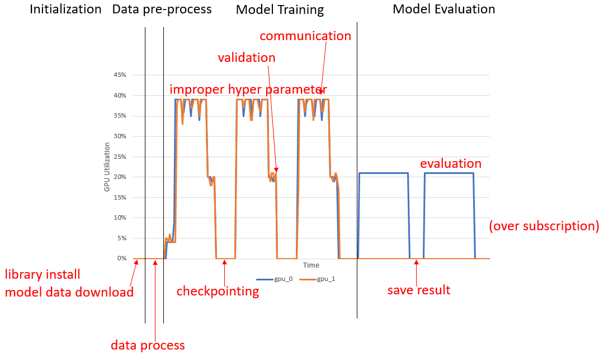
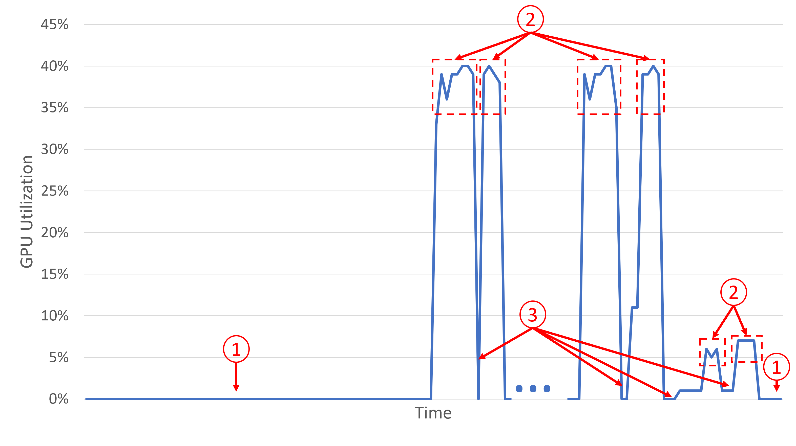
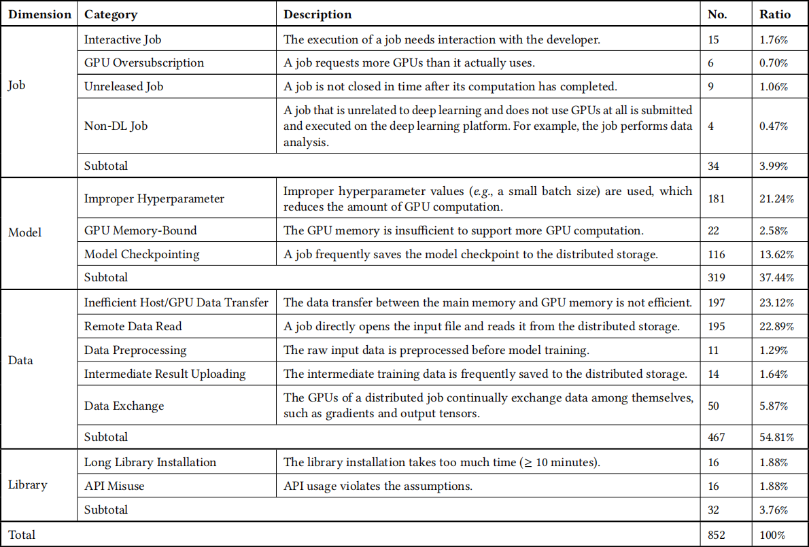

## An Empirical Study on Low GPU Utilization of Deep Learning Jobs

### Motivation

**Deep learning (DL)** has made remarkable achievements in many areas (such as natural language processing, gaming, and image recognition) and is playing a critical role in many intelligent software applications.

To facilitate efficient model training and testing, enterprises build shared, multi-tenant **platforms** (such as Amazon SageMaker, Microsoft Azure Machine Learning, and Google Cloud AI) for developers to submit and run their DL jobs.

These DL platforms are equipped with a large number of hardware accelerators dedicated to DL computation, among which **graphics processing units (GPUs)** are typically used.

As deep learning is computationally intensive, the **GPU utilization**, a measurement of the actual GPU computing time as a percentage of the GPU’s capacity, is an important indicator to the runtime performance of DL jobs.

Although we expect that DL jobs should fully utilize the computing resources, we actually notice that some of them exhibit rather **low utilization** of the allocated GPUs.

The low GPU utilization of DL jobs not only leads to a significant **waste** of precious platform resources (including GPUs, CPUs, main memory, network bandwidth, and storage) but also **reduces development productivity**. 

Therefore, it is important to understand **why** the DL jobs cannot utilize GPUs well and **how** to fix the problems.

### Background

From a developer’s perspective, the life cycle of a DL job is typically divided into the following four consecutive stages:

1. Initialization. The job customizes the execution environment on Platform-Y to keep the same as that on the developer’s local machine because of the apparent environmental differences . For example, many dependent libraries may be missing, especially when the developer specifies an official DL Docker image. Therefore, the startup Shell script must install them by either invoking the “pip” tool or cloning and building the source code.

2. Data preprocessing. This stage is usually for cleaning and augmenting the input data. Because the job continuously uses such large and remote data for a long time, it is a common practice for developers to download the data to the worker machines first.

3. Model training. In this stage, a DL model (*i.e.*, a layered data representation [10]) is firstly constructed with mathematical operations called *operators*, including, for example, Conv2d (2D convolution) and ReLU (rectified linear unit function). Then, model training is actually to update the weight parameters of operators iteratively until the model learning performance (*e.g.*, predictive accuracy) reaches our expectation. Once every several training iterations, the job may measure current learning performance in order to tune hyperparameter values or terminate early.

4. Model evaluation. After having finished the training, the job quantifies the final learning performance and outputs the trained model and evaluation results to the distributed storage.

### Methodology

Suppose that the job uses $N$ GPUs, and $𝑡$, $𝑡^′$ are its start and end time, respectively. Let $𝑡_𝑗$ be $K$ time points (1 ≤ $j$ ≤ $𝐾$ and $𝑡$ = $𝑡_0$ *<* $𝑡_1$ *<* · · · *<* $𝑡_K$ = $𝑡^′$ ) at which $u_{i,j}$, the current GPU utilization of the $i$-th GPU (1 ≤ $i$ ≤ $N$), is collected. Then, we calculate the overall GPU utilization of the $i$-th GPU (denoted by $U_i$) and the job (denoted by *$U$* ) as follows:
$$
U_{i\in[1,N]}=\frac{\sum_{j=1}^Ku_{i,j}\times(t_j-t_{(j-1)})}{t^′-t},U=\frac{\sum_{i=1}^NU_i}{N}
$$
We finally selected 400 jobs whose overall GPU utilization was less than or equal to 50%. The jobs were randomly chosen across all the job submitters, teams, clusters, and application areas. For each selected job, we also collected its related information for later investigation, including, for example, the job metadata, execution logs, various runtime metrics, scripts, and programs.

We studied the sequence of GPU utilization collected by Platform-Y at each stage. To better illustrate, we show a simplified time series chart of GPU utilization from a single-GPU job in Figure below, which includes only a few training and evaluation iterations for brevity. The X-axis denotes the time while the Y-axis expresses the GPU utilization as a percentage. We indeed observed three typical low-utilization patterns that appeared alternately from all the 400 jobs. The first pattern is that a GPU is idle at all; that is to say, the GPU utilization is always zero for a time, which is demonstrated by ①. The second is that although a GPU is in normal computation, but the GPU utilization generally remains at a low level, which is demonstrated by ②. The last one is that the GPU utilization suddenly drops severely (even to zero) for a while, which is demonstrated by ③. To determine all the temporal intervals matching the above mentioned patterns, we used the three-sigma-based anomaly detection plus manual inspection.

### Study Eesults

In this section, we present the classification of low GPU utilization by the root causes and describe the fixes. The 852 low-utilization issues found in 400 DL jobs are classified into 14 categories. We further group these categories into four high-level dimensions: Job, Model, Data, and Library.

