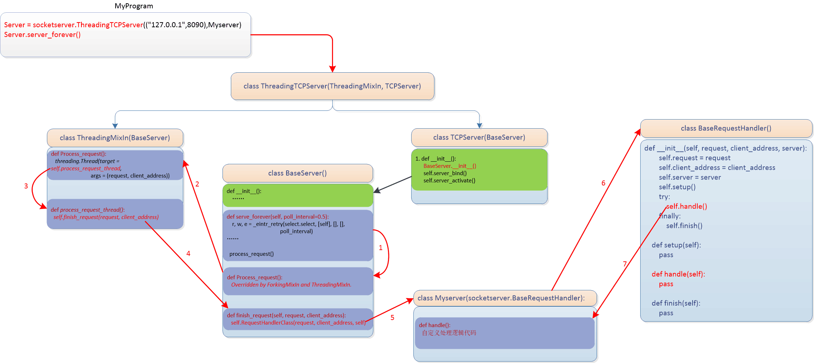

[返回首页](/)

# Html

```
https://www.cnblogs.com/yuanchenqi/articls/5976755.html
```

## 搭建一个简单的本地服务器

```python
import socket

def main():
    sock = socket.socket(socket.AF_INET, socket.SOCK_STREAM)
    sock.bind(('localhost',8089))
    sock.listen(5)

    while True:
        connection, address = sock.accept()
        buf = connection.recv(1024) # 最多一次获取1024字节
        connection.sendall(bytes("HTTP/1.1 201 OK\r\n\r\n","utf8"))
        connection.sendall(bytes("<h1>Hello,World</h1>","utf8"))
        connection.close()

if __name__ == '__main__':
    main()
```

客户端：

```python
import socket

client = socket.socket()
client.connect(('localhost',8089))
client.send(b'hello')
print(connection.recv(1024))
client.close()
```

### socket文件传输

```python
def send_file(action, filename):
    sock = socket.socket()
    filesize = os.path.getsize(filename)
    file_info = {
        "action": action,
        "filename": filename,
        "filesize": filename
    }
    file_info_json = json.dumps(file_info).encode("utf-8")
    json_len = struct.pack("i", len(file_info_json))
    sock.send(json_len) # file_info_json的打包长度(4字节)
    sock.send(file_info_json)
    with open(filename, "rb") as f:
        for line in f:
            sock.send(line)
```

```python
def recv_file():
    sock = socket.socket()
    conn, addr = sock.accept()
    json_len_pack = conn.recv(4) # file_info_json的打包长度
    json_len = struct.unpack("i", json_len_pack)[0]
    file_info_json = conn.recv(json_len).decode("utf-8")
    file_info = json.loads(file_info_json)
    action = file_info.get("action")
    filename = file_info.get("filename")
    filesize = file_info.get("filesize")
    with open(filename, "wb") as f:
        recv_data_len = 0
        while recv_data_len < filesize:
            data = conn.recv(1024)
            recv_data_len += len(data)
            f.write(data)
```

## socketserver模块

### server类

BaseServer(不直接对外服务)

TCPServer使用TCP协议

UDPServer使用UDP协议

UnixStreamServer和UnixDatagramServer，仅仅在unix环境下有用(AF_unix)。

```python
+------------+
| BaseServer |
+------------+
      |
      v
+-----------+         +------------------+
| TCPServer |-------->| UnixStreamServer |
+-----------+         +------------------+
      |
      v
+-----------+         +--------------------+
| UDPServer |-------->| UnixDatagramServer |
+-----------+         +--------------------+
```

### socketserver的流程图



### 单线程示例

```python
from socket import *

ip_port=('127.0.0.1',8888)
tcp_socket_server=socket()
tcp_socket_server.bind(ip_port)
tcp_socket_server.listen(5)

while True:
    conn, addr = tcp_socket_server.accept()
    print('客户端', addr)
    while True:
        client_data=conn.recv(1024)
        if len(client_data)==0:
            print("客户端断开连接，等待新的用户连接....")
            break
        print ("接受数据 >>>",str(client_data,"utf8"))
        response=input("响应数据 >>>")
        conn.sendall(bytes(response,"utf8"))
    conn.close()

import socket

ip_port = ('127.0.0.1',8888)
sock = socket.socket()
sock.connect(ip_port)
print ("客户端启动:")

while True:
    inp = input('发送数据 >>>')
    if inp == 'exit':
        break
    sock.sendall(bytes(inp,"utf8"))
    server_response=sock.recv(1024)
    print ("服务端响应数据 >>>",str(server_response,"utf8"))
sock.close()
```

### 并发示例

```python
import socketserver

class Myserver(socketserver.BaseRequestHandler):
    def handle(self):
        while True:
            client_data=self.request.recv(1024)
            if len(client_data)==0:
                print("客户端断开连接，等待新的用户连接....")
                break
            print ("接受数据 >>>",str(client_data,"utf8"))
            response=input("响应数据 >>>")
            self.request.sendall(bytes(response,"utf8"))
            self.request.close()
server = socketserver.ThreadingTCPServer(("127.0.0.1",8888), Myserver)
server.serve_forever()

import socket

ip_port = ('127.0.0.1',8888)
sock = socket.socket()
sock.connect(ip_port)
print ("客户端启动:")

while True:
    inp = input('发送数据 >>>')
    if inp == 'exit':
        break
    sock.sendall(bytes(inp,"utf8"))
    server_response=sock.recv(1024)
    print ("服务端响应数据 >>>",str(server_response,"utf8"))
sock.close()
```

## 标签

- 是由一对尖括号包裹的单词构成，例如: `<html>` 。所有标签中的单词不可能以数字开头。
- 标签**不区分大小写**，例如:`<html>` 和 `<HTML>`。推荐使用小写。

- 标签分为两部分: 开始标签`<a>` 和 结束标签`</a>`。两个标签之间的部分 我们叫做标签体。
- 有些标签功能比较简单.使用一个标签即可。这种标签叫做自闭和标签。例如: `<br/>` `<hr/>` `<input/>` ``
- 标签可以嵌套，但是不能交叉嵌套。`<a><b></a></b>`

## 标签的属性

- 通常是以键值对形式出现的，例如 `name="alex"`，`id="1"`。
- 属性只能出现在开始标签或自闭和标签中。
- 属性名字全部小写。属性值必须使用双引号或单引号包裹，例如 `name="alex"`。
- 如果属性值和属性名完全一样，直接写属性名即可，例如 `readonly`。

## 常用标签

### 基本标签

```html
<!DOCTYPE html>
<html lang="en">
  <head>
    <!-- name属性主要用于描述网页，与之对应的属性值为content，content中的内容主要是便于搜索引擎机器人查找信息和分类信息用的。 -->
    <meta name="keywords" content="meta总结,html meta,meta属性,meta跳转">
    <meta name="description" content="老男孩培训机构是由一个老的男孩创建的">
    <!-- 向浏览器传回一些有用的信息，以帮助正确和精确地显示网页内容，与之对应的属性值为content,content中的内容其实就是各个参数的变量值。 -->
    <meta http-equiv="Refresh" content="2;URL=https://www.baidu.com"><!--两秒后跳转到指定网站，无网址则刷新。-->
    <meta http-equiv="content-Type" charset="UTF8">
    <title>hyc2026</title>
    <link rel="icon" href="http://www.jd.com/favicon.ico">
    <link rel="stylesheet" href="css.css">
    <script src="hello.js"></script>　
    <style>
      div{
        color:#cc3399;
      }
    </style>
  </head>
  <body>
      <h1>标题</h1>...<h6>标题</h6>
      <p>段落(包裹的内容被换行,并且也上下内容之间有一行空白。)</p>
      <br>换行
      <hr>水平线
      <b>加粗</b>
      <em>斜体</em>
      <strike>删除线</strike>
      <del>删除线</del>
      <sup>上角标</sup>
      <sub>下角标</sub>
      <div style="color:red" class="div1 div2">块级标签</div>
      <span>内联标签(in-line)</span>
      &nbsp;&copy;&lt;&gt;
  </body>
</html>
```

+ 块级标签：`<p><h1><table><ol><ul><form><div>`

+ 内联标签：`<a><input><sub><sup><textarea><span>`

+ block（块）元素的特点
  + 总是在新行上开始；
  + 宽度缺省是它的容器的100%，除非设定一个宽度。
  + 它可以容纳内联元素和其他块元素

+ in-line元素的特点
  + 和其他元素都在一行上；
  + 宽度就是它的文字或图片的宽度，不可改变
  + 内联元素只能容纳文本或者其他内联元素

+ 特殊字符 `&lt; &gt; &quot; &copy; &reg;`

### 图形标签

```html

```

### 超链接标签

```html
<a href="http://www.baidu.com" title="悬浮标题">百度</a>
<a href="http://www.baidu.com" target="_blank">百度</a><!--新建标签页-->
<a href="#div1">1</a><!--锚: 跳转到指定标签(返回顶部功能)-->
```

### 列表标签

```html
<ul>
  <li>unordered list</li>
</ul>
<ol>
  <li>ordered list</li>
</ol>
<dl>
    <dt>列表标题</dt>
    <dd>列表项</dd>
</dl>
```

### 表单标签

**后端获取的是(name, value)键值对**

```html
<form method="get" action="url" >
  输入框：<input type="text" name="uesr"><br>
  密码：<input type="password" name="passwd"><br>
  <input type="button" value="js触发事件">
  复选框<input type="checkbox" name="框框" value="同一个name多个框时，传一个列表">
  <!-- name属性是给服务器看的 -->
  单选框<input type="radio" name="相同name只能选一个" value="1">
  上传文件<input type="file" enctype="multipart/form-data"><!--上传文件必须post-->
  <select name="sel" multiple size="3">
    <optgroup label="l1">
      <option value="1">op1</option>
      <option value="2">op1</option>
    </optgroup>
  </select>
  <textarea name="key" cols="5" row="5">text</textarea>
  <!-- 关联-->
  <label for="www">姓名</label>
  <input id="www" type="text">
  <input type="reset">
  <input type="submit" value="form数据提交">
  <textarea cols="50" rows="10" id="id" name="textarea">textarea</textarea>  
</form>
```

value属性是表单提交项的值，对于不同的输入类型，value属性的用法也不同：

+ type = "button"，"reset"，"submit" - 定义按钮上的显示的文本。

+ type = "text"，"password"，"hidden" -定义输入字段的初始值。

+ type = "checkbox"，"radio"，"image" - 定义与输入相关联的值，后端用。

checked:  radio 和 checkbox 默认被选中。
readonly: 只读， text 和 password。
disabled: 对所用input都好使。
placeholder: 输入框里的提示词。

**后端接收file：**

```python
file = request.FILES.get('file')
f = open(file.name, 'wb')
for chunk in file.chunks():
    f.write(chunk)
f.close()
```

### 表格标签

```html
<table border="1px" cellspacing="70" cellpadding="50px" width="30px">
    <!--cellpadding: 内边距; cellspacing: 外边距; width: 像素 百分比。-->
    <thead>
        <tr>
            <th>表头</th>
            <th colspan="3">表头</th>
        </tr>
    </thead>
    <tbody>
        <tr>
            <td>列1</td>
            <td rowspan="2">列2</td>
            <td>列3</td>
            <td>列4</td>
        </tr>
        <tr>
            <td>列1</td>
            <td>列3</td>
            <td>列4</td>
        </tr>
    </tbody>
</table>
```

**get:**

1. 提交的键值对.放在地址栏中`url`后面. 
2. 安全性相对较差.
3. 对提交内容的长度有限制.

**post:**

1. 提交的键值对 不在地址栏.
2. 安全性相对较高.
3. 对提交内容的长度理论上无限制.