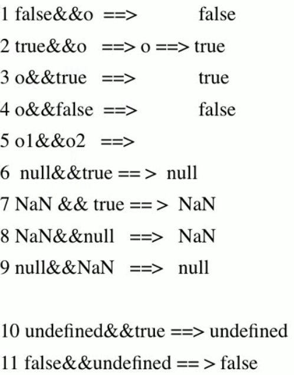

[返回首页](/)

# JavaScript

```
https://www.cnblogs.com/yuanchenqi/articls/5980312.html
```

## 概述与基础

一个完整的 JavaScript 实现是由以下 3 个不同部分组成的：

- 核心（ECMAScript） 
- 文档对象模型（DOM） Document object model (整合js，css，html)
- 浏览器对象模型（BOM） Broswer object model（整合js和浏览器）

JavaScript 在开发中绝大多数情况是基于对象的.也是面向对象的. 

ECMAScript 描述了以下内容：

- 语法 
- 类型 
- 语句 
- 关键字 
- 保留字 
- 运算符 
- 对象 (封装 继承 多态) 基于对象的语言.使用对象.

### JavaScript引入方式

```html
{#1 直接编写#}
    <script>
        alert('hello yuan')
    </script>
{#2 导入文件#}
    <script src="hello.js"></script>　　
```

建议放在`</body>`之前

## 变量

1. 变量是弱类型的(很随便)；

2. 声明变量时不用声明变量类型. 全都使用var关键字;

```javascript
var a;
```

3. 一行可以声明多个变量.并且可以是不同类型.

```javascript
var name="yuan", age=20, job="lecturer";
```

4. (了解) 声明变量时 可以不用var. 如果不用var 那么它是全局变量.

5. 变量命名,首字符只能是字母,下划线,$美元符 三选一，且区分大小写，x与X是两个变量

6. 变量还应遵守以下某条著名的命名规则：

```
Camel 标记法
首字母是小写的，接下来的字母都以大写字符开头。例如：
var myTestValue = 0, mySecondValue = "hi";
Pascal 标记法
首字母是大写的，接下来的字母都以大写字符开头。例如：
Var MyTestValue = 0, MySecondValue = "hi";
匈牙利类型标记法
在以 Pascal 标记法命名的变量前附加一个小写字母（或小写字母序列），说明该变量的类型。例如，i 表示整数，s 表示字符串，如下所示“
Var iMyTestValue = 0, sMySecondValue = "hi";
```

### 保留字

`break`、`case`、`catch`、`continue`、`default`、`delete`、`do`、`else`、`false`、`finally`、`for`、`function`、`if`、`in`、`instanceof`、`new`、`null`、`return`、`switch`、`this`、`throw`、`true`、`try`、`typeof`、`var`、`void`、`while`、`with`

## 基础规范

1. 每行结束可以不加分号. 没有分号会以换行符作为每行的结束

2. 注释 支持多行注释和单行注释. /* */ //

3. 使用{}来封装代码块

## 数据类型


### Number

整数、浮点数。String转化成Number失败时返回`NaN`

### String

unicode字符，数字，标点组成。支持转义。

### Boolean

true和false。if和while等的条件必须是boolean。

### Null

Null类型只有一个值：null。

### Undefined

Undefined 类型只有一个值：undefined。

### 数据类型转换

数字 + 字符串：数字转换为字符串

数字 + 布尔值：true转换为1，false转换为0

字符串 + 布尔值：布尔值转换为字符串true或false

函数parseInt：强制转换成整数   例如parseInt("6.12")=6; parseInt(“12a")=12 ; parseInt(“a12")=NaN; parseInt(“1a2")=1;

函数parseFloat：强制转换成浮点数  parseFloat("6.12")=6.12;

函数eval：将字符串强制转换为表达式并返回结果 eval("1+1")=2; eval("1<2")=true;

### 类型查询函数

函数typeof ：查询数值当前类型 (string / number / boolean / object )

例如typeof("test"+3)      "string"
例如typeof(null)          "object "
例如typeof(true+1)        "number"
例如typeof(true-false)    "number"

## 运算符

### 算数运算符

`+`、`-`、`*`、`/`、`%`、`++`、`--`

一元加减法

### 逻辑运算符

`==`、`!=`、`>`、`<`、`>=`、`<=`、`&&`、`||`、`!`

and运算符

- 如果某个运算数是 null，返回 null。 
- 如果某个运算数是 NaN，返回 NaN。 
- 如果某个运算数是 undefined，返回undefined。 



### 等性运算符

- 如果一个运算数是 Boolean 值，在检查相等性之前，把它转换成数字值。false 转换成 0，true 为 1。 
- 如果一个运算数是字符串，另一个是数字，在检查相等性之前，要尝试把字符串转换成数字。 
- 如果一个运算数是对象，另一个是字符串，在检查相等性之前，要尝试把对象转换成字符串。 
- 如果一个运算数是对象，另一个是数字，在检查相等性之前，要尝试把对象转换成数字。 

- 值 null 和 undefined 相等。 
- 在检查相等性时，不能把 null 和 undefined 转换成其他值。 
- 如果某个运算数是 NaN，等号将返回 false，非等号将返回 true。 
- 如果两个运算数都是对象，那么比较的是它们的引用值。如果两个运算数指向同一对象，那么等号返回 true，否则两个运算数不等。 


### 关系运算符

```
比较运算符两侧如果一个是数字类型,一个是其他类型,会将其类型转换成数字类型.
比较运算符两侧如果都是字符串类型,比较的是最高位的asc码,如果最高位相等,继续取第二位比较.
```

## 控制语句

### if语句

```javascript
if (表达式){
    语句1;
}else if{
    语句2;
}else{
    语句3;
}
```

### switch语句

```javascript
switch (表达式) {
    case 值1:语句1;break;
    case 值2:语句2;break;
    case 值3:语句3;break;
    default:语句4;
}
```

### for语句

```javascript
for (初始化;条件;增量){
    语句1;
}
```

### while语句

```javascript
while (条件){
	语句1;
}
```

### 异常处理

```javascript
try {
    //这段代码从上往下运行，其中任何一个语句抛出异常该代码块就结束运行
} catch (e) {
    // 如果try代码块中抛出了异常，catch代码块中的代码就会被执行。
    //e是一个局部变量，用来指向Error对象或者其他抛出的对象
} finally {
    //无论try中代码是否有异常抛出（甚至是try代码块中有return语句），finally代码块中始终会被执行。
}
```

## 对象

十一种内置对象：Array ,String , Date, Math, Boolean, Number, Function, Global, Error, RegExp , Object

- 由ECMAScript定义的本地对象.独立于宿主环境的 ECMAScript 实现提供的对象.(native object)
- ECMAScript 实现提供的、独立于宿主环境的所有对象，在 ECMAScript 程序开始执行时出现.这意味着开发者不必明确实例化内置对象，它已被实例化了。ECMA-262 只定义了两个内置对象，即 Global 和 Math （它们也是本地对象，根据定义，每个内置对象都是本地对象）。（built-in object）
- 所有非本地对象都是宿主对象（host object），即由 ECMAScript 实现的宿主环境提供的对象。所有 BOM 和 DOM 对象都是宿主对象。

**object对象**：ECMAScript 中的所有对象都由这个对象继承而来；Object 对象中的所有属性和方法都会出现在其他对象中。

+ ToString() : 返回对象的原始字符串表示。
+ ValueOf() : 返回最适合该对象的原始值。对于许多对象，该方法返回的值都与 ToString() 的返回值相同。

### String对象

```javascript
var str1="hello world";
var str1= new String("hello word");
str1.length //获取字符串长度
str1.toLowerCase(); //转小写
str1.toUpperCase(); //转大写
x.charAt(index) //索引处的字符
x.charCodeAt(index)  //索引处的字符编码
//x代表字符串对象
//regexp代表正则表达式或字符串
//match返回匹配字符串的数组，如果没有匹配则返回null
//search返回匹配字符串的首字符位置索引
x.match(regexp) //match返回匹配字符串的数组，如果没有匹配则返回null
x.search(regexp) //search返回匹配字符串的首字符位置索引
//截取字符串
x.substr(start, length)
x.slice(start, end)
//替换字符串
x.replace(findstr,tostr)
//分割字符串
x.split(",");
//连接字符串
y=x.concat(addstr)
```

### Function对象

```javascript
function func(para) {
    //function body;
    return ret;
}
var 函数名 = new Function("para_1", "para_n", "function_body");
func.length //函数参数个数
void() //阻拦return
```

#### 函数内置对象arguments

```javascript
function nxAdd(){
  var result=0;
  for (var num in arguments){
    result+=arguments[num]
  }
  alert(result)
}
function f(a,b,c){
  if (arguments.length!=3){
    throw new Error("function f called with "+arguments.length+" arguments,but it just need 3 arguments")
  } else {
    alert("success!")
  }
}
```

#### 匿名函数

```javascript
var func = function(arg){
  return "tony";
}

(function(){
  alert("tony");
} )()

(function(arg){
  console.log(arg);
})('123')
```

#### 作用域

```
https://www.cnblogs.com/wupeiqi/p/5649402.html
```

**JavaScript中无块级作用域**

**JavaScript采用函数作用域**

**声明提前**

**函数被调用之前，作用域链已经创建，与在哪里执行函数无关。**

```javascript
x='alex'
function f1() {
    var x='eric';
    function f2() {
        console.log(x);
    }
    return f2;
}
var f=f1()
f1()  //->'eric'
//========分割线========
x='alex'
function f1() {
    var x='eric';
    function f2() {
        console.log(x);
    }
    x='666'
    return f2;
}
var f=f1()
f1()  //->'666'
```

### Array对象

```javascript
var a=[1,2,3];
new Array(element0, element1, ..., elementn);
new Array();     //  创建数组时允许指定元素个数也可以不指定元素个数。
new Array(size); //if 1个参数且为数字,即代表size,not content
//二维数组
var cnweek=new Array(7);
for (var i=0;i<=6;i++){
  cnweek[i]=new Array(2);
}
a.length //数组长度
```


```javascript
//连接数组-join方法
//x代表数组对象
//bystr作为连接数组中元素的字符串
//返回连接后的字符串
//与字符串的split功能刚好相反
x.join(bystr) 
var arr1=[1, 2, 3, 4, 5, 6, 7];
var str1=arr1.join("-");
alert(str1); //结果为"1-2-3-4-5-6-7" 
//连接数组-concat方法
x.concat(value,...);
//颠倒数组元素
x.reverse();
//排序数组元素
x.sort()
//数组切片-slice
x.slice(start, end)
//删除子数组
//x代表数组对象
//splice的主要用途是对数组指定位置进行删除和插入
//start表示开始位置索引
//deleteCount删除数组元素的个数
//value表示在删除位置插入的数组元素
//value参数可以省略
x.splice(start, deleteCount, value, ...);
//数组的进出栈操作
x.push(value, ...)  //压栈
x.pop()             //弹栈   
//x代表数组对象
//value可以为字符串、数字、数组等任何值
//unshift是将value值插入到数组x的开始
//shift是将数组x的第一个元素删除
x.unshift(value,...)
x.shift()
```

### Date对象

```javascript
//方法1：不指定参数
var nowd1=new Date();
alert(nowd1.toLocaleString( )); //当前时间
//方法2：参数为日期字符串
var nowd2=new Date("2004/3/20 11:12");
alert(nowd2.toLocaleString( ));
var nowd3=new Date("04/03/20 11:12");
alert(nowd3.toLocaleString( ));
//方法3：参数为毫秒数
var nowd3=new Date(5000);
alert(nowd3.toLocaleString( )); //北京时间
alert(nowd3.toUTCString()); //零时区时间
//方法4：参数为年月日小时分钟秒毫秒
var nowd4=new Date(2004,2,20,11,12,0,300);
alert(nowd4.toLocaleString( ));
//毫秒并不直接显示
getDate()                 //获取日
getDay ()                 //获取星期
getMonth ()               //获取月（0-11）
getFullYear ()            //获取完整年份
getYear ()                //获取年
getHours ()               //获取小时
getMinutes ()             //获取分钟
getSeconds ()             //获取秒
getMilliseconds ()        //获取毫秒
getTime ()                //返回累计毫秒数(从1970/1/1午夜)
setDate(day_of_month)     //设置日
setMonth (month)          //设置月
setFullYear (year)        //设置年
setHours (hour)           //设置小时
setMinutes (minute)       //设置分钟
setSeconds (second)       //设置秒
setMillliseconds (ms)     //设置毫秒(0-999)
setTime (allms)           //设置累计毫秒(从1970/1/1午夜)
getTimezoneOffset()       //返回本地时间与GMT的时间差，以分钟为单位
toUTCString()             //返回国际标准时间字符串
toLocalString()           //返回本地格式时间字符串
Date.parse(x)             //返回累计毫秒数(从1970/1/1午夜到本地时间)
Date.UTC(x)               //返回累计毫秒数(从1970/1/1午夜到国际时间)
```

### RegExp对象

```javascript
var re=new RegExp("", "gi")
//参数1 正则表达式  参数2 验证模式  g global / i 忽略大小写. 
var re = /^[a-zA-Z][a-zA-Z0-9_]{5,11}$/g; // /填写正则表达式/匹配模式;
re.test(str)); //返回true or false
alert(str.match(/o/g)); //查找字符串中 复合正则的 内容.
alert(str.search(/h/g));// 0  查找字符串中符合正则表达式的内容位置
alert(str.split(/o/g)); // 按照正则表达式对字符串进行切割. 返回数组;
alert(str.replace(/o/g, "s")); // hells wsrld  对字符串按照正则进行替换.
```

### Math对象

```javascript
Math.PI
alert(Math.random());   // 获得随机数 0~1 不包括1.
alert(Math.round(1.5)); // 四舍五入
Math.max(1,2)
Math.min(1,2)
abs(x)                  //返回数的绝对值。
exp(x)                  //返回 e 的指数。
floor(x)                //对数进行下舍入。
log(x)                  //返回数的自然对数（底为e）。
pow(x,y)                //返回 x 的 y 次幂。
sin(x)                  //返回数的正弦。
sqrt(x)                 //返回数的平方根。
tan(x)                  //返回角的正切。
```

### BOM对象

BOM（浏览器对象模型），可以对浏览器窗口进行访问和操作。使用 BOM，开发者可以移动窗口、改变状态栏中的文本以及执行其他与页面内容不直接相关的动作。使 JavaScript 有能力与浏览器“对话”。

##### Window对象

所有浏览器都支持 window 对象。

+ 概念上讲.一个html文档对应一个window对象.
+ 功能上讲: 控制浏览器窗口的.
+ 使用上讲: window对象不需要创建对象,直接使用即可.

```javascript
alert()            //显示带有一段消息和一个确认按钮的警告框。
confirm()          //显示带有一段消息以及确认按钮和取消按钮的对话框。
prompt()           //显示可提示用户输入的对话框。
open()             //打开一个新的浏览器窗口或查找一个已命名的窗口。
close()            //关闭浏览器窗口。
setInterval()      //按照指定的周期（以毫秒计）来调用函数或计算表达式。
clearInterval()    //取消由 setInterval() 设置的 timeout。
setTimeout()       //在指定的毫秒数后调用函数或计算表达式。
clearTimeout()     //取消由 setTimeout() 方法设置的 timeout。
scrollTo()         //把内容滚动到指定的坐标。
```

**setInterval clearInterval**

```html
<input id="ID1" type="text" onclick="begin()">
<button onclick="end()">停止</button>
<script>
    function showTime(){
           var nowd2=new Date().toLocaleString();
           var temp=document.getElementById("ID1");
           temp.value=nowd2; //给input标签里的value属性赋值
    }
    var clock;
    function begin(){
        if (clock==undefined){
             showTime();
             clock=setInterval(showTime,1000);
        }
    }
    function end(){
        clearInterval(clock);
        clock=undefined;
    }
</script>
```

#### History对象

History 对象包含用户（在浏览器窗口中）访问过的 URL。

History 对象是 window 对象的一部分，可通过 window.history 属性对其进行访问。

```javascript
history.length     //返回浏览器历史列表中的 URL 数量。
history.back()     //加载 history 列表中的前一个 URL。
history.forward()  //加载 history 列表中的下一个 URL。
history.go()       //加载 history 列表中的某个具体页面。参数：int
```

#### Location对象

```javascript
location.assign(URL)     //
location.reload()        //
location.replace(newURL) //注意与assign的区别
```

### DOM对象

DOM 定义了访问 HTML 和 XML 文档的标准：

"W3C 文档对象模型（DOM）是中立于平台和语言的接口，它允许程序和脚本动态地访问和更新文档的内容、结构和样式。"

W3C DOM 标准被分为 3 个不同的部分：

- 核心 DOM - 针对任何结构化文档的标准模型
- XML DOM - 针对 XML 文档的标准模型
- HTML DOM - 针对 HTML 文档的标准模型

#### DOM结点

- 整个文档是一个文档节点(document对象)
- 每个 HTML 元素是元素节点(element 对象)
- HTML 元素内的文本是文本节点(text对象)
- 每个 HTML 属性是属性节点(attribute对象)
- 注释是注释节点(comment对象)

节点(自身)属性:

- attributes - 节点（元素）的属性节点
- nodeType – 节点类型
- nodeValue – 节点值
- nodeName – 节点名称
- innerHTML - 节点（元素）的文本值

导航属性:

- parentNode - 节点（元素）的父节点 (推荐)
- firstChild – 节点下第一个子元素
- lastChild – 节点下最后一个子元素
- childNodes - 节点（元素）的子节点 

```html
<div id="div1">
    <div id="div2"></div>
    <p>hello yuan</p>
</div>

<script>
    var div=document.getElementById("div2");
    console.log(div.nextSibling.nodeName);  //思考:为什么不是P?
</script>
```

导航属性：

```
parentElement             // 父节点标签元素
children                  // 所有子标签
firstElementChild         // 第一个子标签元素
lastElementChild          // 最后一个子标签元素
nextElementtSibling       // 下一个兄弟标签元素
previousElementSibling    // 上一个兄弟标签元素
```


页面查找：

- 通过使用 getElementById() 方法 
- 通过使用 getElementsByTagName() 方法 
- 通过使用 getElementsByClassName() 方法 
- 通过使用 getElementsByName() 方法 

局部查找：

```html
<div id="div1">
    <div class="div2">i am div2</div>
    <div name="yuan">i am div2</div>
    <div id="div3">i am div2</div>
    <p>hello p</p>
</div>

<script>
   var div1=document.getElementById("div1");
////支持;
//   var ele= div1.getElementsByTagName("p");
//   alert(ele.length);
////支持
//   var ele2=div1.getElementsByClassName("div2");
//   alert(ele2.length);
////不支持
//   var ele3=div1.getElementById("div3");
//   alert(ele3.length);
////不支持
//   var ele4=div1.getElementsByName("yuan");
//   alert(ele4.length)
</script>
```

全局四种，局部两种。

#### DOM事件

```
onclick        当用户点击某个对象时调用的事件句柄。
ondblclick     当用户双击某个对象时调用的事件句柄。
onfocus        元素获得焦点。练习：输入框。
onblur         元素失去焦点。应用场景：用于表单验证,用户离开某个输入框时,代表已经输入完了,我们可以对它进行验证。
onchange       域的内容被改变。应用场景：通常用于表单元素,当元素内容被改变时触发.（三级联动）
onkeydown      某个键盘按键被按下。应用场景: 当用户在最后一个输入框按下回车按键时,表单提交.
onkeypress     某个键盘按键被按下并松开。(keycode)
onkeyup        某个键盘按键被松开。
onload         一张页面或一幅图像完成加载。一般只给body添加。
onmousedown    鼠标按钮被按下。
onmousemove    鼠标被移动。
onmouseout     鼠标从某元素移开。
onmouseover    鼠标移到某元素之上。
onmouseleave   鼠标从元素离开
onselect       文本被选中。
onsubmit       确认按钮被点击。(前端验证，阻止提交event.preventDefault();)
```

绑定事件

```html
<!--方法一-->
<p onclick="func1(this)">hello</p>
<script>
    function func(self) {
        alert(self.innerHTML);
    }
</script>
<!--方法二-->
<p class="p">hello</p>
<script>
    var ele=document.getElementsByClassName("p")[0];
    ele.onlick=function(){
        alert(this.innerHTML);
    }
</script>
```

查看keyCode

```html
<input type="button" value="press" onkeydown="fun1(event)">

<script type="text/javascript">
    function fun1(e) {
        alert(e.keyCode);
    }
</script>
```

阻止事件传播

```html
<div id="abc_1" style="border:1px solid red;width:300px;height:300px;">
    <div id="abc_2" style="border:1px solid red;width:200px;height:200px;">
    </div>
</div>
<script type="text/javascript">
    document.getElementById("abc_1").onclick=function(){
        alert('111');
    }
    document.getElementById("abc_2").onclick=function(event){
        alert('222');
        event.stopPropagation(); //阻止事件向外层div传播.
    }
</script>
```

#### 增删改查

```javascript
//增
createElement(name); //创建元素
appendChild();       //将元素添加
//删
removeChild();       //获得要删除的元素->获得它的父元素->删除
//改
innerHTML            //修改innerHTML属性的值
setAttribute()       //修改属性
//查
//在第一个div中动态增加一个a标签. 该a标签点击之后跳转到百度首页.
function addNode(){
    //1.获得 第一个div
    var div = document.getElementById("div_1");
    //2.创建a标签  createElement==>创建一个a标签   <a></a>
    var eleA =  document.createElement("a");
    //3.为a标签添加属性 <a href="http://www.baidu.com"></a>
    eleA.setAttribute("href", "http://www.baidu.com");
    //4.为a标签添加内容 <a href="http://www.baidu.com">百度</a>
    eleA.innerHTML = "百度";    
    //5.将a标签添加到div中
    div.appendChild(eleA);
}
//点击后 删除div区域2
function deleteNode(){
    //1 获得要删除的div区域
    var div = document.getElementById("div_2");
    //2.获得父亲
    var parent = div.parentNode;
    //3 由父亲操刀 
    parent.removeChild(div);
}
//点击后 替换div区域3 为一个美女
function updateNode(){
    //1 获得要替换的div区域3
    var div = document.getElementById("div_3");
    //2创建img标签对象 
    var img = document.createElement("img");
    //3添加属性 
    img.setAttribute("src", "001.JPG");
    //4.获得父节点
    var parent = div.parentNode;
    //5.替换
    parent.replaceChild(img, div);
}
//点击后 将div区域4 克隆一份 添加到页面底部
function copyNode(){
    //1.获取要克隆的div
    var div = document.getElementById("div_4");
    //2.克隆 参数为true 那么克隆时克隆所有子元素. false 只克隆自己
    var div_copy = div.cloneNode(true);
    //3.获得父亲
    var parent = div.parentNode;
    //4.添加
    parent.appendChild(div_copy);
}
```

#### 修改HTML DOM

- 改变 HTML 内容 

​    改变元素内容的最简答的方法是修改属性`innerHTML` ，`innerText`。

​    `innerText`添加的标签不能被解析。

- 改变 CSS 样式 

```html
<p id="p2">Hello world</p>
<script>
    var ele=document.getElementById("p2");
    ele.style.color="blue";
    ele.style.fontSize=48px
</script>
```

- 改变 HTML 属性 

```
elementNode.setAttribute(name,value)
elementNode.getAttribute(name)
elementNode.value(DHTML) //?
```

- 创建新的 HTML 元素 

```
createElement(name)
```

- 删除已有的 HTML 元素 

```
elementNode.removeChild(node)
```

- 关于class的操作 

```
elementNode.className
elementNode.classList.add
elementNode.classList.remove  
```

## 实例

### 搜索框

```html
<input id="ID1" type="text" value="请输入用户名" onblur="Blurs()" onfocus="Focus()">
<script>
function Focus(){
    var input=document.getElementById("ID1");
    if (input.value=="请输入用户名"){
        input.value="";
    }
};
function Blurs(){
    var ele=document.getElementById("ID1");
    var val=ele.value;
    if(!val.trim()){
        ele.value="请输入用户名";
    }
}
</script>
```

### 模态对话框

```html
<!DOCTYPE html>
<html lang="en">
<head>
    <meta charset="UTF-8">
    <title>Title</title>
    <style>
        .back{
            background-color: rebeccapurple;
            height: 2000px;
        }
        .shade{
            position: fixed;
            top: 0;
            bottom: 0;
            left:0;
            right: 0;
            background-color: coral;
            opacity: 0.4;
        }
        .hide{
            display: none;
        }
        .models{
            position: fixed;
            top: 50%;
            left: 50%;
            margin-left: -100px;
            margin-top: -100px;
            height: 200px;
            width: 200px;
            background-color: gold;
        }
    </style>
</head>
<body>
<div class="back">
    <input id="ID1" type="button" value="click" onclick="action('show')">
</div>
<div class="shade hide"></div>
<div class="models hide">
    <input id="ID2" type="button" value="cancel" onclick="action('hide')">
</div>

<script>
    function action(act){
        var ele=document.getElementsByClassName("shade")[0];
        var ele2=document.getElementsByClassName("models")[0];
        if(act=="show"){
              ele.classList.remove("hide");
              ele2.classList.remove("hide");
        }else {
              ele.classList.add("hide");
              ele2.classList.add("hide");
        }
    }
</script>
</body>
</html>
```

### 全选反选取消

```html
<button onclick="select('all');">全选</button>
     <button onclick="select('cancel');">取消</button>
     <button onclick="select('reverse');">反选</button>
     <table border="1" id="Table">
         <tr>
             <td><input type="checkbox"></td>
             <td>111</td>
         </tr>
         <tr>
             <td><input type="checkbox"></td>
             <td>222</td>
         </tr>
         <tr>
             <td><input type="checkbox"></td>
             <td>333</td>
         </tr>
         <tr>
             <td><input type="checkbox"></td>
             <td>444</td>
         </tr>
     </table>

<script>
    function select(choice){
        var ele=document.getElementById("Table");
        var inputs=ele.getElementsByTagName("input");
        for (var i=0;i<inputs.length;i=i+1){
                var ele2=inputs[i];
            if (choice=="all"){
                ele2.checked=true;
            }else if(choice=="cancel"){
                ele2.checked=false;
            }
            else {
                if (ele2.checked){
                    ele2.checked=false;
                }else {
                    ele2.checked=true;
                }
            }
        }
    }
</script>
```

### 两级联动

```html
<select id="province">
    <option>请选择省:</option>
</select>
<select id="city">
    <option>请选择市:</option>
</select>

<script>
    data={"河北省":["廊坊","邯郸"],"北京":["朝阳区","海淀区"]};
    var p=document.getElementById("province");
    var c=document.getElementById("city");
    for(var i in data){
        var option_pro=document.createElement("option");
        option_pro.innerHTML=i;
        p.appendChild(option_pro);
    }
    p.onchange=function(){
         pro=(this.options[this.selectedIndex]).innerHTML;
         citys=data[pro];
         c.options.length=0;
         for (var i in citys){
             var option_city=document.createElement("option");
             option_city.innerHTML=citys[i];
             c.appendChild(option_city);
         }
    }
</script>
```
