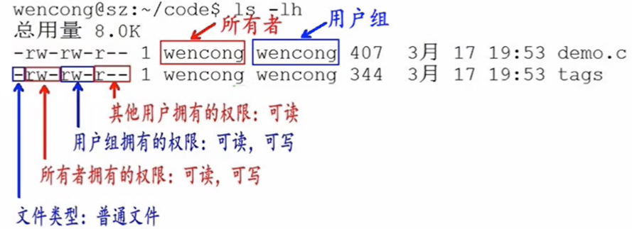

[返回首页](/)

# Linux基础

## 文件权限



第一个字母代表文件类型：`d`代表文件夹，`-`代表普通文件，`c`代表硬件字符设备，`b`代表硬件块设备，`s`代表管道文件，`l`代表软链接文件。

后九个字母分别代表三组权限：文件所有者、用户组和其他用户拥有的权限。

`r`代表read读权限，`w`代表write写权限，`x`代表executable可执行权限。

## 常用命令

### ls 查看文件信息

`-a`：显示指定目录下所有子目录与文件，包括隐藏文件。

`-l`：以列表的方式显示文件的详细信息。

`-h`：配合`-l`以人性化的方式显示文件大小。

### ps 查看进程信息

`-a`：显示终端上的所有进程，包括其同用户的进程。

`-u`：显示进程的详细状态。

`-x`：显示没有控制终端的进程。

`-w`：显示加宽，以便展示更多东西。

`-r`：只显示正在运行的东西。

### kill 杀死进程

`kill [-signal] PID`    kill -9 2026

### top 动态显示进程

`M`：根据内存使用量排序。

`P`：根据CPU占有率排序。

`T`：根据进程运行时间长短排序。

`U`：可以根据后面输入的用户名来筛选进程。

`K`：可以根据后面输入的PID来杀死进程。

`q`：退出。

`h`：获得帮助。

### grep 文本搜索

`grep [-选项] '搜索内容串' 文件名`

`-v`：显示不包含匹配文本行的所有串。

`-n`：显示匹配行及行号。

`-i`：忽略大小写。

### find 查找文件

`find 查找目录 选项 查找内容`

| 命令                        | 含义                                     |
| --------------------------- | ---------------------------------------- |
| find ./ -name test.sh       | 查找当前目录下所有名为test.sh的文件      |
| find ./ -name '*.sh'        | 查找当前目录下所有后缀为.sh的文件        |
| find ./ -name '[A-Z]*'      | 查找当前目录下所有以大小字母开头的文件   |
| find /tmp -size 2M          | 查找在/tmp 目录下文件大小为2M的文件      |
| find /tmp -size +2M         | 查找在/tmp 目录下文件大小大于2M的文件    |
| find /tmp -size -2M         | 查找在/tmp 目录下文件大小小于2M的文件    |
| find ./ -size +4k -size -5k | 查找当前目录下文件大小大于4k小于5k的文件 |
| find ./ -perm 0777          | 查找当前目录下权限为777的文件或目录      |

### tar 归档管理

`tar [参数] 打包文件名 文件`  打包：tar -cvf  解包：tar -xvf

`-c`：生成档案文件，创建打包文件。

`-v`：列出归档解档的详细过程，显示进度。

`-f`：指定档案文件名，f后面一定是.tar文件，所以必须放在选项最后。

`-t`：列出档案中包含的文件。

`-x`：解开归档文件。

`-z`：打包并压缩。

### gzip 文件压缩解压

`gzip [选项] 被压缩文件`

`-d`：解压。

`-r`：压缩所有子目录。

```
tar zcvf xxx.tar.gz *.py
tar zxvf xxx.tar.gz

tar jcvf xxx.tar.bz2 *.py
tar jxvf xxx.tar.bz2

zip xxx.zip *.py
unzip -d 解压后的文件夹xxx xxx.zip
```
### chmod 修改文件权限

字母法 `chmod u/g/o/a +/-/= rwx 文件`

`u`：user 表示该文件的所有者。

`g`：group 表示与该文件的所有者属于同一组。

`o`：other 其他人。

`a`：all 前三者全部。

`+`：增加权限。

`-`：撤销权限。

`=`：设定权限。

数字法 `chmod [0-7]*3 文件`

r->4 w->2 x->1

## 重定向、分屏和管道

`>`覆盖，`>>`追加。

信息过长无法在一屏上显示时，`more`命令每次只显示一页，按下空格显示下一页。

管道：一个命令的输出可以通过管道作为另一个命令的输出。`|`左边写东西，右边读东西。

## 其他功能

### 安装字体

```bash
sudo apt install ttf-mscorefonts-installer # 安装
sudo fc-cache # 生效

fc-match Arial # 查看Arial
fc-match Times # 查看Times New Roman

import matplotlib    
print(matplotlib.get_cachedir())

# rm -rf [cachedir] 清除缓存激活字体
```

### 监控gpu使用

`nvidia-smi`

### 连接服务器

.ssh/id_rsa.pub拷贝到服务器的~/.ssh/authorized_keys

authorized_keys的权限必须是644 (chmod 644 authorized_keys)

### 生成ssh key

`ssh-keygen -t rsa -C "your_email@example.com"` --> `~/.ssh/id_rsa.pub`


