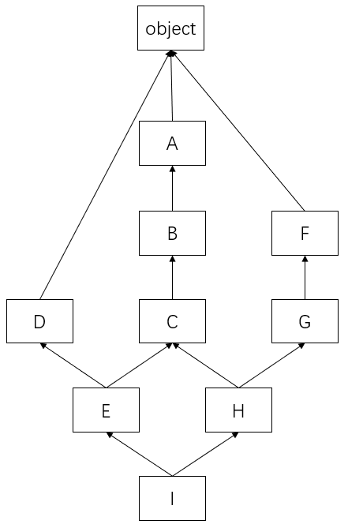

[返回首页](/)

# python

<span id="open"></span>

## 文件操作

`open(文件名(路径), mode="", encoding="字符集合")`

**模式**：`r`，`w`，`a`  

按字节读取，不能encoding`rb`，`wb`，`ab`  

先读后写，读光标位置，写在文件末尾`r+` 

先写后读，写完光标在最后，读不到东西(f.seek(0)将光标移动到开头)，少用，会清空内容`w+`

光标直接在最后，需要移动光标`a+`

**光标操作**：

`f.seek(offset[, whence])`

- **offset** -- 开始的偏移量，也就是代表需要移动偏移的字节数
- **whence：**可选，默认值为 0。给offset参数一个定义，表示要从哪个位置开始偏移；0代表从文件开头开始算起，1代表从当前位置开始算起，2代表从文件末尾算起。

`f.tell()`  返回光标位置

`f.truncate()`  从截断到光标位置或参数位置(没给参数)

## 函数

参数顺序：位置参数，*args，默认值参数，**kwargs  `f(a, *args, b=c, **kwargs)`

形参的\*用于打散，实参的\*用于聚合

`global`用来在函数或其他作用域中使用全局变量

`nonlocal`用来在函数或其他作用域中使用最近外层(非全局)变量，改变量必须之前使用过。

函数名是变量。

### 闭包

**闭包**可以保护变量不受侵害，可以让一个变量常驻内存

```python
def outer()
    a = 10
    def inner()
        print(a)
    return inner
fn = outer()
fn()
```

### 迭代器

**迭代器** 只能向前，节省内存

```python
s = 可迭代对象
it = s.__iter__()
print(it.__next__())
```

判断是否可迭代

"\_\_iter\_\_" in dir(it)

or

from collections import Iterable, Iterator
isinstance(it, Iterable)

### 生成器

**生成器**  惰性机制，只能向前，节省内存

```python
def func():
    a = yeild 1
    yeild 2
gen = func()
gen.__next__() # 第一个必须为__next__()
gen.send(1) # a的值为1
for i in func(): # 生成器可以迭代
    print(1)
```

函数中如果有yield，这个函数就是生成器函数。

func() 获取的是生成器，不执行函数。

yield相当于return，但不会彻底中断函数，分段执行函数。

send()与\_\_next\_\_()功能相同，还可以给上一个yield传值

### 列表推导式

**列表推导式**：用一句话生成一个列表

```python
lst = [i for i in range(1, 10)]
```

`[结果 for循环 判断]`

```python
dic = {i[0]:i[1] for i in enumerate(list)}
dic = {i:list[i] for i in range(len(list))}
dic = {v:k for k, v in dic.items()}
set = {i for i in list}
```

### 生成器表达式

**生成器表达式**  没有元祖推导式！！

```python
gen = (i for i in range(10))
gen.__next__()
```

### 内置函数

+ 面向对象相关(9)

+ 迭代器/生成器相关(3)
  + range(start, end, step)
  
    start：起始值(包括)；end：结束值(不包括)；step：步长

  + next(iterator[, default])：迭代器的下一个元素
  
    iterator：迭代器；default：可选，没有下一个元素时返回值
  
  + iter(iterable)：用于生成迭代器
  
    iterable：可迭代对象
  
+ 其他(12)
  + 字符串类型代码的执行(3)
    + eval：执行字符串类型的代码，并返回最终结果

    + exec：执行字符串类型的代码

    + compile(source, filename, mode)：将一个字符串编译为字节代码

      source：字符串或者AST(Abstract Syntax Trees)对象；filename：代码文件名称，如果不是从文件读取代码则传递一些可辨认的值；mode：指定编译代码的种类，可以指定为 exec, eval, single
  + 输入输出(2)
    + input
    + print
  + 内存相关(2)
    + hash(object)：获取对象的哈希值
    + id(object)：获取对象的内存地址
  + 文件操作相关(1)
    + open：见[文件操作](#open)相关内容
  + 模块相关(1)
    + \_\_import\_\_：用于动态加载类和函数
  + 帮助(1)
    + help([object])：查看帮助信息
  + 调用相关(1)
    + callable：是否可被调用
  + 查看内置属性(1)
    + dir([object])：获取对象的名字、属性或方法列表
+ 反射相关(4)
+ 基础数据类型相关(38)
  + 和数字相关(14)
    + 数据类型(4)
      + bool([x])
      
        x：可选，要转换的对象  bool([])->True bool({})->True bool()->False bool(0)->False bool(None)->False
      
      + int(x[, base])
      
        x：数字或字符串；base：进制数，默认为10
      
      + float(x)
      
      + complex：复数
    + 进制转换(3)
      + bin(x)：转换为二进制
      + oct(x)：转换为十进制
      + hex(x)：转换为十六进制
    + 数学运算(7)
      + abs(x)：求绝对值
      
      + divmod(x, y)：
      
        x：被除数；y：除数，不能为0
      
      + round(number[, ndigits])
      
        number：四舍五入的数值；ndigits：小数点后的位数
      
      + pow(x, y[, z])
      
        x：底数；y：指数，z：最结果取模
      
      + sum(iterable[, start])
      
        iterable：可迭代对象；start：指定相加的参数
      
      + min(iterable)
      
        iterable：可迭代对象
      
      + max(iterable)
      
        iterable：可迭代对象
  + 和数据结构相关(24)
    + 序列(13)
      + 列表和元祖(2)
        + list
        + tuple
      + 相关内置函数(2)
        + reversed(seq)：反转序列
        
        + slice(start, stop[, step])
        
          start：开始裁剪的位置；end：结束裁剪的位置；step：步长
      + 字符串(9)
        + str(object)：对象转换为字符串

        + format

          ```python
          format('test', '<20') # 左对齐
          format('test', '>20') # 右对齐
          format('test', '^20') # 居中
          format('11', 'b') # 二进制
          format('11', 'c') # 转换成Unicode字符
          format('11', 'd') # 十进制
          format('11', 'o') # 八进制
          format('11', 'x') # 十六进制(小写字母)
          format('11', 'X') # 十六进制(大写字母)
          format('11', 'n') # 十进制
          format(123456789, 'e') # 科学计数法，默认保留6位小数
          format(123456789, '0.2e') # 科学计数法，保留2位小数(小写)
          format(123456789, '0.2E') # 科学计数法，保留2位小数(大写)
          format(1.23456789, 'f') # 小数点计数法，保留6位小数
          format(1.23456789, '0.2f') # 小数点计数法，保留2位小数
          format(1.23456789, '0.10f') # 小数点计数法，保留10位小数
          format(1.23456789e+10000, 'F') # 小数点计数法
          ```

        + bytes([source[, encoding[, errors]]])

          source：整数、字符可迭代对象；encoding：字符编码；errors：错误处理方法

          ​	如果 source 为整数，则返回一个长度为 source 的初始化数组；

          ​	如果 source 为字符串，则按照指定的 encoding 将字符串转换为字节序列；

          ​	如果 source 为可迭代类型，则元素必须为[0 ,255] 中的整数；

          ​	如果 source 为与 buffer 接口一致的对象，则此对象也可以被用于初始化 bytearray。

        + bytearry([source[, encoding[, errors]]])

          source：整数、字符可迭代对象；encoding：字符编码；errors：错误处理方法

        + memoryview(object)：返回内存查看对象。

        + ord(c)：字符串转换为ASCII

        + chr(i)：ASCII转换为字符串

          i：十进制或十六进制形式

        + ascii(object)：返回ascii编码或Unicode编码

        + repr(object)：将对象转为可转义字符(原样输出，不转义)
    + 数据集合(3)
      + 字典(1)
        + dict
      + 集合(2)
        + set
        + frozenset
    + 相关内置函数(8)
      + len(s)：可迭代对象长度或个数
      
      + sorted(iterable, key=None, reverse=False)
      
        iterable：可迭代对象；key：可选，排序规则；reverse：可选，升序或降序
      
      + enumerate(iterable, start=0)：创建枚举对象
      
        iterable：一个序列、迭代器；start：下标起始值
      
      + all(iterable)：and，判断可迭代对象是否包括假值
      
      + any(iterable)：or，判断可迭代对象是否全为假值
      
      + zip(iterable1, iterable2, ...)：可迭代对象打包成元祖
      
      + fiter(function, iterable)：过滤序列
      
        function：判断的函数；iterable：可迭代对象
      
        对iterable每个元素使用function，返回True的保留，返回False的丢弃
      
      + map(function, iterable, ...)：函数操作可迭代对象
      
        对iterable每个元素使用function，生成结果的列表
+ 作用域相关(2)
  + locals：函数会以字典的类型返回当前位置的全部局部变量
  + globals：函数以字典的类型返回全部全局变量

### 匿名函数

```python
lambda 参数: 返回值  # __name__都为lambda
```

## 模块

```
https://www.cnblogs.com/Eva-J/articles/7292109.html
```

import加载的模块分为四个通用类别：　

1. 使用python编写的代码（.py文件）
2. 已被编译为共享库或DLL的C或C++扩展
3. 包好一组模块的包
4. 使用C编写并链接到python解释器的内置模块

### 模块的导入

#### import

```python
找到该模块
if(该模块未被导入):
    创建一个属于这个模块的命名空间
    让模块的名字指向这个命名空间
    执行这个模块中的代码
    
import 内置模块
import 第三方模块
import 自定义模块
```

#### from ... import

```python
找到该模块
if(该模块未被导入):
    创建一个属于这个模块的命名空间
    让模块的名字指向这个命名空间
    执行这个模块中的代码
找到要导入的变量
给要导入的变量创建一个引用，指向要导入的变量

from module import name as n
# from my_module import * 把my_module中所有的不是以下划线(_)开头的名字都导入到当前位置，该方法很有可能会覆盖掉你之前已经定义的名字，而且可读性极其的差。
__all__ = [] # 约束*导入的变量内容
```

### 模块的搜索路径

python解释器在启动时会自动加载一些模块，可以使用sys.modules查看

在第一次导入某个模块时（比如my_module），会先检查该模块是否已经被加载到内存中（当前执行文件的名称空间对应的内存），如果有则直接引用

如果没有，解释器则会查找同名的内建模块，如果还没有找到就从sys.path给出的目录列表中依次寻找my_module.py文件。

**所以总结模块的查找顺序是：内存中已经加载的模块->内置模块->sys.path路径中包含的模块**

在初始化后，python程序可以修改sys.path,路径放到前面的优先于标准库被加载。

```python
import sys
sys.path.append('/a/b/c/d')
sys.path.insert(0,'/x/y/z') # 排在前的目录，优先被搜索
```

```
https://www.cnblogs.com/Eva-J/articles/7228075.html
```

### re模块和正则表达式

正则表达式是对字符串操作的一种逻辑公式，就是用事先定义好的一些特定字符、及这些特定字符的组合，组成一个“规则字符串”，这个“规则字符串”用来表达对字符串的一种过滤逻辑。re模块是python提供的方便操作正则表达式的工具。

```
在线测试工具：http://tool.chinaz.com/regex/
```

#### 正则表达式

**字符组**：在同一个位置可能出现的各种字符组成了一个字符组，在正则表达式中用[]表示

[0-9]、[a-z]、[0-9a-fA-F]

**元字符**：

`.`：匹配除换行符以外的任意字符

`\w`：匹配字母或数字或下划线

`\s`：匹配任意的空白符

`\d`：匹配数字

`\n`：匹配一个换行符

`\t`：匹配一个制表符

`\b`：匹配一个单词的开头或结尾。

```
虽然通常英文的单词是由空格，标点符号或者换行来分隔的，但是 \b 并不匹配这些单词分隔字符中的任何一个，它只匹配一个隐式位置。一个前一个字符和后一个字符不全是(一个是,一个不是或不存在) \w 的位置。
例如 "BLACKPINK in your area"
正确的正则: \byour\b
第一个 \b 前面一个字符是空格，后面一个字符是 'y'，不全是 \w，所以可以匹配出 'y' 是一个单词的开头。第二个 \b 前面一个字符是 'r'，后面一个字符是空格，不全是 \w，可以匹配出 'r' 是一个单词的结尾。所以，合在一起，就能匹配出以 'y' 开头以 'r' 结尾的单词，这里就能匹配出 "your" 这个单词。
错误的正则: in\byour
\b 前面是字符 'n'，后面是字符 'y'，两个都是“显式字符”，显然违背了 \b 的含义，所以这就是个错误的表达式，匹配不出任何东西。想要匹配出 "in your"，正确的正则写法是：in\b.\byour（不能换行）
```

`^`：匹配字符串的开始

`$`：匹配字符串的结尾

`\W`：匹配非(字母或数字或下划线)

`\D`：匹配非数字

`\S`：匹配非空白符

`|`：a|b匹配字符a或字符b

`()`：匹配括号内的表达式，也表示一个组

`[...]`：匹配字符组中的字符

`[^...]`：匹配除了字符组中字符的所有字符

**量词**：

`*`：重复零次或更多次

`+`：重复一次或更多次

`?`：重复零次或一次

`{n}`：重复n次

`{n,}`：重复n次或更多次

`{n,m}`：重复n到m次

**贪婪匹配**：在满足匹配时，匹配尽可能长的字符串，默认情况下，采用贪婪匹配(回溯算法)

在量词后加问号则可转化为非贪婪匹配(惰性匹配)。

```
*? 重复任意次，但尽可能少重复
+? 重复1次或更多次，但尽可能少重复
?? 重复0次或1次，但尽可能少重复
{n,m}? 重复n到m次，但尽可能少重复
{n,}? 重复n次以上，但尽可能少重复
```

**flag**的使用

`re.I(IGNORECASE)`：忽略大小写
`re.M(MULTILINE)`：多行模式，改变^和$的行为
`re.S(DOTALL)`：点可以匹配任意字符，包括换行符
`re.L(LOCALE)`：做本地化识别的匹配，表示特殊字符集 \w, \W, \b, \B, \s, \S 依赖于当前环境，不推荐使用
`re.U(UNICODE)`：使用\w \W \s \S \d \D使用取决于unicode定义的字符属性。在python3中默认使用该flag
`re.X(VERBOSE)`：冗长模式，该模式下pattern字符串可以是多行的，忽略空白字符，并可以添加注释

#### re模块的使用

```python
import re

ret = re.findall('a', 'eva egon yuan')  # 返回所有满足匹配条件的结果，放在列表里
print(ret) #结果 : ['a', 'a']
ret = re.findall('www.(baidu|oldboy).com', 'www.oldboy.com')
print(ret)  # ['oldboy']     这是因为findall会优先把匹配结果组里内容返回，如果想要匹配结果，使用?:取消优先获取组的权限
ret = re.findall('www.(?:baidu|oldboy).com', 'www.oldboy.com')
print(ret)  # ['www.oldboy.com']

ret = re.search('a', 'eva egon yuan')
print(ret.group()) #结果 : 'a'
# 函数会在字符串内查找模式匹配，只到找到第一个匹配然后返回一个包含匹配信息的对象，该对象可以通过调用group()方法得到匹配的字符串，如果字符串没有匹配，则返回None。
ret = re.search('<(\w+)>(\w+)</(\w+)>', '<a>hello</a>')
print(ret.group(0)) # <a>hello</a> 所有的结果
print(ret.group(1)) # a 第一个分组
print(ret.group(2)) # hello
print(ret.group(3)) # a
ret = re.search("<(?P<tag_name>\w+)>\w+</(?P=tag_name)>","<h1>hello</h1>")
#还可以在分组中利用?P<name>的形式给分组起名字，?P=tag_name保证前后标签相同
#获取的匹配结果可以直接用group('名字')拿到对应的值
print(ret.group('tag_name'))  #结果 ：h1
print(ret.group())  #结果 ：<h1>hello</h1>

ret = re.match('a', 'abc')  # 同search，不过仅在字符串开始处进行匹配
print(ret.group()) #结果 : 'a'

ret = re.split('[ab]', 'abcd')  # 先按'a'分割得到''和'bcd'，在对''和'bcd'分别按'b'分割
print(ret)  # ['', '', 'cd']
ret=re.split("\d+","eva3egon4yuan")
print(ret) #结果 ： ['eva', 'egon', 'yuan']
ret=re.split("(\d+)","eva3egon4yuan")
print(ret) #结果 ： ['eva', '3', 'egon', '4', 'yuan']
#在匹配部分加上（）之后所切出的结果是不同的，没有（）的没有保留所匹配的项，但是有（）的却能够保留了匹配的项

ret = re.sub('\d', 'H', 'eva3egon4yuan4', 1)#将数字替换成'H'，参数1表示只替换1个
print(ret) #evaHegon4yuan4
ret = re.subn('\d', 'H', 'eva3egon4yuan4')#将数字替换成'H'，返回元组(替换的结果,替换了多少次)
print(ret)

obj = re.compile('\d{3}')  #将正则表达式编译成为一个正则表达式对象，在使用过程中不会多次编译
ret = obj.search('abc123eeee') #正则表达式对象调用search，参数为待匹配的字符串
print(ret.group())  #结果 ： 123

ret = re.finditer('\d', 'ds3sy4784a')   #finditer返回一个存放匹配结果的迭代器
print(ret)  # <callable_iterator object at 0x10195f940>
print(next(ret).group())  #查看第一个结果print(next(ret).group())  #查看第二个结果
print([i.group() for i in ret])  #查看剩余的左右结果
```

#### 爬虫练习

```python
import requests

import re
import json

def getPage(url):

    response=requests.get(url)
    return response.text

def parsePage(s):
    
    com=re.compile('<div class="item">.*?<div class="pic">.*?<em .*?>(?P<id>\d+).*?<span class="title">(?P<title>.*?)</span>'
                   '.*?<span class="rating_num" .*?>(?P<rating_num>.*?)</span>.*?<span>(?P<comment_num>.*?)评价</span>',re.S)

    ret=com.finditer(s)
    for i in ret:
        yield {
            "id":i.group("id"),
            "title":i.group("title"),
            "rating_num":i.group("rating_num"),
            "comment_num":i.group("comment_num"),
        }

def main(num):

    url='https://movie.douban.com/top250?start=%s&filter='%num
    response_html=getPage(url)
    ret=parsePage(response_html)
    print(ret)
    f=open("move_info7","a",encoding="utf8")

    for obj in ret:
        print(obj)
        data=json.dumps(obj,ensure_ascii=False)
        f.write(data+"\n")

if __name__ == '__main__':
    count=0
    for i in range(10):
        main(count)
        count+=25
```

### random模块

```python
import random
random.random()                 # 大于0且小于1之间的小数
random.uniform(1,3)             # 大于1小于3的小数
random.randint(1,5)             # 大于等于1且小于等于5之间的整数
random.randrange(1,10,2)        # 大于等于1且小于10之间的奇数
random.choice([1,'23',[4,5]])   # 1或者23或者[4,5]
random.sample([1,'23',[4,5]],2) # 列表元素任意2个组合
random.shuffle([1,3,5,7,9])     # 打乱次序
```

### time模块

在Python中，通常有这三种方式来表示时间：时间戳、元组(struct_time)、格式化的时间字符串：

1. 时间戳(timestamp) ：通常来说，时间戳表示的是从1970年1月1日00:00:00开始按秒计算的偏移量。运行“type(time.time())”，返回的是float类型。

2. 格式化的时间字符串(Format String)： ‘1999-12-06’

   ```
   %y 两位数的年份表示（00-99）
   %Y 四位数的年份表示（000-9999）
   %m 月份（01-12）
   %d 月内中的一天（0-31）
   %H 24小时制小时数（0-23）
   %I 12小时制小时数（01-12）
   %M 分钟数（00=59）
   %S 秒（00-59）
   %a 本地简化星期名称
   %A 本地完整星期名称
   %b 本地简化的月份名称
   %B 本地完整的月份名称
   %c 本地相应的日期表示和时间表示
   %j 年内的一天（001-366）
   %p 本地A.M.或P.M.的等价符
   %U 一年中的星期数（00-53）星期天为星期的开始
   %w 星期（0-6），星期天为星期的开始
   %W 一年中的星期数（00-53）星期一为星期的开始
   %x 本地相应的日期表示
   %X 本地相应的时间表示
   %Z 当前时区的名称
   %% %号本身
   ```
   
3. 元组(struct_time) ：struct_time元组共有9个元素共九个元素:(年, 月, 日, 时, 分, 秒, 一年中第几周, 一年中第几天, 是否是夏令时）
```python
import time
time.time() # 1500875844.800804

#时间字符串
time.strftime("%Y-%m-%d %X") # '2017-07-24 13:54:37'
time.strftime("%Y-%m-%d %H-%M-%S") # '2017-07-24 13-55-04'

#时间元组:localtime将一个时间戳转换为当前时区的struct_time
time.localtime()
time.struct_time(tm_year=2017, tm_mon=7, tm_mday=24, tm_hour=13, tm_min=59, tm_sec=37, tm_wday=0, tm_yday=205, tm_isdst=0)
```


```python
#时间戳-->结构化时间
#time.gmtime(时间戳)    #UTC时间，与英国伦敦当地时间一致
#time.localtime(时间戳) #当地时间。例如我们现在在北京执行这个方法：与UTC时间相差8小时，UTC时间+8小时 = 北京时间 
time.gmtime(1500000000)
# time.struct_time(tm_year=2017, tm_mon=7, tm_mday=14, tm_hour=2, tm_min=40, tm_sec=0, tm_wday=4, tm_yday=195, tm_isdst=0)
time.localtime(1500000000)
# time.struct_time(tm_year=2017, tm_mon=7, tm_mday=14, tm_hour=10, tm_min=40, tm_sec=0, tm_wday=4, tm_yday=195, tm_isdst=0)

#结构化时间-->时间戳　
#time.mktime(结构化时间)
time_tuple = time.localtime(1500000000)
time.mktime(time_tuple) # 1500000000.0

#结构化时间-->字符串时间
#time.strftime("格式定义","结构化时间")  结构化时间参数若不传，则显示当前时间
time.strftime("%Y-%m-%d %X") # '2017-07-24 14:55:36'
time.strftime("%Y-%m-%d",time.localtime(1500000000)) # '2017-07-14'

#字符串时间-->结构化时间
#time.strptime(时间字符串,字符串对应格式)
time.strptime("2017-03-16","%Y-%m-%d")
# time.struct_time(tm_year=2017, tm_mon=3, tm_mday=16, tm_hour=0, tm_min=0, tm_sec=0, tm_wday=3, tm_yday=75, tm_isdst=-1)
time.strptime("07/24/2017","%m/%d/%Y")
# time.struct_time(tm_year=2017, tm_mon=7, tm_mday=24, tm_hour=0, tm_min=0, tm_sec=0, tm_wday=0, tm_yday=205, tm_isdst=-1)

# 计算时间差
true_time=time.mktime(time.strptime('2017-09-11 08:30:00','%Y-%m-%d %H:%M:%S'))
time_now=time.mktime(time.strptime('2017-09-12 11:00:00','%Y-%m-%d %H:%M:%S'))
dif_time=time_now-true_time
struct_time=time.gmtime(dif_time)
print('过去了%d年%d月%d天%d小时%d分钟%d秒'%(struct_time.tm_year-1970, struct_time.tm_mon-1, struct_time.tm_mday-1, struct_time.tm_hour, struct_time.tm_min, struct_time.tm_sec))
```

### sys模块

sys模块是与python解释器交互的一个接口sys模块是与python解释器交互的一个接口

```python
sys.argv           # 命令行参数List，第一个元素是程序本身路径
sys.exit(n)        # 退出程序，正常退出时exit(0),错误退出sys.exit(1)
sys.version        # 获取Python解释程序的版本信息
sys.path           # 返回模块的搜索路径，初始化时使用PYTHONPATH环境变量的值
sys.platform       # 返回操作系统平台名称
sys.modules        # 导入内存的所有模块的名字
```

### os模块

 os模块是与操作系统交互的一个接口

```python
os.makedirs('dirname1/dirname2') # 可生成多层递归目录
os.removedirs('dirname1') # 若目录为空，则删除，并递归到上一级目录，如若也为空，则删除，依此类推
os.mkdir('dirname') # 生成单级目录；相当于shell中mkdir dirname
os.rmdir('dirname') # 删除单级空目录，若目录不为空则无法删除，报错；相当于shell中rmdir dirname
os.listdir('dirname') # 列出指定目录下的所有文件和子目录，包括隐藏文件，并以列表方式打印(相对路径)
os.remove() # 删除一个文件
os.rename("oldname","newname") # 重命名文件/目录
os.stat('path/filename') # 获取文件/目录信息
"""stat 结构:
st_mode: inode 保护模式
st_ino: inode 节点号。
st_dev: inode 驻留的设备。
st_nlink: inode 的链接数。
st_uid: 所有者的用户ID。
st_gid: 所有者的组ID。
st_size: 普通文件以字节为单位的大小；包含等待某些特殊文件的数据。
st_atime: 上次访问的时间。
st_mtime: 最后一次修改的时间。
st_ctime: 由操作系统报告的"ctime"。在某些系统上（如Unix）是最新的元数据更改的时间，在其它系统上（如Windows）是创建时间（详细信息参见平台的文档）。"""

os.system("bash command") # 运行shell命令，直接显示
os.popen("bash command").read() # 运行shell命令，获取执行结果
os.getcwd() # 获取当前工作目录，即当前python脚本工作的目录路径
os.chdir("dirname") # 改变当前脚本工作目录；相当于shell下cd

os.path
os.path.abspath(path) # 返回path规范化的绝对路径
os.path.split(path) # 将path分割成目录和文件名二元组返回 
os.path.dirname(path) # 返回path的目录。其实就是os.path.split(path)的第一个元素 
os.path.basename(path) # 返回path最后的文件名。如何path以／或\结尾，那么就会返回空值。即os.path.split(path)的第二个元素
os.path.exists(path) # 如果path存在，返回True；如果path不存在，返回False
os.path.isabs(path) # 如果path是绝对路径，返回True
os.path.isfile(path) # 如果path是一个存在的文件，返回True。否则返回False
os.path.isdir(path) # 如果path是一个存在的目录，则返回True。否则返回False
os.path.join(path1[, path2[, ...]]) # 将多个路径组合后返回，第一个绝对路径之前的参数将被忽略
os.path.getatime(path) # 返回path所指向的文件或者目录的最后访问时间
os.path.getmtime(path) # 返回path所指向的文件或者目录的最后修改时间
os.path.getsize(path) # 返回path的大小

os.sep # 输出操作系统特定的路径分隔符，win下为"\\",Linux下为"/"
os.linesep # 输出当前平台使用的行终止符，win下为"\r\n",Linux下为"\n"
os.pathsep # 输出用于分割文件路径的字符串 win下为;,Linux下为:
os.name # 输出字符串指示当前使用平台。win->'nt'; Linux->'posix'
```

### 序列化模块

序列化：将原本的字典、列表等内容转换成一个字符串的过程。

**序列化的目的**

1. 以某种存储形式使自定义对象持久化。

2. 将对象从一个地方传递到另一个地方。

3. 使程序更具维护性。

### json模块

json只支持字符串、列表、字典和数字；字典中的key只能是字符串

```python
import json
dic = {'k1':'v1','k2':'v2','k3':'v3'}
str_dic = json.dumps(dic)  # 序列化：将一个字典转换成一个字符串
print(type(str_dic),str_dic)  # <class 'str'> {"k3": "v3", "k1": "v1", "k2": "v2"} 注意，json转换完的字符串类型的字典中的字符串是由""表示的
dic2 = json.loads(str_dic)  # 反序列化：将一个字符串格式的字典转换成一个字典
#注意，要用json的loads功能处理的字符串类型的字典中的字符串必须由""表示
print(type(dic2),dic2)  # <class 'dict'> {'k1': 'v1', 'k2': 'v2', 'k3': 'v3'}
list_dic = [1,['a','b','c'],3,{'k1':'v1','k2':'v2'}]
str_dic = json.dumps(list_dic) # 也可以处理嵌套的数据类型 
print(type(str_dic),str_dic) # <class 'str'> [1, ["a", "b", "c"], 3, {"k1": "v1", "k2": "v2"}]
list_dic2 = json.loads(str_dic)
print(type(list_dic2),list_dic2) # <class 'list'> [1, ['a', 'b', 'c'], 3, {'k1': 'v1', 'k2': 'v2'}]

f = open('json_file','w')
dic = {'k1':'v1','k2':'v2','k3':'v3'}
json.dump(dic,f)  #dump方法接收一个文件句柄，直接将字典转换成json字符串写入文件
f.close()
f = open('json_file')
dic2 = json.load(f)  #load方法接收一个文件句柄，直接将文件中的json字符串转换成数据结构返回
f.close()
print(type(dic2),dic2)
```

**参数说明**

1. kipkeys：默认值是False，如果dict的keys内的数据不是python的基本类型(str,unicode,int,long,float,bool,None)，设置为False时，就会报TypeError的错误。此时设置成True，则会跳过这类key 
2. ensure_ascii：当它为True的时候，所有非ASCII码字符显示为\uXXXX序列，只需在dump时将ensure_ascii设置为False即可，此时存入json的中文即可正常显示。)
3. check_circular：If check_circular is false, then the circular reference check for container types will be skipped and a circular reference will result in an OverflowError (or worse). 
4. allow_nan：If allow_nan is false, then it will be a ValueError to serialize out of range float values (nan, inf, -inf) in strict compliance of the JSON specification, instead of using the JavaScript equivalents (NaN, Infinity, -Infinity). 
5. indent：应该是一个非负的整型，如果是0就是顶格分行显示，如果为空就是一行最紧凑显示，否则会换行且按照indent的数值显示前面的空白分行显示，这样打印出来的json数据也叫pretty-printed json 
6. separators：分隔符，实际上是(item_separator, dict_separator)的一个元组，默认的就是(‘,’,’:’)；这表示dictionary内keys之间用“,”隔开，而KEY和value之间用“：”隔开。 
7. default(obj)：default(obj) is a function that should return a serializable version of obj or raise TypeError. The default simply raises TypeError.
8. sort_keys：将数据根据keys的值进行排序。 

### pickle模块

pickle用于python特有的类型和python的数据类型间进行转换。

```python
import pickle
dic = {'k1':'v1','k2':'v2','k3':'v3'}
str_dic = pickle.dumps(dic)
print(str_dic)  #一串二进制内容

dic2 = pickle.loads(str_dic)
print(dic2)    #字典

import time
struct_time  = time.localtime(1000000000)
print(struct_time)
f = open('pickle_file','wb')
pickle.dump(struct_time,f)
f.close()

f = open('pickle_file','rb')
struct_time2 = pickle.load(f)
print(struct_time2.tm_year)
```

### hashlib模块

```python
import hashlib

obj = hashlib.md5(b'key') # md5加密
obj.update("admin".encode('utf-8'))
v = obj.hexdigest()
```

### logging模块

```python
import logging

logging.basicConfig(filename='log.log', format='%(asctime)s - %(name)s - %(levelname)s -%(module)s:  %(message)s', datefmt='%Y-%m-%d %H:%M:%S %p', level=30) # 只有【当前写等级】大于【日志等级】时，日志文件才被记录。

logging.debug('debug') # 10
logging.info('info') # 20
logging.warning('warning') # 30
logging.error('error') # 40
logging.critical('critical') # 50
logging.log(10,'log')
```

多文件日志，当使用logger1写日志时，会将相应的内容写入l1_1.log和l1_2.log文件中

```python
# 定义文件
file_1_1 = logging.FileHandler('l1_1.log', 'a', encoding='utf-8')
fmt = logging.Formatter(fmt="%(asctime)s - %(name)s - %(levelname)s -%(module)s:  %(message)s")
file_1_1.setFormatter(fmt)

file_1_2 = logging.FileHandler('l1_2.log', 'a', encoding='utf-8')
fmt = logging.Formatter()
file_1_2.setFormatter(fmt)

# 定义日志
logger1 = logging.Logger('s1', level=logging.ERROR)
logger1.addHandler(file_1_1)
logger1.addHandler(file_1_2)

# 写日志
logger1.critical('1111')
```

## 异常处理

### 常见异常

`AttributeError`：试图访问一个对象没有的属性，比如foo.x，但是foo没有属性x
`IOError`：输入/输出异常；基本上是无法打开文件
`ImportError`：无法引入模块或包；基本上是路径问题或名称错误
`IndentationError`：语法错误(的子类)；代码没有正确对齐
`IndexError`：下标索引超出序列边界，比如当x只有三个元素，却试图访问x[5]
`KeyError`：试图访问字典里不存在的键
`KeyboardInterrupt`：Ctrl+C被按下
`NameError`：使用一个还未被赋予对象的变量
`SyntaxError`：Python代码非法，代码不能编译(个人认为这是语法错误，写错了）
`TypeError`：传入对象类型与要求的不符合
`UnboundLocalError`：试图访问一个还未被设置的局部变量，基本上是由于另有一个同名的全局变量，导致你以为正在访问它
`ValueError`：传入一个调用者不期望的值，即使值的类型是正确的

### 异常处理

```python
try:
    被检测的代码块
except 异常类型:
    try中一旦检测到异常，就执行这个位置的逻辑
else:
    try中代码执行完毕没有发现异常，就执行这个位置的逻辑
finally:
    不管是否有异常，都会执行这个位置的逻辑
# try ... except
# try ... except ... else
# try ... finally
# try ... except ... finally
# try ... except ... else ... finally

except ValueError as e: # 处理指定异常
    print(e)
except Exception as e: # 万能异常
    print(e)
    
# 主动触发异常
try:
    raise TypeError('类型错误')
except Exception as e:
    print(e)

# 自定义异常
class EvaException(BaseException):
    def __init__(self,msg):
        self.msg=msg
    def __str__(self):
        return self.msg

try:
    raise EvaException('类型错误')
except EvaException as e:
    # 获取当前错误的堆栈信息
    logging.error(traceback.format_exc())
    print(e)
```

### 自定义异常

```python
class MyException(Exception):
    def __init__(self, code, msg):
        self.code = code
        self.msg = msg
try:
    # ...
    rase MyException(1000, "异常")
```

## 包

包是一种通过使用‘.模块名’来组织python模块名称空间的方式。

1. 无论是import形式还是from...import形式，凡是在导入语句中（而不是在使用时）遇到带点的，都要第一时间提高警觉：这是关于包才有的导入语法

2. 包是目录级的（文件夹级），文件夹是用来组成py文件（包的本质就是一个包含\_\_init\_\_.py文件的目录）

3. import导入文件时，产生名称空间中的名字来源于文件，import 包，产生的名称空间的名字同样来源于文件，即包下的\_\_init\_\_.py，导入包本质就是在导入该文件

python2中包下必须有\_\_init\_\_.py，创建包的目的不是为了运行，而是被导入使用，记住，包只是模块的一种形式而已，包即模块。

### 包的导入

1. 可用import和from ... import ...导入，在导入时都必须遵循一个原则：凡是在导入时带点的，点的左边都必须是一个包。
2. from ... import ...的import后不能带点。
3. 对比import item 和from item import name的应用场景：如果想直接使用name必须使用后者。
4. 导入包之后，不意味着包里的所有内容可使用，只是执行了包下的\_\_init\_\_.py文件。

#### 绝对导入和相对导入

```
https://www.bilibili.com/video/BV1u44114753?p=115&spm_id_from=pageDriver
https://www.cnblogs.com/Eva-J/articles/7292109.html
```

最顶级包glance是写给别人用的，然后在glance包内部也会有彼此之间互相导入的需求，这时候就有绝对导入和相对导入两种方式：

绝对导入：以glance作为起始

相对导入：用.或者..的方式最为起始（只能在一个包中使用，不能用于不同目录内）

**特别需要注意的是：可以用import导入内置或者第三方模块（已经在sys.path中），但是要绝对避免使用import来导入自定义包的子模块(没有在sys.path中)，应该使用from... import ...的绝对或者相对导入,且包的相对导入只能用from的形式。**

#### 绝对导入

在执行一个py脚本的时候，这个脚本以及和这个脚本统计的模块中只能用绝对导入。

所有的导入都要从一个根目录下往后解释文件夹之间的关系。

导入包的文件和被导入的包的位置关系发生变化，则所有init文件都要做出相应调整。

````
glance/                   
├── __init__.py      from glance import api
│                    from glance import cmd
│                    from glance import db
├── api                  
│   ├── __init__.py  from glance.api import policy
│   │                from glance.api import versions
│   ├── policy.py
│   └── versions.py
├── cmd            
│   ├── __init__.py  from glance.cmd import manage
│   └── manage.py
└── db
    ├── __init__.py  from glance.db import models
    └── models.py
````

#### 相对导入

只要一个包中所有文件的相对关系不变，则不需要修改路径；也不需要关心包与被执行文件之间的层级关系。

含有相对导入的文件不能直接执行。

```
glance/
├── __init__.py      from . import api  #.表示当前目录
│                    from . import cmd
│                    from . import db
├── api
│   ├── __init__.py  from . import policy
│   │                from . import versions
│   ├── policy.py
│   └── versions.py
├── cmd
│   ├── __init__.py  from . import manage
│   └── manage.py    from ..api import policy #..表示上一级目录   
└── db
    ├── __init__.py  from . import models
    └── models.py
```

**如果只是从包中导入模块，直接导入就行**：from urllib import request

**如果希望导入包时能顺便导入模块，则需要设计init文件**：import urllib

import glance后直接调用模块中的方法(不加glance.)

```
glance/                   
├── __init__.py       from .api import *
│                     from .cmd import *
│                     from .db import *    
├── api                  
│   ├── __init__.py   __all__ = ['policy','versions'] 
│   ├── policy.py
│   └── versions.py
├── cmd               __all__ = ['manage']    
│   ├── __init__.py
│   └── manage.py    
└── db                __all__ = ['models']              
    ├── __init__.py
    └── models.py

import glance
policy.get()
```

## 面向对象

```
https://www.cnblogs.com/wupeiqi/p/4493506.html
```

```python
class Foo:
    def __init__(self, name):
        delf.name = name
    def detail(self, msg=None):
        print(self.name, msg)
obj = Foo()
obj.detail()
```

### 面向对象三大特性

#### 封装

将内容封装到一个类中，将数据封装到一个对象中。使用对象调用被封装的内容。

#### 继承

```python
class father:
    def father_method(self):
        # do something
class child(father): # 子类继承父类
    pass
c = child() # 创建子类对象
c.father_method() # 执行从父类中继承的方法
```

**多继承**

+ 如果当前类或者父类继承了object类，那么该类便是新式类，否则便是经典类。(python3中只有新式类)

- 当类是经典类时，多继承情况下，会按照深度优先方式查找

  ```python
  class D:
      def bar(self):
          print 'D.bar'
  
  class C(D):
      def bar(self):
          print 'C.bar'
  
  class B(D):
      def bar(self):
          print 'B.bar'
  
  class A(B, C):
      def bar(self):
          print 'A.bar'
  
  a = A()
  # 执行bar方法时
  # 首先去A类中查找，如果A类中没有，则继续去B类中找，如果B类中么有，则继续去D类中找，如果D类中么有，则继续去C类中找，如果还是未找到，则报错
  # 所以，查找顺序：A --> B --> D --> C
  # 在上述查找bar方法的过程中，一旦找到，则寻找过程立即中断，便不会再继续找了
  a.bar()
  ```

- 当类是新式类时，多继承情况下，会按照广度优先方式查找(c3算法)

  ```python
  class D(object):
      def bar(self):
          print 'D.bar'
  
  class C(D):
      def bar(self):
          print 'C.bar'
  
  class B(D):
      def bar(self):
          print 'B.bar'
  
  class A(B, C):
      def bar(self):
          print 'A.bar'
  
  a = A()
  # 执行bar方法时
  # 首先去A类中查找，如果A类中没有，则继续去B类中找，如果B类中么有，则继续去C类中找，如果C类中么有，则继续去D类中找，如果还是未找到，则报错
  # 所以，查找顺序：A --> B --> C --> D
  # 在上述查找bar方法的过程中，一旦找到，则寻找过程立即中断，便不会再继续找了
  a.bar()
  ```

**c3算法**

MRO是一个有序列表L，在类被创建时就计算出来。
$$
L(Child(Base1，Base2)) = [ Child + merge( L(Base1) , L(Base2))]\\
L(object) = [ object ]
$$
L的性质：结果为列表，列表中至少有一个元素即类自己。

\+的性质：添加到列表的末尾，即 [ A + B ] = [ A，B ]

merge： 

1. 如果列表空则结束，非空读merge中第一个列表的表头
2. 查看该表头是否在 merge中所有列表的表尾中。
   3. 不在，则放入最终的L中，并从merge中的所有列表中删除，然后回到1中
   4. 在，查看 当前列表是否是merge中的最后一个列表
      5. 不是 ，跳过当前列表，读merge中下一个列表的表头，然后 回到 ②中
      6. 是，异常。类定义失败。 

表头：列表的第一个元素

表尾：列表中表头以外的元素集合

merge简单的说即寻找合法表头（也就是不在表尾中的表头），如果所有表中都未找到合法表头则异常。



$$\begin{aligned} L(E) &= [E, D, C, B, A, object] \\ L(H) &= [H, C, B, A, G, F, object] \\ L(I) &= L(I(E, H)) = [I, merge(L(E), L(H))] \\ merge(L(E), L(H)) &= merge([E, D, C, B, A, object], [H, C, B, A, G, F, object]) \\&= E + merge([D, C, B, A, object], [H, C, B, A, G, F, object]) \\&= E + D + merge([C, B, A, object], [H, C, B, A, G, F, object]) \\&= E + D + H + merge([C, B, A, object], [C, B, A, G, F, object]) \\&= E + D + H + C + merge([B, A, object], [B, A, G, F, object]) \\&= E + D + H + C + B + merge([A, object], [A, G, F, object]) \\&= E + D + H + C + B + A + merge([object], [G, F, object])  \\&= E + D + H + C + B + A + G + F + object \\ L(I) &=[I, E, D, H, C, B, A, G, F, object]\end{aligned} $$


#### 多态

```python
class F1:
    pass

class S1(F1):
    def show(self):
        print 'S1.show'

class S2(F1):
    def show(self):
        print 'S2.show'

def Func(obj):
    print obj.show()

s1_obj = S1()
Func(s1_obj) 
s2_obj = S2()
Func(s2_obj)
```

### 类的成员

类的成员可以分为三大类：字段、方法和属性

所有成员中，只有普通字段的内容保存对象中，即：根据此类创建了多少对象，在内存中就有多少个普通字段。而其他的成员，则都是保存在类中，即：无论对象的多少，在内存中只创建一份。

#### 字段

字段包括普通字段和静态字段，他们在定义和使用中有所区别，而最本质的区别是内存中保存的位置不同

+ 普通字段属于对象
+ 静态字段属于类

```python
class Province:
    # 静态字段
    country ＝ '中国'

    def __init__(self, name):
        # 普通字段
        self.name = name

# 直接访问普通字段，普通字段需要通过对象来访问
obj = Province('河北省')
print obj.name
# 直接访问静态字段，静态字段通过类访问
Province.country
```

#### 方法

方法包括：普通方法、静态方法和类方法，三种方法在内存中都归属于类，区别在于调用方式不同。

- 普通方法：由对象调用；至少一个self参数；执行普通方法时，自动将调用该方法的对象赋值给*self
- 类方法：由类调用； 至少一个cls参数；执行类方法时，自动将调用该方法的类复制给cls
- 静态方法：由类调用；无默认参数

```python
class Foo:

    def __init__(self, name):
        self.name = name

    def ord_func(self):
        """ 定义普通方法，至少有一个self参数 """
        # print self.name
        print '普通方法'

    @classmethod
    def class_func(cls):
        """ 定义类方法，至少有一个cls参数 """
        print '类方法'

    @staticmethod
    def static_func():
        """ 定义静态方法 ，无默认参数"""
        print '静态方法'

# 调用普通方法
f = Foo()
f.ord_func()
# 调用类方法
Foo.class_func()
# 调用静态方法
Foo.static_func()
```

**方法和函数**

```
对象.xxx --> xxx就是方法
类.xxx   --> xxx就是函数
xxx      --> xxx就是函数
from types import MethodType, FunctionType
```

#### 属性

- 定义时，在普通方法的基础上添加@property装饰器；
- 定义时，属性仅有一个self参数
- 调用时，无需括号
        方法：foo_obj.func()
        属性：foo_obj.prop

属性存在意义是：访问属性时可以制造出和访问字段完全相同的假象，属性由方法变种而来，如果Python中没有属性，方法完全可以代替其功能。

属性的两种定义方式：装饰器和静态字段。

##### 装饰器

在类的普通方法上应用@property装饰器。

经典类，具有一种@property装饰器

```python
class Goods:
    @property
    def price(self):
        return "wupeiqi"

obj = Goods()
result = obj.price  # 自动执行@property修饰的price方法，并获取方法的返回值
```

新式类，具有三种@property装饰器

```python
class Goods(object):
    @property
    def price(self):
        print '@property'

    @price.setter
    def price(self, value):
        print '@price.setter'

    @price.deleter
    def price(self):
        print '@price.deleter'

obj = Goods()
obj.price        # 自动执行@property修饰的price方法，并获取方法的返回值
obj.price = 123  # 自动执行@price.setter修饰的price方法，并将123赋值给方法的参数
del obj.price    # 自动执行@price.deleter修饰的price方法
```

##### 静态字段

创建值为property对象的静态字段

```python
class Foo：
    def get_bar(self):
        return 'wupeiqi'

    # *必须两个参数
    def set_bar(self, value): 
        return return 'set value' + value

    def del_bar(self):
        return 'wupeiqi'

    BAR ＝ property(get_bar, set_bar, del_bar, 'description...')

obj = Foo()
obj.BAR              # 自动调用第一个参数中定义的方法：get_bar
obj.BAR = "alex"     # 自动调用第二个参数中定义的方法：set_bar方法，并将“alex”当作参数传入
del Foo.BAR          # 自动调用第三个参数中定义的方法：del_bar方法
obj.BAE.__doc__      # 自动获取第四个参数中设置的值：description...
```

property的构造方法中有个四个参数

- 第一个参数是**方法名**，调用 `对象.属性` 时自动触发执行方法
- 第二个参数是**方法名**，调用 `对象.属性 ＝ XXX` 时自动触发执行方法
- 第三个参数是**方法名**，调用 `del 对象.属性` 时自动触发执行方法
- 第四个参数是**字符串**，调用 `对象.属性.__doc__` ，此参数是该属性的描述信息

#### 主动调用其他类的成员

```python
class Base(object):
    def f1(self):
        print('5个功能')
class Foo(Base):
    def f1(Self):
        """
        Base.f1(self) # 与继承关系无关
        super().f1() # 必须有继承关系
        """
        print('三个功能')
obj = Foo()
obj.f1()
```

**super按照执行顺序找下一个**

```python
class Foo(object):
    def f1(self):
        super().f1()
        print('Foo')
class Bar(object):
    def f1(self):
        print('Bar')
class Info(Foo, Bar):
    pass
obj = Info()
obj.f1()
```

Foo没有父类，但是super能执行，按继承顺序执行Bar的f1()

### 类成员的修饰符

对于每一个类的成员而言都有两种形式：

- 公有成员，在任何地方都能访问
- 私有成员，只有在类的内部才能方法

私有成员命名时，前两个字符是下划线。

私有成员和公有成员的访问限制不同：

+ 静态字段
  + 公有静态字段：类可以访问；类内部可以访问；派生类中可以访问
  + 私有静态字段：仅类内部可以访问；

+ 普通字段
  + 公有普通字段：对象可以访问；类内部可以访问；派生类中可以访问
  + 私有普通字段：仅类内部可以访问；

### 类的特殊成员

`__doc__`：表示类的描述信息

`__module__ `：表示当前操作的对象在哪个模块

`__class__ `：表示当前操作的对象的类是什么

`__new__`、`__init__ `：new创建空对象，init对空对象进行初始化

```python
class Foo(object):
    def __init__(self, a):
        self.a = a
    def __new__(cls, *args, **kwargs):
        return object.__new__(cls)
```

`__del__ `：析构方法，当对象在内存中被释放时，自动触发执行。此方法一般无须定义，因为Python是一门高级语言，程序员在使用时无需关心内存的分配和释放，因为此工作都是交给Python解释器来执行，所以，析构函数的调用是由解释器在进行垃圾回收时自动触发执行的

`__call__ `：对象后面加括号，触发执行，即：对象()或者类()()

`__dict__ `：类或对象中的所有成员

`__str__ `：如果一个类中定义了\_\_str\_\_方法，那么在打印对象时，默认输出该方法的返回值。

`__setitem__ `、`__getitem__ `、`__delitem__`：用于索引操作

`__getslice__`、`__setslice__`、`__delslice__`：用于分片操作

`__iter__ `：用于迭代器

`__add__ `：用于两个对象相加(所有运算符都有与之对应的方法)

`__enter__ `、`__exit__`：配合with语法使用，enter的返回值赋值给`with ... as f`的f

### 反射

`getattr(obj, "s")`：根据字符串去对象中寻找与之同名的成员。

```python
f1 = getattr(Clazz, "s") # 获取类函数
f1(self)
f2 = getattr(self, "s") # 获取对象方法
f2()
```

`hasattr`：判断是否有某成员

`setattr`：设置成员(字段、方法)

`delattr`：删除某成员

### 约束

+ 抽象类+抽象方法
+ 人为主动抛出异常`NotImplementedError("该方法必须被重写")`

## 补充

### 小数据池

小数据池字面值相同用`is`返回True

数字：-5~256

字符串中如果有特殊字符，内存的值就不同

### 软件开发规范

```
.soft
|-- bin
|   `-- start.py            项目的启动脚本
|-- conf                    配置文件
|   |-- config.ini
|   |-- my_log_settings.py
|   `-- settings.py
|-- core                    核心代码
|   `-- core.py
|-- db
|   `-- data.json
|-- lib                     非内置模块或第三方模块，功能较完善可在很多项目中使用
|   `-- read_ini.py
`-- log
    `-- logs.log
```

### 字符串&编码

+ py2
  + s = u"root" 本质上用unicode存储(万国码)
  + s = "root"  本质上用字节存储
  + 编码：默认ascii，可用头文件修改 #-\*- encoding:utf-8 -\*-
+ py3
  + s = "root" 本质上用unicode存储(万国码)
  + s = b"root"  本质上用字节存储
  + 编码：默认utf-8

 
