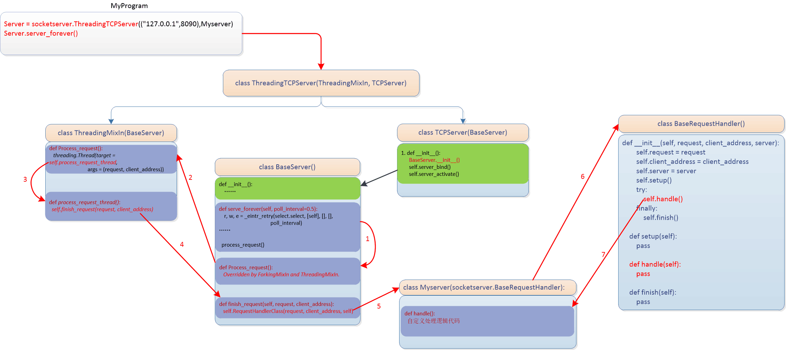

# 网络编程

## 搭建一个简单的本地服务器

```python
import socket

def main():
    sock = socket.socket(socket.AF_INET, socket.SOCK_STREAM)
    sock.bind(('localhost',8089))
    sock.listen(5)

    while True:
        connection, address = sock.accept()
        buf = connection.recv(1024) # 最多一次获取1024字节
        connection.sendall(bytes("HTTP/1.1 201 OK\r\n\r\n","utf8"))
        connection.sendall(bytes("<h1>Hello,World</h1>","utf8"))
        connection.close()

if __name__ == '__main__':
    main()
```

客户端：

```python
import socket

client = socket.socket()
client.connect(('localhost',8089))
client.send(b'hello')
print(connection.recv(1024))
client.close()
```

### socket文件传输

```python
def send_file(action, filename):
    sock = socket.socket()
    filesize = os.path.getsize(filename)
    file_info = {
        "action": action,
        "filename": filename,
        "filesize": filename
    }
    file_info_json = json.dumps(file_info).encode("utf-8")
    json_len = struct.pack("i", len(file_info_json))
    sock.send(json_len) # file_info_json的打包长度(4字节)
    sock.send(file_info_json)
    with open(filename, "rb") as f:
        for line in f:
            sock.send(line)
```

```python
def recv_file():
    sock = socket.socket()
    conn, addr = sock.accept()
    json_len_pack = conn.recv(4) # file_info_json的打包长度
    json_len = struct.unpack("i", json_len_pack)[0]
    file_info_json = conn.recv(json_len).decode("utf-8")
    file_info = json.loads(file_info_json)
    action = file_info.get("action")
    filename = file_info.get("filename")
    filesize = file_info.get("filesize")
    with open(filename, "wb") as f:
        recv_data_len = 0
        while recv_data_len < filesize:
            data = conn.recv(1024)
            recv_data_len += len(data)
            f.write(data)
```

## socketserver模块

### server类

BaseServer(不直接对外服务)

TCPServer使用TCP协议

UDPServer使用UDP协议

UnixStreamServer和UnixDatagramServer，仅仅在unix环境下有用(AF_unix)。

```python
+------------+
| BaseServer |
+------------+
      |
      v
+-----------+         +------------------+
| TCPServer |-------->| UnixStreamServer |
+-----------+         +------------------+
      |
      v
+-----------+         +--------------------+
| UDPServer |-------->| UnixDatagramServer |
+-----------+         +--------------------+
```

### socketserver的流程图



### 单线程示例

```python
from socket import *

ip_port=('127.0.0.1',8888)
tcp_socket_server=socket()
tcp_socket_server.bind(ip_port)
tcp_socket_server.listen(5)

while True:
    conn, addr = tcp_socket_server.accept()
    print('客户端', addr)
    while True:
        client_data=conn.recv(1024)
        if len(client_data)==0:
            print("客户端断开连接，等待新的用户连接....")
            break
        print ("接受数据 >>>",str(client_data,"utf8"))
        response=input("响应数据 >>>")
        conn.sendall(bytes(response,"utf8"))
    conn.close()

import socket

ip_port = ('127.0.0.1',8888)
sock = socket.socket()
sock.connect(ip_port)
print ("客户端启动:")

while True:
    inp = input('发送数据 >>>')
    if inp == 'exit':
        break
    sock.sendall(bytes(inp,"utf8"))
    server_response=sock.recv(1024)
    print ("服务端响应数据 >>>",str(server_response,"utf8"))
sock.close()
```

### 并发示例

```python
import socketserver

class Myserver(socketserver.BaseRequestHandler):
    def handle(self):
        while True:
            client_data=self.request.recv(1024)
            if len(client_data)==0:
                print("客户端断开连接，等待新的用户连接....")
                break
            print ("接受数据 >>>",str(client_data,"utf8"))
            response=input("响应数据 >>>")
            self.request.sendall(bytes(response,"utf8"))
            self.request.close()
server = socketserver.ThreadingTCPServer(("127.0.0.1",8888), Myserver)
server.serve_forever()

import socket

ip_port = ('127.0.0.1',8888)
sock = socket.socket()
sock.connect(ip_port)
print ("客户端启动:")

while True:
    inp = input('发送数据 >>>')
    if inp == 'exit':
        break
    sock.sendall(bytes(inp,"utf8"))
    server_response=sock.recv(1024)
    print ("服务端响应数据 >>>",str(server_response,"utf8"))
sock.close()
```

