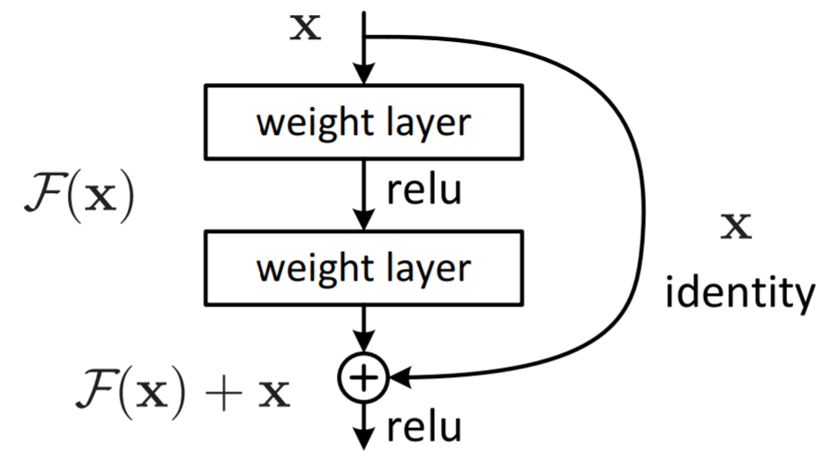
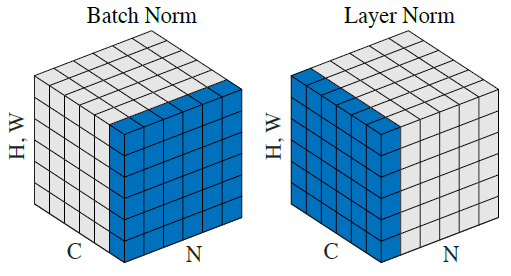

# Attention is All You Need

Transformer 是谷歌大脑在2017年底发表的论文中所提出的seq2seq模型。现在已经取得了大范围的应用和扩展，而BERT就是从Transformer中衍生出来的预训练语言模型。

传统RNN的训练时串行的，必须要等当前字处理完，才可以处理下一个字。而Transformer的训练时并行的，即所有字是同时训练的，这样就大大增加了计算效率。


## Self-Attention

Scaled Dot-Product Attention是归一化的点乘Attention，具体细节如图所示。


$$
Attention(Q,K,V)=softmax(\frac{QK^T}{\sqrt{d_k}})V
$$
多头注意力是使用多组权值($W_q,W_k,W_v$)，将最终结果进行拼接。
$$
MultiHead(Q,K,V)=Concat(head_1,...,head_h)W^O\\where\ head_i=Attention(QW^Q_i,KW^K_i,VW^V_i)
$$
其中h=8，$d_q=d_k=d_v=d_{model}/4=64$

## Encoder

编码器由六个相同的层堆叠而成，每层包括两个子层——多头自注意力机制(multi-head self-attention mechanism)和__位置__全连接前馈神经网络(position-wise fully connected feed-forward network)。每个子层都使用了残差连接(residual connection)和层归一化(layer normalization)。所有子层的输出维数为$d_{model}=512$。

子层的输出可以表示为：
$$
LayerNorm(x+Sublayer(x))
$$

### 全连接前馈神经网络

全连接前馈神经网络(position-wise fully connected feed-forward network)包括两个线性转换，中间有一个ReLU激活。
$$
FFN(x)=ReLU(xW_1+b_1)W_2+b_2
$$
其中内层维度为2048。

### 残差连接

残差网络(Residual Network)引入了能够跳过一层或多层的捷径连接，因为捷径的存在使得网络的性能至少性能不会差于浅层网络。该方法解决了堆叠卷积层带来的退化问题，使得卷积神经网络的层数大大加深达到上百层，并且大幅度提升了卷积神经网络的性能。



### 批归一化和层归一化



设输入的图像大小为[N, C, H, W]：

+ Batch Norm在batch方向上对NHW做归一化，就是对每个单一通道输入进行归一化，这样做对小batchsize效果不好；
+ Layer Norm在channel方向上对CHW做归一化，就是对每个深度上的输入进行归一化，主要对RNN作用明显；

<font face="华文楷体">个人理解：</font>

<font face="华文楷体">对于CNN，一个卷积核对一张输入图像进行扫描算作一次卷积操作的话，共需要batch size次操作。因此需要在batch方向上进行归一化操作。</font>

<font face="华文楷体">对于RNN，batch size通常为1，而循环的次数为输入长度的次数(channel数)。因此需要在channel方向上进行归一化操作。</font>

### 整体结构

#### input & positional embedding

$$
X=Embedding-Lookup(X)+Positional-Encoding
$$

#### multi-head attention

$$
Q=Linear_q(X)=XW_q\\K=Linear_q(X)=XW_k\\V=Linear_v(X)=XW_v\\X_{attention}=Self-Attention(Q,K,V)
$$

#### add & norm

$$
X_{attention}=LayerNorm(X+X_{attention})
$$

#### feed forward

$$
X_{hidden}=Linear(ReLU(Linear(X_{attention})))
$$

#### add & norm

$$
X_{hidden}=LayerNorm(X_{hidden}+X_{attention})
$$

encoder中的Multi-Head Attention是自注意力机制，自注意力机制中的k、q和v来自相同的位置，每一层的encoder可以注意到前一层的所有位置。

## Decoder

解码器由六个相同的层堆叠而成，其中Multi-Head Attention的q来自之前的decoder，k和v来自encoder的输出。这使得decoder中的每个位置能注意到输入序列的所有位置。

除了编码器中的两个子层外，解码器新增了一个处理编码器输出的子层——掩码多头自注意力机制(masked multi-head self-attention mechanism)。传统Seq2Seq中Decoder使用的是RNN模型，因此在训练过程中输入t时刻的词，模型无论如何也看不到未来时刻的词，因为循环神经网络是时间驱动的，只有当t时刻运算结束了，才能看到t+1时刻的词。而Transformer Decoder抛弃了RNN，改为Self-Attention，由此就产生了一个问题，在训练过程中，整个ground truth都暴露在Decoder中，这显然是不对的，我们需要对Decoder的输入进行一些处理，该处理被称为Mask。

举个例子，Decoder的ground truth为"\<start\> I am fine"，我们将这个句子输入到 Decoder中，经过Word Embedding和Positional Encoding之后，将得到的矩阵做三次线性变换$(W_Q,W_K,W_V)$。然后进行self-attention操作，首先通过$\frac{Q×K^T}{\sqrt{d_k}}$ 得到Scaled Scores，接下来非常关键，我们要对Scaled Scores进行Mask，举个例子，当我们输入 "I" 时，模型目前仅知道包括 "I" 在内之前所有字的信息，即"\<start\>" 和"I"的信息，不应该让其知道"I"之后词的信息。道理很简单，我们做预测的时候是按照顺序一个字一个字的预测，怎么能这个字都没预测完，就已经知道后面字的信息了呢？Mask 非常简单，首先生成一个下三角全 0，上三角全为负无穷的矩阵，然后将其与 Scaled Scores 相加即可。

## 实现细节

多头注意力共有三种不同的形式：

+ 

+ 
+ decoder中的Masked Multi-Head Attention和encoder的类似，但每个position只能获取到之前position的信息，因此需要做mask——将所有position后的值在输入softmax之前设为$-\infin$。

## 词嵌入和位置嵌入

### 词嵌入

词嵌入使用可学习的词嵌入，其维度为$d_{model}$。

One-Hot编码形式简洁，但过于稀疏，也不能体现出词义相近。因此使用the Skip-Gram Model或者continuous bag of words model等可学习的词嵌入。

### 位置嵌入

因为模型不包括循环结构，因此是无法捕捉到序列顺序信息的，例如将K、V按行进行打乱，那么Attention之后的结果是一样的。但是序列信息非常重要，代表着全局的结构，因此必须将序列的token相对或者绝对position信息利用起来。

#### 自行设计的位置嵌入

一种想法是取 [0,1] 之间的数分配给每个字，其中 0 给第一个字，1 给最后一个字，具体公式就是 $PE=\frac{pos}{T−1}$。这样做的问题在于，假设在较短文本中任意两个字位置编码的差为 0.0333，同时在某一个较长文本中也有两个字的位置编码的差是 0.0333。假设较短文本总共 30 个字，那么较短文本中的这两个字其实是相邻的；假设较长文本总共 90 个字，那么较长文本中这两个字中间实际上隔了两个字。这显然是不合适的，因为相同的差值，在不同的句子中却不是同一个含义。

另一个想法是线性的给每个时间步分配一个数字，也就是说，第一个单词被赋予 1，第二个单词被赋予 2，依此类推。这种方式也有很大的问题：1. 它比一般的字嵌入的数值要大，难免会抢了字嵌入的「风头」，对模型可能有一定的干扰；2. 最后一个字比第一个字大太多，和字嵌入合并后难免会出现特征在数值上的倾斜。

#### 理想的位置嵌入

理想情况下，位置嵌入的设计应该满足以下条件：

- 它应该为每个字输出唯一的编码
- 不同长度的句子之间，任何两个字之间的差值应该保持一致
- 它的值应该是有界的

因此Transformer中使用了正余弦位置嵌入。

现在定义一个位置嵌入(Positional Encoding)的概念，位置嵌入的维度为 `[max_sequence_length, embedding_dimension]`, 位置嵌入的维度与词向量的维度是相同的，都是 `embedding_dimension`。`max_sequence_length` 属于超参数，指的是限定每个句子最长由多少个词构成。

位置嵌入的维度和词嵌入相同，也是$d_{model}$，其计算公式为：
$$
PE_{(pos,2i)}=sin(pos/10000^{2i/d_{model}})\\PE_{(pos,2i+1)}=cos(pos/10000^{2i/d_{model}})
$$
其中$pos$表示位置index，$i$表示维度index。位置嵌入本身是一个绝对的位置信息，但在语言中，相对位置也很重要，因为
$$
sin(\alpha+\beta)=sin\alpha cos\beta+cos\alpha sin\beta\\cos(\alpha+\beta)=cos\alpha cos\beta-sin\alpha sin\beta
$$
这表明位置p+k的向量可以表示成位置p的向量的线性变换，这提供了表达相对位置信息的可能性。正弦的版本还可以允许模型外推至比训练期间遇到的序列长度更长的序列长度。

## Q&A

### Transformer 为什么需要进行 Multi-head Attention？

原论文中说到进行 Multi-head Attention 的原因是将模型分为多个头，形成多个子空间，可以让模型去关注不同方面的信息，最后再将各个方面的信息综合起来。其实直观上也可以想到，如果自己设计这样的一个模型，必然也不会只做一次 attention，多次 attention 综合的结果至少能够起到增强模型的作用，也可以类比 CNN 中同时使用**多个卷积核**的作用，直观上讲，多头的注意力**有助于网络捕捉到更丰富的特征 / 信息**。

### Transformer 相比于 RNN/LSTM，有什么优势？为什么？

1. RNN 系列的模型，无法并行计算，因为 T 时刻的计算依赖 T-1 时刻的隐层计算结果，而 T-1 时刻的计算依赖 T-2 时刻的隐层计算结果。
2. Transformer 的特征抽取能力比 RNN 系列的模型要好。

### 为什么说 Transformer 可以代替 seq2seq？

这里用代替这个词略显不妥当，seq2seq 虽已老，但始终还是有其用武之地，seq2seq 最大的问题在于**将 Encoder 端的所有信息压缩到一个固定长度的向量中**，并将其作为 Decoder 端首个隐藏状态的输入，来预测 Decoder 端第一个单词 (token) 的隐藏状态。在输入序列比较长的时候，这样做显然会损失 Encoder 端的很多信息，而且这样一股脑的把该固定向量送入 Decoder 端，**Decoder 端不能够关注到其想要关注的信息**。Transformer 不但对 seq2seq 模型这两点缺点有了实质性的改进 (多头交互式 attention 模块)，而且还引入了 self-attention 模块，让源序列和目标序列首先 “自关联” 起来，这样的话，源序列和目标序列自身的 embedding 表示所蕴含的信息更加丰富，而且后续的 FFN 层也增强了模型的表达能力，并且 Transformer 并行计算的能力远远超过了 seq2seq 系列模型。

```
https://wmathor.com/index.php/archives.html
```

```pdf
/Transformer/transformer.pdf
```

