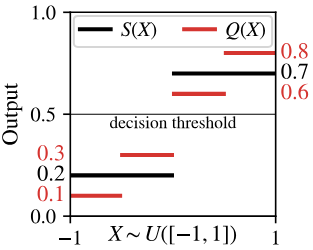

# Paper Reading: Experts Don’t Cheat: Learning What You Don’t Know By Predicting Pairs

a stochastic real-world process: $p_{\scriptscriptstyle{Y|X}}$ $\leftrightarrow$ a generative model: $\hat{p}^\theta_{\scriptscriptstyle{Y|X}}$

probabilistic predictions do not distinguish:
- per-response noise, variability intrinsic to $p_{\scriptscriptstyle{Y|X}}$ (aleatoric uncertainty)
- lack of knowledge about the process, uncertainty about the process (epistemic uncertainty)

Train a model both to approximate $p_{\scriptscriptstyle{Y|X}}$ and also estimate the remaining gaps between $\hat{p}^\theta_{\scriptscriptstyle{Y|X}}$ and $p_{\scriptscriptstyle{Y|X}}$. 

Collect pairs of responses ($Y_1$, $Y_2$) for each $X$ and train it to predict *pairs* of independent responses drawn from the true conditional distribution, allow it to "cheat" by observing one response while predicting the other, then measure how much it cheats.

(If a model's prediction $\hat{p}^\theta_{\scriptscriptstyle{Y|X}}(\cdot|x)$ does not match the true distribution $p_{\scriptscriptstyle{Y|X}}(\cdot|x)$ , the model should be able to improve its prediction if it cheats by peeking at a sample $y_1 \sim p_{\scriptscriptstyle{Y|X}}(\cdot|x)$ from the distribution first. And since models only benefit from cheating when they do not already know the distribution, the amount that a calibrated model cheats gives us exactly what we need to robustly estimate the gaps between $\hat{p}^\theta_{\scriptscriptstyle{Y|X}}$ and $p_{\scriptscriptstyle{Y|X}}$.)

Contributes:

1. 

##  Second-Order Calibrated Models Report Where They Know The True Conditional

$\mathcal{X}$: a set of inputs (e.g. prompts or images)

$\mathcal{Y}$: an arbitrary discrete set of possible responses (such as token sequences or class labels).

model $\hat{p}^\theta_{\scriptscriptstyle{Y|X}}$ is trained on a dataset collected from a query distribution $p(X)$ and a ground-truth conditional distribution $p_{\scriptscriptstyle{Y|X}}(Y|X)$, with $X \in \mathcal{X}$ and $Y \in \mathcal{Y}$

- How can we tell if our model $\hat{p}^\theta_{\scriptscriptstyle{Y|X}}$ knows enough to match $p_{\scriptscriptstyle{Y|X}}$ for these new queries? 
- How can we obtain a reliable estimate of the gap between $\hat{p}^\theta_{\scriptscriptstyle{Y|X}}(\cdot|x)$ and $p_{\scriptscriptstyle{Y|X}}(\cdot|x)$?

### Calibrated Models can Be Far from Perfect

If we aggregate over inputs $X$ that have the same predicted probability $\hat{p}^\theta_{\scriptscriptstyle{Y|X}}(y|X)$, we should hope the true fraction for which $Y=y$ to be about $\hat{p}^\theta_{\scriptscriptstyle{Y|X}}(y|X)$.

> **Definition:** Let $\Delta^\mathcal{Y}$ denote the set of probability distributions over the discrete space $\mathcal{Y}$.
A predictor $\hat{p}^\theta_{\scriptscriptstyle{Y|X}} : \mathcal{X} \to \Delta^\mathcal{Y}$ is **(first-order) calibrated** if there exists a **grouping function** $\Phi : \mathcal{X} \to \mathcal{Z}_\Phi$ such that $\hat{p}^\theta_{\scriptscriptstyle{Y|X}}$ maps each input $x \in \mathcal{X}$ to the average ground-truth distribution $p_{\scriptscriptstyle{Y|X}}$ across random inputs $X$ in the same *equivalence class* $[x]_\Phi = \{ x' : \Phi(x) =\Phi(x')\} \subset \mathcal{X}$:

$$
\begin{aligned}
\hat{p}^\theta_{\scriptscriptstyle{Y|X}}(y|x) &= \mathbb{E}[~p_{\scriptscriptstyle{Y|X}}(y|X)~|~X \in [x]_\Phi~]\\
&= p(~Y=y~|~\Phi(X)=\Phi(x)~).
\end{aligned}
$$

A well-calibrated predictor can still be a bad estimate of $p_{\scriptscriptstyle{Y|X}}$ if it fails to distinguish inputs with different true probabilities $p_{\scriptscriptstyle{Y|X}}(y|X)$ and thus averages across them.

- True posterior probabilities: $Q := p_{\scriptscriptstyle{Y|X}}(Y = 1|X)$
- Confidence scores: $S := \hat{p}^\theta_{\scriptscriptstyle{Y|X}}(Y = 1|X)$
- $\Phi : \{~[-1,0),~[0,1]~\}$
- A calibrated binary classifier with optimal accuracy and confidence scores $S(X)$ everywhere different from the true posterior probabilities $Q(X)$.
- Calibration with good accuracy does not imply good individual confidence.

    

### Second-Order Calibration Measures the Gap

It would be helpful if we could get a **model** to tell us how far $\hat{p}^\theta_{\scriptscriptstyle{Y|X}}(y|x)$ might be from $p_{\scriptscriptstyle{Y|X}}(y|x)$ for each $x$, conditioned on what the model "knows".

> A predictor $\hat{p}^\theta_{\scriptscriptstyle{Y|X}} : \mathcal{X} \to \Delta^{\mathcal{Y}}$ and covariance estimator $\hat\Sigma^\theta : \mathcal{X} \to \R^{\mathcal{Y}\times\mathcal{Y}}$ are **second-order calibrated** if there exists a grouping function $\Phi$ such that
$\hat{p}^\theta_{\scriptscriptstyle{Y|X}}$ and $\hat\Sigma^\theta$ map each input $x \in \mathcal{X}$ to the average *and covariance matrix* of the ground truth probability vector $\bm{p}_{\scriptscriptstyle{Y|X}}(\cdot|x) \in \Delta^{\mathcal{Y}}$ across inputs $X$ in the same equivalence class under $\Phi$:

$$
\begin{aligned}
\hat{p}^\theta_{\scriptscriptstyle{Y|X}}(y|x)&=\mathbb{E}[~p_{\scriptscriptstyle{Y|X}}(y|X)~|~X\in[x]_\Phi~],\\
\hat\Sigma^\theta(x)&=\mathrm{Cov}[~\bm{p}_{\scriptscriptstyle{Y|X}}(\cdot|X),~\bm{p}_{\scriptscriptstyle{Y|X}}(\cdot|X)~|~X\in[x]_\Phi]
\end{aligned}
$$

> We call $\hat\Sigma^\theta$ the **epistemic covariance** of the true conditional $\bm{p}_{\scriptscriptstyle{Y|X}}(\cdot|x)$ under $\Phi$.

If we had a second-order-calibrated predictor, we could use it to identify how tightly concentrated the true probability vector $\bm{p}_{\scriptscriptstyle{Y|X}}$ is around the model's best guess $\hat{p}^{\theta}_{\scriptscriptstyle{Y|X}}$, which would tell us whether $\hat{p}^{\theta}_{\scriptscriptstyle{Y|X}}$ is a good approximation of $p_{\scriptscriptstyle{Y|X}}$.

    

Unfortunately, it is not straightforward to construct a second-order-calibrated predictor, because we only observe a *sample* $Y \sim p_{\scriptscriptstyle{Y|X}}(\cdot|x)$ and not the full $\bm{p}_{\scriptscriptstyle{Y|X}}$. 

## Second-Order Calibration from Paired $Y$ s

We now show that making second-order-calibrated predictions about individual response *probabilities* is equivalent to making first-order-calibrated predictions about *paired responses*.

$$\hat{p}^{\theta}_{\scriptscriptstyle{Y_1,Y_2|X}}(Y_1, Y_2 | X):~\mathcal{X}\to\Delta^{\mathcal{Y} \times \mathcal{Y}}$$

If $\hat{p}^{\theta}_{\scriptscriptstyle{Y_1,Y_2|X}}$ is calibrated at predicting a pair of independent responses $Y_1, Y_2\stackrel{iid}{\sim} p_{\scriptscriptstyle{Y|X}}(\,\cdot\,|X)$, it must be the case that
$$
\hat{p}^{\theta}_{\scriptscriptstyle{Y_1,Y_2|X}}(y_1, y_2|x) = \mathbb{E}[~p_{\scriptscriptstyle{Y|X}}(y_1|X)\cdot p_{\scriptscriptstyle{Y|X}}(y_2|X)~|~X\in[x]_\Phi~]
$$
for some $\Phi$.

The **pair covariance** of $\hat{p}^{\theta}_{\scriptscriptstyle{Y_1,Y_2|X}}$ is $\hat{\bm{\Sigma}}^{\theta}_{\scriptscriptstyle{Y_1,Y_2|X}}(x)_{y_i, y_j} \triangleq \hat{p}^{\theta}_{\scriptscriptstyle{Y_1,Y_2|X}}(y_i, y_j | x) - \hat{p}^{\theta}_{\scriptscriptstyle{Y_1|X}}(y_i|x)\,\hat{p}^{\theta}_{\scriptscriptstyle{Y_2|X}}(y_j|x)$, $\hat{\bm{\Sigma}}^{\theta}_{\scriptscriptstyle{Y_1,Y_2|X}}(x)_{y_i, y_j}$ is the difference between the predicted joint and what we would expect if $Y_1$ and $Y_2$ were independent given $\Phi(X)$.

> If $\hat{p}^{\theta}_{\scriptscriptstyle{Y_1,Y_2|X}}$ is first-order calibrated at predicting pairs $(Y_1, Y_2)$, then its marginal $\hat{p}^{\theta}_{\scriptscriptstyle{Y_1|X}}$ and pair covariance $\hat{\bm{\Sigma}}^{\theta}_{\scriptscriptstyle{Y_1,Y_2|X}}$ are second-order calibrated at predicting $p_{\scriptscriptstyle{Y|X}}$. Moreover, this is a bijection: for any second-order-calibrated $(\hat{p}^{\theta'}_{\scriptscriptstyle{Y|X}}, \hat{\bm{\Sigma}}^{\theta'})$, there is a unique first-order-calibrated $\hat{p}^{\theta}_{\scriptscriptstyle{Y_1,Y_2|X}}$ with $\hat{p}^{\theta'}_{\scriptscriptstyle{Y|X}} = \hat{p}^{\theta}_{\scriptscriptstyle{Y_1|X}}$ and $\hat{\bm{\Sigma}}^{\theta'}=\hat{\bm{\Sigma}}^{\theta}_{\scriptscriptstyle{Y_1,Y_2|X}}$.

In particular, we propose to directly train a model $\hat{p}^{\theta}_{\scriptscriptstyle{Y_1,Y_2|X}}(Y_1, Y_2 | X)$ to predict paired responses by minimizing the standard cross-entropy loss
$$
-\mathbb{E}_{\substack{X \sim p(X),\\Y_1, Y_2 \sim p_{\scriptscriptstyle{Y|X}}}}[ \log\hat{p}^{\theta}_{\scriptscriptstyle{Y_1,Y_2|X}}(Y_1, Y_2 | X) ]
$$
over a dataset of $(X^{(i)}, Y_1^{(i)}, Y_2^{(i)})$ triples.

We note that if our model is explicitly factorized as
$$
\hat{p}^{\theta}_{\scriptscriptstyle{Y_1,Y_2|X}}(y_1, y_2 | x) = \hat{p}^{\theta}_{\scriptscriptstyle{Y_1|X}}(y_1 | x) \cdot \hat{p}^{\theta}_{\scriptscriptstyle{Y_2|Y_1,X}}(y_2 | y_1, x)
$$
(e.g. an autoregressive model), we expect it to learn to "cheat" by copying information from $Y_1$ to $Y_2$ whenever there are regularities between $Y_1$ and $Y_2$ that aren't explained away by what the model knows. This is exactly what we want, because calibration *requires* $\hat{p}^{\theta}_{\scriptscriptstyle{Y_1,Y_2|X}}$ to cheat whenever $\hat{p}^{\theta}_{\scriptscriptstyle{Y_1|X}} \ne p_{\scriptscriptstyle{Y|X}}$; we can then use to
determine how close $\hat{p}^{\theta}_{\scriptscriptstyle{Y_1|X}}$ is to $p_{\scriptscriptstyle{Y|X}}$.
Informally, an expert doesn't need to cheat, so if you let your model cheat and it does, it must not know the answer to your question.

## Bounding Approximation Error with Pairs

### Pair Predictors Can Bound Their Own Individual-Response Errors By Self-Cheating

We can treat $p_{\scriptscriptstyle{Y|X}}(y|X)$ as a random variable whose mean is $\hat{p}^\theta_{\scriptscriptstyle{Y_1|X}}(y|X)$ and varaiance is $\hat{V}^{\theta}_{\scriptscriptstyle{Cheat}}(y|X)$

> The **cheat-corrected epistemic variance** of $p_{\scriptscriptstyle{Y|X}}$ for response $y$ to query $x$ (under $\hat{p}^{\theta}_{\scriptscriptstyle{Y_1,Y_2|X}}$) is: $\hat{V}^{\theta}_{\scriptscriptstyle{Cheat}}(y|x) \triangleq \hat{p}^{\theta}_{\scriptscriptstyle{Y_1|X}}(y|x)\,\big( \hat{p}^{\theta}_{\scriptscriptstyle{Y_2{|}Y_1,X}}(y | y, x) - \hat{p}^{\theta}_{\scriptscriptstyle{Y_1|X}}(y|x)  \big).$

$\hat{V}^{\theta}_{\scriptscriptstyle{Cheat}}$ can be computed easily by scoring $y$ twice, once under the marginal distribution of $Y_1$ and once when the model "self-cheats" by conditioning on $y$ (as $Y_1$) when predicting $y$ again (as $Y_2$). 
We can use it to bound the distance between $\hat{p}^{\theta}_{\scriptscriptstyle{Y_1|X}}$ and $p_{\scriptscriptstyle{Y|X}}$.

Suppose $\hat{p}^{\theta}_{\scriptscriptstyle{Y_1,Y_2|X}}$ is calibrated.
Let $A$ be any event and $\tilde{Y} \in \mathcal{Y}$ be any (possibly random) value. Then
$$
\mathbb{E}[(\hat{p}^{\theta}_{\scriptscriptstyle{Y_1|X}}(\tilde{Y} | X) - p_{\scriptscriptstyle{Y|X}}(\tilde{Y} | X) )^2|A
] = \mathbb{E}[
\hat{V}^{\theta}_{\scriptscriptstyle{Cheat}}(\tilde{Y} | X)|A
].
$$
Furthermore, for any $\beta \in (0,1)$,
$$
P[~|~\hat{p}^{\theta}_{\scriptscriptstyle{Y_1|X}}(\tilde{Y} | X) - p_{\scriptscriptstyle{Y|X}}(\tilde{Y} | X) | \ge \sqrt{\frac{\hat{V}^{\theta}_{\scriptscriptstyle{Cheat}}(\tilde{Y} | X)}{\beta}}\, | A~] \le \beta.
$$

If our model reports a small value of $\hat{V}^{\theta}_{\scriptscriptstyle{Cheat}}(\tilde{Y} | X)$, we can guess that $\hat{p}^{\theta}_{\scriptscriptstyle{Y_1|X}}(\tilde{Y} | X)$ is close to $p_{\scriptscriptstyle{Y|X}}(\tilde{Y} | X)$ and be right most of the time.

Suppose A is the event with epistemic variance $\hat{V}^{\theta}_{\scriptscriptstyle{Cheat}}(\tilde{Y} | X) \le \epsilon$
- if $\beta=0.05$, at least 95% predictions have a bias within $\sqrt{\epsilon/0.05}$
- if $\beta=0.5$, at least 50% predictions have a bias within $\sqrt{\epsilon/0.5}$

#### Experiment1: Classifying Ambiguous Images

$ECE\!-\!1=\sum_{b=1}^B\frac1N|~\Sigma_{i\in n_b}1(\hat{y}_i=y)-\Sigma_{i\in n_b}\hat{p}_i^\theta~|$

$ECE\!-\!2=\mathbb{E}[~(p(y|X)-\hat{p}^{\theta}_{\scriptscriptstyle{Y|X}}(y|X))^2-\hat{V}^{\theta}(y|X)~]$

We demonstrate our technique on CIFAR-10H, a relabeling of the CIFAR-10 test set by $>50$ independent annotators per image.
We cast it as a distribution-matching problem rather than an accuracy-maximization problem: the goal is to estimate the fraction of human annotators assigning each label $y$ to each image $x$. 

    

When $\mathcal{Y}$ is large, we may be less interested in directly estimating $p_{\scriptscriptstyle{Y|X}}$ for a particular $y$, and more interested in making sure we don't
generate any response $y$ for which $p_{\scriptscriptstyle{Y|X}}(y|x)$ was actually zero. At the same time, in the majority of datasets, it's hard for us to get $p_{\scriptscriptstyle{Y|X}}$.

> The **cheat-corrected epistemic confidence** of $\hat{p}^{\theta}_{\scriptscriptstyle{Y_1,Y_2|X}}$ about response $y$ to query $x$ is $C^{\theta}_{\scriptscriptstyle{Cheat}}(y|x) \triangleq \frac{\hat{p}^{\theta}_{\scriptscriptstyle{Y_1|X}}(y|x)}{\hat{p}^{\theta}_{\scriptscriptstyle{Y_2{|}Y_1,X}}(y|y,x)}~~$(or 0 if $\hat{p}^{\theta}_{\scriptscriptstyle{Y_1|X}}(y|x) = 0$).

We can use it to bound the statistical-hallucination rate of any well-behaved decoding algorithm:

> Suppose $\hat{p}^{\theta}_{\scriptscriptstyle{Y_1,Y_2|X}}$ is calibrated. Let $A$ be the event that a decoding algorithm responds to a query $X$, and $\tilde{Y} \in \mathcal{Y}$ be its response. The statistical hallucination rate of the generated responses is bounded above as $P[ p_{\scriptscriptstyle{Y|X}}(\tilde{Y}|X) = 0 \;|\; A ] \le 1 - \mathbb{E}[C^{\theta}_{\scriptscriptstyle{Cheat}}(\tilde{Y} | X) \;|\; A].$

$$P[ p_{\scriptscriptstyle{Y|X}}(\tilde{Y}|X) = 0 \;|\; A ] \le 1 - \mathbb{E}[C^{\theta}_{\scriptscriptstyle{Cheat}}(\tilde{Y} | X) \;|\; A]$$

Any decoding strategies will all have a statistical hallucination rate at most $\beta$ when $\hat{p}^{\theta}_{\scriptscriptstyle{Y_1,Y_2|X}}$ is calibrated:

- **Cheat-corrected selective generation / filtering**: Generate $\tilde{Y}$ using an arbitrary off-the-shelf sampler, but reject it (and don't respond) if $1 - C^{\theta}_{\scriptscriptstyle{Cheat}}(\tilde{Y} | X) > \beta$.
- **Cheat-corrected rejection sampling**: Repeatedly sample $\tilde{Y} \sim \hat{p}^{\theta}_{\scriptscriptstyle{Y_1|X}}$ until $1 - C^{\theta}_{\scriptscriptstyle{Cheat}}(\tilde{Y} | X) < \beta$.
- **Cheat-corrected top-1 search**: Deterministically output (or approximate) $\argmax_{y \in S} \hat{p}^{\theta}_{\scriptscriptstyle{Y_1|X}}(y|x)$, where $S = \{ y \mathrel{:} 1 - C^{\theta}_{\scriptscriptstyle{Cheat}}(\tilde{Y} | X) < \beta \}$, or abstain if $S = \varnothing$.

Selectively responding only when we find a $\tilde{Y}$ with $1 - C^{\theta}_{\scriptscriptstyle{Cheat}}(\tilde{Y} | X) < \beta$ ensures that, our responses will be non-hallucinated with probability at least $1-\beta$.

The smaller the $\beta$, the lower the probability of hallucinations, and the more difficult it is to find such results.

#### Experiment2: English Description of Digits of $\pi$

We construct a synthetic language modeling task that allow us to control the difficulty and amount of stochasticity in the target responses, where the goal is to correctly respond to requests like $x=\,$ "Tell me about digit 24 of $\pi$". Early digits of $\pi$ are sampled more often than later ones, and the target responses are randomly-chosen true statements, such as "Sure, that is the number 6", "That's an even number", "It is spelled S I X", or "Sure, it's spelled with three letters'', which are sampled with different probabilities and exhibit variation in both style and semantic content.

    

    

    

#### Experiment3: Safe Offline RL With Unobserved Confounders

    

    

### Paired Data Enables Distribution-Free Frequentist Confidence Intervals for $p(Y|X)$

    

> Let $\hat{p}^{\theta}_{\scriptscriptstyle{Y|X}}$, $\hat{V}^{\theta}$, and $p_{\scriptscriptstyle{Y|X}}$ be arbitrary. With probability at least $1 - \alpha$ (over draws of the calibration set), Algorithm 1 returns a value $\gamma_\varepsilon^+$ such that, for a randomly sampled input $X \sim p(X)$, and any $\beta \in (0, 1), y \in \{0,1\}$,$\textstyle{}P\left[\Big| \hat{p}^{\theta}_{\scriptscriptstyle{Y|X}}(y|x) - p_{\scriptscriptstyle{Y|X}}(y|x) \Big| \ge \sqrt{\frac{\gamma_\varepsilon^+\max\{\hat{V}^{\theta}(y|x), \varepsilon\}}{\beta}} \right] \le \beta.$

    

