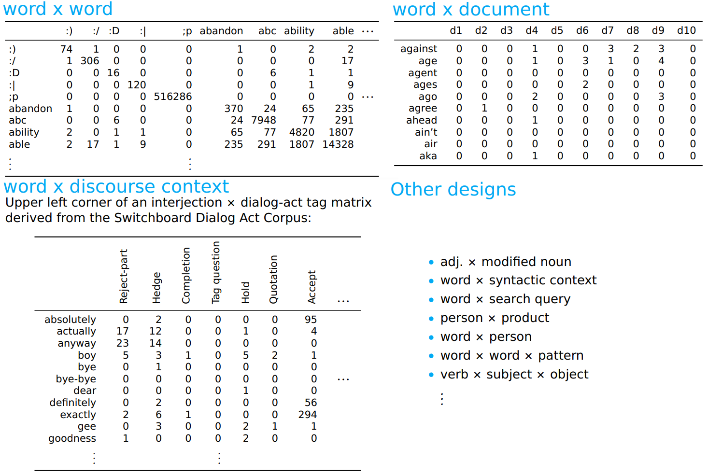
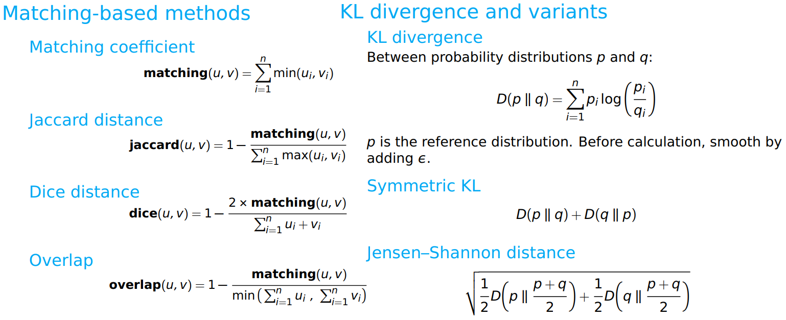

## 向量空间模型 Vector-space models

本节主要介绍了构建有效的分布式表示方法，主要包括矩阵设计(matrix design)，相似性评估(assessing similarity)和矩阵重新加权(matrix re-weighting)的方法，中心思想是我们可以将单词和短语表示为密集的实数向量。

**Why build distributed representations?**

1. **Understanding words in context**: There is value to linguists in seeing what these data-rich approaches can teach us about natural language lexicons, and there is value for social scientists in understanding how words are being used.
2. **Feature representations for other models**: As we will see, many models can benefit from representing examples as distributed representations.

### 矩阵设计 Matrix designs

下面介绍构建$word\times word$矩阵的概述 

1. 定义**共现上下文**的概念。这可能是一个完整的文档、一个段落、一个句子、一个分句等等。
2. 定义**计数缩放方法**。最简单的方法是计算上下文窗口中的所有内容，对其中的所有内容赋予相等的权重。另一种方法是根据与目标单词的接近程度来缩放权重，例如$1/𝑑$，其中$d$是标记与目标之间的距离。
3. 遍历语料库构建词典$d$将单词对映射到共现值。每次一对字$w$和$𝑤'$出现在相同的上下文中（1中定义的），增量$𝑑[(𝑤,𝑤')]$的值由2中的加权方案确定。
4. 使用$d$建立完整的词汇表$V$
   1. 对于大文档来说$|V|$通常会比较大，因此可能需要缩小词汇表
   2. 可以通过过滤到特定的子集，或者施加一个计数阈值来做到这一点。
   3. 即使$|V|$很小也可以设定计数阈值，因为对于计数非常低的单词，没有足够的证据证明它可以支持很好的表示
   4. 对于词汇表之外的单词，可以完全忽略它们，或者将它们的所有值累积到指定的\<UNK\>向量中。
5. 现在可以构建一个矩阵$M$，其大小为$|V|\times|V|$。$M$的行和列都表示单词，每个单元$M[i,j]$通过$𝑑[(𝑤,𝑤')]$填充

### 向量比较 Vector comparison

在大多数情况下，我们对测量向量之间的距离感兴趣。指导思想是，在我们构建的向量空间中，语义相关的词应该紧密相连，而语义无关的词应该相隔很远。

#### 欧几里得距离

$$
euclidean(u,v)=\sqrt{\sum_{i=1}^n|u_i-v_i|^2}
$$

#### 长度归一化

$$
[\frac{u_1}{||u||_2},\frac{u_2}{||u||_2},...\frac{u_n}{||u||_2}]
$$

其中
$$
||u||_2=\sqrt{\sum_{i=1}^nu_i^2}
$$

#### 余弦距离

$$
cosine(u,v)=1-\frac{\sum_{i = 1}^nu_i\cdot v_i}{||u||_2\cdot||v||_2}
$$

余弦距离不满足三角形不等式：$𝑑(𝑥,𝑧)\le 𝑑(𝑥,𝑦)+𝑑(𝑦,𝑧)$

#### 其他方法

### 矩阵重新加权 Matrix re-weighting

矩阵重新加权的目的是放大重要、值得信赖和不寻常的内容，同时淡化平凡和古怪的内容。如果没有一个明确的目标函数，这将仍然是模糊的，但脱离原始计数背后的直觉是，频率不能很好地代表我们的目标语义想法。

#### Normalization

归一化是最简单的矩阵重新加权的形式之一，该方法对数据的规模不敏感，如$[1,10]$和$[1000,10000]$

#### Observed/Expected

将观察到的超出预期(observed-over-expected)的值重新加权是所有VSM中的一个中心模式：我们可以使用相应行和列中的信息调整共现矩阵中的实际单元格值。在观察到的超出预期的情况下，行和列定义了如果两个共现单词是独立的，那么该单元格的值将是什么。

对于一个$m \times n$的矩阵$X$，定义
$$
\textbf{rowsum}(X, i) = \sum_{j=1}^{n}X_{ij}
$$
$$
\textbf{colsum}(X, j) = \sum_{i=1}^{m}X_{ij}
$$
$$
\textbf{sum}(X) = \sum_{i=1}^{m}\sum_{j=1}^{n} X_{ij}
$$
$$
\textbf{expected}(X, i, j) = 
\frac{\textbf{rowsum}(X, i) \cdot \textbf{colsum}(X, j)
}{\textbf{sum}(X)}
$$

观察到的超出预期的值是

$$
\textbf{oe}(X, i, j) = \frac{X_{ij}}{\textbf{expected}(X, i, j)}
$$

#### Pointwise Mutual Information

PMI是observed-over-expected的对数形式:
$$
\textbf{pmi}(X, i, j) = \log\left(\frac{X_{ij}}{\textbf{expected}(X, i, j)}\right)
$$
对于0的单元，此定义将无法处理。通常将log(0)定义为0，但这可能会让人困惑——小于预期的单元格计数会得到负值，大于预期的单元格计数会得到正值，而0值会被置于该排名的中间，且没有真正的理由。

Positive PMI可以解决这一问题
$$
\textbf{ppmi}(X, i, j) = 
\begin{cases}
\textbf{pmi}(X, i, j) & \textrm{if } \textbf{pmi}(X, i, j) > 0 \\
0 & \textrm{otherwise}
\end{cases}
$$

#### Term Frequency–Inverse Document Frequency

也许最著名的重新加权方案是术语频率-反向文档频率（TF-IDF），我相信它仍然是当今Web搜索技术的支柱。

对于一个$m \times n$的矩阵$X$，定义
$$
\textbf{TF}(X, i, j) = \frac{X_{ij}}{\textbf{colsum}(X, i, j)}
$$

$$
\textbf{IDF}(X, i, j) = \log\left(\frac{n}{|\{k : X_{ik} > 0\}|}\right)
$$

$$
\textbf{TF-IDF}(X, i, j) = \textbf{TF}(X, i, j) \cdot \textbf{IDF}(X, i, j)
$$

TF-IDF通常在稀疏矩阵中表现最好。它严厉惩罚出现在许多文件中的词语；如果每个文档中都出现一个单词，则其IDF值为0。

### 降维 Dimensionality reduction

#### Latent Semantic Analysis

潜在语义分析（LSA）是一种重要的降维技术。它是截断奇异值分解（SVD）的一种应用，因此只使用线性代数的技术（无需机器学习）。

对于任何$m \times n$的矩阵$X$ , 有一个因式分解𝑋 转化为矩阵$𝑇$，$𝑆$和$𝐷$

$$
𝑋_{𝑚\times 𝑛}=𝑇_{𝑚\times m}𝑆_{𝑚\times m}𝐷^⊤_{n\times 𝑚}
$$

#### GloVe

[Pennington et al. (2014)](http://www.aclweb.org/anthology/D/D14/D14-1162.pdf) 介绍了一个表征语义的目标函数，该函数是用于学习单词$w_{i}$和$w_{j}$的词向量，使他们的点积与共现概率成比例。
$$
w_{i}^{\top}\widetilde{w}_{k} + b_{i} + \widetilde{b}_{k} = \log(X_{ik})
$$
$$
w_{i}^{\top}\widetilde{w}_{k} = \log(P_{ik}) = \log(X_{ik}) - \log(X_{i})
$$
$$
w_{i}^{\top}\widetilde{w}_{k} = \log(P_{ik}) = \log(X_{ik}) - \log(X_{i*} \cdot X_{*k})
$$
GloVe的目的是使两个学习向量的点积等于PMI！
$$
\sum_{i, j=1}^{|V|} f\left(X_{ij}\right) \left(w_i^\top \widetilde{w}_j + b_i + \widetilde{b}_j - \log X_{ij}\right)^2
$$
其中$V$是词汇表，$f$是一个比例因子，旨在减少非常大的共现计数的影响
$$
f(x) \begin{cases}(x/x_{\max})^{\alpha} & \textrm{if } x < x_{\max} \\1 & \textrm{otherwise}\end{cases}
$$
通常，$\alpha=0.75$，$x_{\max}=100$

#### Autoencoders

自动编码器是一种机器学习模型，旨在学习预测自身输入的参数。当存在维数低于输入的中间表示时，这是有意义的。这些提供了类似于LSA所学习的数据的降维视图，但现在我们有了更多的设计选择，也有了更多的潜力来学习underyling数据中的高阶关联。

使用PyToch一线一个简单的单层自编码器：
$$
\begin{align}h &= \mathbf{f}(xW + b_{h}) \\\widehat{x} &= hW^{\top} + b_{x}\end{align}
$$
这里，假设$h$是一个低维向量，$f$是一个非线性激活函数(tanh)，使用两个权重矩阵$W_{xh}$和$W_{hx}$作为输出，可能比使用$W^{\top}$更有意义。

自动编码器的目标函数将对输入和预测输出之间的距离进行某种评估。例如，可以使用半均方误差：
$$
\frac{1}{m}\sum_{i=1}^{m} \frac{1}{2}(\widehat{X[i]} - X[i])^{2}
$$
其中$X$是输入矩阵(维度是$m \times n$)，$X[i]$表示第$i$个例子。

更多有关自编码器的内容可以参考[Goodfellow et al. 2016](http://www.deeplearningbook.org).