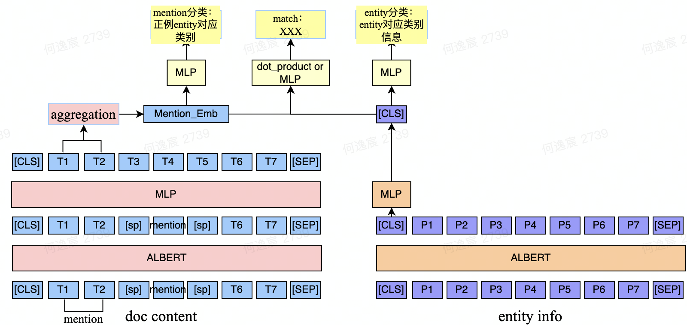

# 实体链接

## 项目背景

现有业务的模型是一个在多个任务上finetune好的预训练模型，主要的任务包括抽取短答案，摘要飘红等任务。当前模型的输入为一个`query`以及一个`doc`，`doc`包括待查询文章的`title`和`content`，`content`是短句构成的列表，将`[CLS]+query+[SEP]+title+[CLS]+short_sentence1+[CLS]+short_sentence2+...`作为模型输入，模型的输出再经过一系列head，最终达到业务效果。

目前希望在原有业务不变的基础上，加入一个实体链接的任务，将抽取出的短答案(mention)和实体库中的实体进行配对。比如：

"query": "十部公认最好看日本电影"

"title": "岛国最难以磨灭的10部电影佳作"

"doc": "岛国‬作为亚洲电影的先锋‬，无论从起步还是影响力都是醒目‬的存在。二战之前，日本的电影工业已经非常完备，战后则开始大师涌现，诞生无数杰作。‬《罗生门》黑泽明‬撒谎是人之本性，在大多数时间里我们甚至都不能对自己诚实，但那是因为人们太脆弱了，所以才撒谎，甚至对自己撒谎。我甚至听说过往在罗生门这儿的鬼，因为害怕人类的凶残而逃走。《情书》岩井俊二“当岁月流逝，所有的东西都消失殆尽的时候，唯有空中飘荡的气味还恋恋不散，让往事历历在目。”《无人知晓》是枝裕和没有哭喊没有大笑没有‬愤怒‬，却有着刺骨的冰冷…这是人世的炎凉与无奈。无人知晓这四个孩子的生活的窘境，就像无人知晓那粉色行李箱中的尸体一样…《**入殓师**》泷田洋二郎向死‬而‬生‬，学会‬告别‬。死亡不过是一扇门，让我们走向一段崭新的旅途。当逝者安息，当生者坚强，当释怀的爱留在心里，片刻即永恒，万物也许就这样生生不息..."

entity_info: [

​	"🕺入殓师🍩书籍📝2010年日本百濑忍所著小说🐏电影《入殓师》的同名小说《入殓师》在日本由著名的出版社小学馆出版。中文小说《入殓师》由北京的东方出版社引进，并于2010年4月出版。🚄彤彫,东方出版社",

​	"🕺入殓师🍩职业📝为死者还原未死之状态的人员🐏入殓师又叫做葬仪师，为死者还原未死之状态。整修面容和身体，尽可能还原完整面容和身体。也可叫做为死者化妆整仪，纳入棺中的职业。主要出现在日本，后进入中国。让已经冰冷的人重焕生机，给她永恒的美丽；还要有冷静准确，并且怀着温柔的情感。🚄葬仪师,用杀菌皂清洗尸体,departures",

​	"🕺入殓师🍩电影📝泷田洋二郎执导电影🐏《入殓师》是根据日本作家青木新门的小说《门纳棺夫日记》改编而成，由泷田洋二郎执导，本木雅弘、山崎努、广末凉子、吉行和子和笹野高史等联袂出演。影片讲述了日本入殓师的生活，影片以一名入殓师🚄彩色,剧情，音乐,纪录片,为逝者送行的人,中泽敏明,笹野高史,浜田毅,剧情,山崎努,广末凉子,Okuribito,小越勇辉,宫田早苗,革命,送行者-礼仪师的乐章,小林美香,日语",

​	"🕺入殓师🍩虚拟角色📝《阴阳师》中的式神,网易手游《阴阳师》中的SR式神之一🐏入殓师，网易手游《阴阳师》中的SR式神之一。又称葬仪师，为逝者还原未死之状态，整修面容和身体，尽可能还原完整面容和身体的男子。🚄男,抽符,碎片合成,Okuribito,控制,输出,おくりびと,织雪,葬仪师,抽符、碎片合成,速水奖",

​	"🕺入殓师🍩小说📝2016年刘东西创作的网络小说🐏我是一名入殓师，一天晚上，就在我和女同事在停尸间进行不可描述的事情之后，一具尸体莫名其妙的消失了……🚄rulianshi,巨匠阅读网",

]

使用双塔模型，将输入分别与匹配上的entity进行配对，的分最高的即为链接上的实体




## 现有做法

1. 为了不影响原有模型的效果，将doc的侧的模型freeze住，不更新参数，用实体链接的训练集训练entity info模型
2. 不freeze住两个模型，训练出一个teacher model，和之前业务上的其他模型一起蒸馏。
3. 这两种做法结束之后都需要将entity info侧的所有实体的embedding输出成tensor存在显存中，因此需要将768维的向量降维成128维，使用pca 初始化降维矩阵可以对墨香效果有很大的提高

```python
import numpy as np
from sklearn.datasets._samples_generator import make_blobs
from sklearn.decomposition import PCA
import torch

# tensor 和 ndarry 的相互转化
# A = X.numpy() # tensor->ndarray
# B = torch.tensor(A) # ndarray->tensor

dim = 512
tensor = torch.cat((torch.load('0.th', map_location=torch.device('cpu')), torch.load('1.th', map_location=torch.device('cpu'))), dim=0) # [20000, 768]
X = tensor.numpy()
pca = PCA(n_components=dim)
pca.fit(X)
comp = pca.components_
B = torch.tensor(comp)
torch.save(B, 'pca_{}.th'.format(str(dim)))

# test
# X, _ = make_blobs(n_samples=10, n_features=8, random_state =9) # 生成10条8维的数据
# print(X.shape)
# pca = PCA(n_components=4) # 将8维降到4维
# X_transformed1 = pca.fit(X).transform(X) # pca.fit(X)-训练 + pca.transform(X)-将数据X转换成降维后的数据
# comp = pca.components_ # (n_components, n_features) 转换矩阵
# print(comp.shape)
# X_M = X - X.mean(axis=0)
# X_transformed2 = np.dot(X_M, comp.T) # 和X_transformed1数值相同
```

