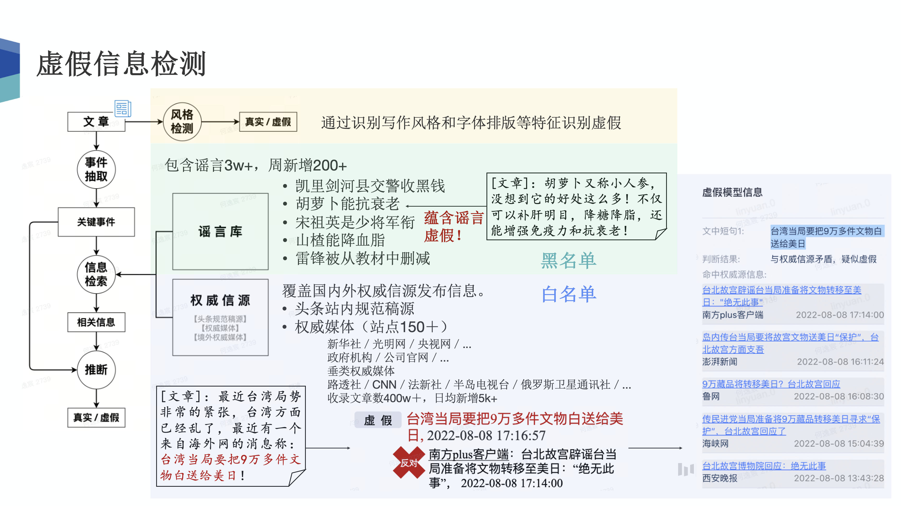
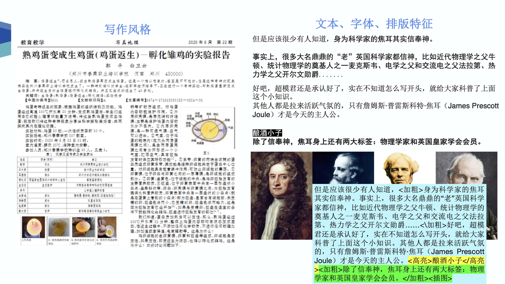
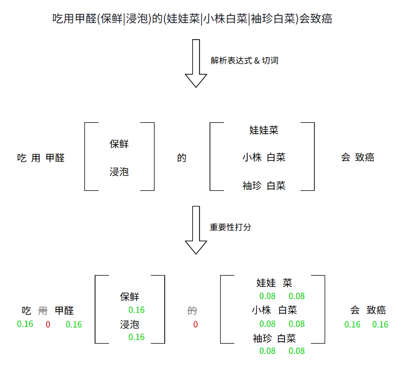
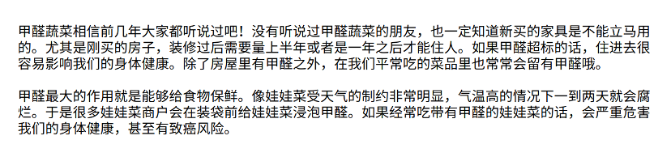
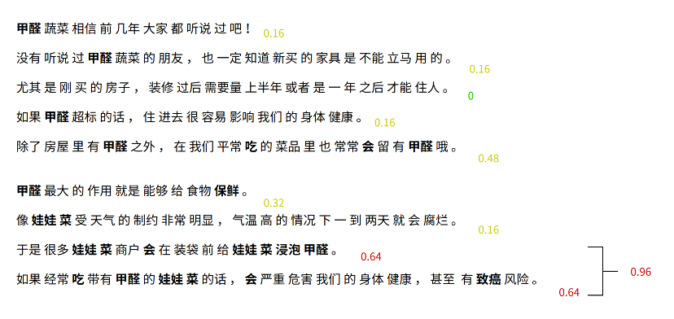
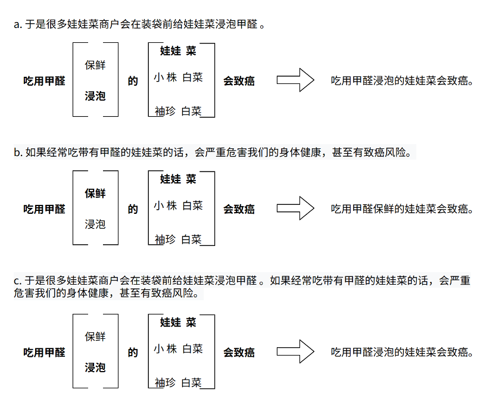

# 内容质量-虚假识别

虚假信息的发布和传播会对社会造成很大的危害，如一些虚假的新闻会影响人们对重大事件的认知，一些伪科学内容会威胁人们的健康，造成财产损失等。

虚假信息鉴别成本高、难度大，不仅需要一定的领域知识和背景信息，同时对于新闻这类体裁，由于具有很高的时效性，其真实性也会随着时间的发展快速变化(佩洛西蹿台，在2022.8.2 22:44前发布的相关文章均为虚假，但在该事件点之后就不虚假)。此外，在进行虚假检测时，还要求模型具有语义推断的能力。

## 方法

我们实现的虚假信息检测的主要方法包含两种手段。
第一个是风格检测，用于识别文章中虚假的写作风格和一些特殊的文字排版特征特征，包括伪科学内容识别，健康虚假识别等。然而对于一些新闻题材，其写作风格可能很正式，很官方，难以简单的通过风格进行判断。

第二个手段采用识别关键事件并和`谣言库`以及`信源库`做语义匹配，来判断文章是否包含虚假内容。
其中`谣言库`包含谣言10万余条，每周新增谣言300余条，它是黑名单的检测手段，命中`谣言库`内容则认为是虚假的。如图中文章称“胡萝卜能增强免疫力和抗衰老”，命中了谣言库中的谣言。
使用权威信源匹配是一种白名单的检测手段，权威信源是指国内外权威媒体发布的信息，我们认为这些信息是真实可信的，将其抓取并录入`信源库`。当抽取出的关键事件没命中信源或与信源矛盾时，则认为是虚假的。如图中文章称“台湾当局要把9万多件文物白送给美日”，但信源中有权威媒体明确对此进行了辟谣，因此该文章的内容是虚假的。

模型判断为虚假的内容会根据置信度分数进行机器自动打压或提示给审核运营并由他们判断是否需要进行打压，自动打压的部分也会定期抽评准确率。

### 风格检测 - 伪科学内容识别
- 简单，搭建模型成本较低
- 准确和召回率低，需要定期更新模型

### 谣言检测 - 谣言库匹配(黑库)
- 构建谣言库，可抽象为自然语言推断
- 手工录入谣言，人工成本高，无法发现新谣言

### 事实检测 - 信源库匹配(白库)
- 可发现新的不实信息
- 识别难度高，对信源质量和语义推断能力有较高要求

## 伪科学内容的识别

头条平台上可以自由上传文章视频，分析观点看法，有很多人借此宣传伪科学内容来吸粉。我们希望通过一个文本分类任务鉴别出伪科学内容进行打压。

伪科学识别的主要方法是识别写作风格和文字字体排版特征等，通过将文章内容输入文本分类模型来判断是否是伪科学内容。同时，通过对一些高亮，加粗等排版使用特殊标记进行强调，提高了模型识别伪科学内容的准召。

数据：平台中被人为审核过后被打压为虚假的作为正例，人为审核后不打压的作为负例。使用6层Albert预训练模型作为baseline，输出的[CLS] token经过sigmoid函数作为虚假的概率。

存在正负例不均衡问题（训练时将正例翻倍），训练数据不足（使用伪标签，用第一轮模型预测没有人审核的数据，把置信度高的打上标签作为训练数据）

写伪科学的人会根据打压情况不断调整自己的写作风格，因此需要不断获取新的数据更新模型。左图展示了伪科学模型审出的case在头条app上会有虚假打标，针对伪科学内容进行风险提示；右图展示了根据审出结果对危险账号进行拦截和封禁。

## 事实(虚假新闻)检测 - 信源库匹配

###  物理架构

如上图所示，虚假新闻检测服务主要由关键事件抽取、信源检索和语义推断三部分组成。其中事件抽取通过抽取模型从用户的发文中抽取出关键事件句子；信源检索以抽取的关键事件句子为query在信源库中进行检索，粗筛出一批信源；语义推断通过推断模型判断关键事件句子是否有信源支持以及是否与已有信源矛盾。无信源的内容会由专业审核人员进行审核，并反馈审核结果和优化模型。同时该服务还有一系列配套自动提示bot，用于为审核人员提供辅助审核的信息。下面会对上述组件分别进行详细介绍。

### 抽取模型Extract

抽取模型在用于在一段文本中抽取出值得进行虚假检测的关键span，同时完成事件完整性和检测价值判断。

> #深圳职业故事#非深圳户籍就业人员随迁子女中考管理办法发布。总结起来，在深圳有缴纳社保，有稳定工作，有居住证，有稳定住的地方，有稳定收入，不是深户，子女也可以参加中考，有机会在公办高中就读了，有机会接受更好的优质教育了，更有机会成才了。不像以前，一中考，就考虑回老家读高中了。具体要求，大家可以...

- `重要事件`：非深圳户籍就业人员随迁子女中考管理办法发布
- `冗余`：非深圳户籍就业人员随迁子女中考管理办法发布。总结起来，在深圳有缴纳社保，有稳定工作，有居住证，有稳定住的地方，有稳定收入，不是深户，子女也可以参加中考
- `事件不完整`：机会在公办高中就读了

### 推断模型NLI

用于判断两个句子之间的关系，包括：“蕴含”，“矛盾”和“不相关”。

### 检索服务

- 检索信源库：使用抽取到的关键句子作为query在信源库和临时信源库中进行检索。
- 综合搜索：使用抽取到的关键句子作为query在头条综合搜索检索信源。

#### 信源库

- `抓取服务`：选取一部分国内外权威网站（新华社、BBC等），针对每个网站制定抓取策略，定期对其新发文进行抓取，并将抓取结果保存在消息队列中。
- `消费订阅信源`：对消息队列中的抓取结果进行消费，对于国外网站内容，还会调用翻译服务进行语言自动检测及翻译。对抓取到的内容调用抽取模型进行抽取，并将抽取结果保存在权威信源库中作为权威信源。

#### 临时信源库

- 热榜内容自动入库：热榜内容很多是突发的高热度事件，其内容是经过审核的但是大都没有录入权威信源库。将热榜内容自动录入临时信源库，设定信源时效并采用精确匹配的方式与抽取关键句子进行比对。

- 多次进审不打压内容：一些发文审核人员认为不需要打压，但是模型没有检索到信源。针对这些内容进行监听和聚类处理，并在累积到一定阈值后实时反馈给审核人员，由他们判断是否要录入录入临时信源库。

- 短时间内大量发文：一些高热事件从进审到多条不打压仍有较长时间间隔，该间隔内仍会有大量的进审发生，因此还对短时间大量进审的内容进行了前置提示，这样不需要等到审核后再提示，可以提早临时信源录入的时间。

#### 综合搜索

综合搜索相当于在头条站内做了一次搜索，搜索结果会根据作者进行过滤，有资质的作者的发文会被当作信源。综合搜索作为信源库的额外补充，其检索结果跟头条内发文分布更接近，但由于搜索的稳定性差和耗时较长，因此作为信源库的旁路和兜底策略。

## 谣言检测 - 谣言库匹配

谣言库运营团队对国内外虚假信息及突发热点事件相关谣言进行查证与总结，形成谣言点，谣言库将这些谣言点汇集；对于平台发文，使用模型判断是否命中谣言点，从而判断事件真伪。

具体实现流程如下：
1. 将新发文切词，并根据词频在谣言库中粗筛相关谣言点（Elasticsearch）
2. 将谣言点的表达式与文章内容进行匹配，找到与谣言点相关的句子
3. 使用大模型（Baichuan 13B）进行语义判断，判断文章中的相关句子是否命中谣言点

### 谣言点（表达式）构建

由于自然语言的复杂性和多样性，一件事可能有多种叙述方式，因此我们设计了谣言表达式，使一条谣言尽可能匹配更多样的表述。表达式可以是一段话、一句话甚至一个关键词等一切想要控制的风险内容，表达式主要是通过语义匹配，因此即使和文本内容表述不完全一致，只要意思相近预期也能命中。

表达式分包含文章限定词（可选）以及谣言句子两个部分，两个部分相互独立，另外必须同时满足才算命中。

例如：[甲醛 娃娃菜|小株白菜|袖珍白菜 致癌|癌症]吃用甲醛保鲜的(娃娃菜|小株白菜|袖珍白菜)会致癌

其中：

- [甲醛 娃娃菜|小株白菜|袖珍白菜 致癌|癌症] 为文章限定词
- 吃用甲醛保鲜的(娃娃菜|小株白菜|袖珍白菜)会致癌 为谣言句子

#### 文章限定词

限定词支持and和or两种关系，词的个数不限，位置在表达式前，用英文中括号`[]`括起来，`|`(竖线)表示或关系，` `(空格)表示且关系。文章中必须出现且关系中的所有词语，才会命中表达式。

|表达式|说明|匹配样例|
|:-|:-|:-|
|[照片 18岁]佩洛西年轻时照片|可以配置多个文章限定词，表示文章必须包含“照片”和“18岁”|佩洛西年轻照片...18岁...|
|[照片\|图片 18岁]佩洛西年轻时照片|包含[照片 18岁]或[图片 18岁]即可命中|佩洛西18岁...图片...|

#### 文章排除词

在`[]`前加上`!`，表示文章中不能出现`[]`中出现的词语，否则不命中

|表达式|说明|
|:-|:-|
|![4006700\|95017]腾讯客服|排除包含“4006700”和“95017”的文章|

### 内容匹配

在获得表达式后，需要在文章中找到与表达式相对应的句子。表达式解析，将表达式切成多组关键词，按组的数量均分权重，并列的部分为一组继续切分。停用词不占用权重，仅在句子匹配时填充组成完整句子。

匹配过程以下文为例

将原文抽取成句子，按照逗号、句号、段落三个维度切分。计算每句话命中关键词得分，高于0.6分的句子进入匹配候选。同时考虑跨句子算分，最大跨越长度不超过100个字符。

对每个候选句子，计算命中表达式对应的句子，主要处理平行谣言中并列的关键词，优先使用候选句子中提到的关键词，如果都没提到则优先使用靠前的关键词。（比如候选句子b，未提到“保鲜”和“浸泡”，表达式用了更靠前的“保鲜”）

将候选的句子进行语义匹配，确认是否命中

### 语义判断

在大模型技术出现以后，我们希望使用大模型进行虚假检测的全流程，以提高模型的准召。因为大模型有很强的总结和推理能力，总结文章内容并和谣言点、审核政策等短句进行匹配。且学习能力很强，可以学到训练集中的审核尺度和一些额外的规则，而不需要大量的标注数据。我们的模型输入目前是由文章和句子构成，文章是一段待审核的文本，句子是谣言点、审核政策等一些短句。此外还在探索增加一些额外补充的规则作为模型输入。

#### 训练数据自动构造

#### 训练数据人工标注

#### 线上使用

为了提高模型的响应速度和吞吐，我们只希望模型输出几个token，就可以知道其对这个case的最终判断，所以就是需要先给出结论，再说明理由或者只给出结论，这样就可以提高推理的速度。因此我又探究了模型输出结论和理由的这个位置关系对最终效果的影响，

通过实验发使用让模型先给结论后说理由的数据训练模型，会有结论和理由不一致或者理由强行解释结论的情况，就如上面这个例子，分析中说强烈建议表达的是一种期望和意愿，并不意味着事实已经发生。但是一开始却给了是的结论。

因此在训练数据中我构造了三种推理的方式，分别是先理由后结论、先结论后理由以及只给结论，使模型对这三种提问方式都有较准确的回答，同时还构造了一些其他的提问方式在训练集中少量出现，来提高模型在对话场景中对一些类似提问的泛化性能。最终的结论是在训练过程中给出一些推理的步骤是会提高模型在预测时的这个准确率的。然后在预测时是否说这个理由对最终的效果影响不大，最终线上也是使用先结论后理由的提问方式。

#### 添加规则

针对模型做错的样例，可以在不重新训练的前提下，通过补充一定的辅助规则，复制模型进行正确判断。

