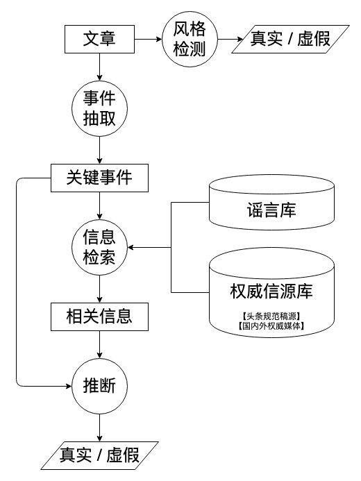
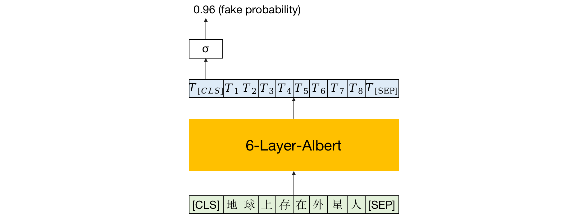
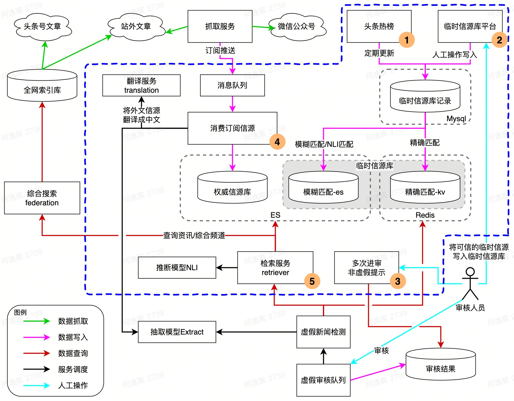

# 内容质量项目组

虚假信息的发布和传播会对社会造成很大的危害，如一些虚假的新闻会影响人们对重大事件的认知，一些伪科学内容会威胁人们的健康，造成财产损失等。

虚假信息鉴别成本高、难度大，不仅需要一定的领域知识和背景信息，同时对于新闻这类体裁，由于具有很高的时效性，其真实性也会随着时间的发展快速变化(佩洛西蹿台 2022.8.2 22:44)。此外，在进行虚假检测时，还要求模型具有语义推断的能力。

## 虚假信息检测的典型方法
### 风格检测
- 简单，搭建模型成本较低
- 召回率低

### 谣言检测
- 构建谣言库，可抽象为自然语言推断
- 手工录入谣言，无法发现新谣言

### 事实检测(存疑)
- 可发现新的不实信息
- 技术挑战大

### 用户评论/行为
- 特征容易挖掘
- 不实信息已经对用户造成了影响

### 传播模式挖掘
- 获取标注数据成本较低
- 检测准确率依赖于传播规模，不能及时发现谣言

## 目标
0展现阶段发现虚假信息

## 伪科学内容的识别

头条平台上有很多人可以自由上传文章视频，有很多人借此宣传伪科学内容来吸粉。我们希望通过一个文本分类任务鉴别出伪科学内容进行打压。

数据：平台中被人为审核过后被打压为虚假的作为正例，人为审核后不打压的作为负例。存在正负例不均衡问题（训练时将正例翻倍），训练数据不足（使用伪标签，用第一轮模型预测没有人审核的数据，把置信度高的打上标签作为训练数据）

写伪科学的人会根据打压情况不断调整自己的写作风格，因此需要不断获取新的数据更新模型

模型识别出的例子还会进行人为审核，因此该任务更注重召回率

### 数据来源

- 头条：图文、微头条、问答
- 抖音：小视频标题以及通过ocr和asr获取的文字信息
- 西瓜：中视频标题以及通过ocr和asr获取的文字信息

### 存在问题及解决方案

训练数据距今时间较长，很多作者会针对之前的模型进行对抗，使得模型检测不出。需要收集新的数据进行训练。未来希望能形成自动化数据收集及定期训练和改进模型。

### 模型结构

使用6层Albert预训练模型作为baseline，输出的[CLS] token经过sigmoid函数作为虚假的概率。

### 工作流程

#### 更新现有模型

1. 数据抓取和清洗：使用SQL在数据库中抓取数据，筛选出人工审核后进行打压的数据作为正例，不打压的数据作为负例。
2. 数据增强：由于正例过少，采用正利double，负例亚采样的方式，保证正负例比例在1:5左右。
3. 构造数据集：按时间由远及近分别构造训练集、验证集和测试集，比例大约为10:1:1。
4. 模型训练及验证：训练模型，使用验证集选取checkpoint并在测试集上进行测试。
5. 人工检验模型效果：将模型命中的数据进行人工标注，验证模型的打压率。

#### 实现模型自动更新

将上述更新模型流程自动化，自动抓取数据，进行数据增强，训练模型，在相同的测试集下测试新旧模型的效果，效果有提升则自动更新线上模型。

## 虚假新闻检测

###  物理架构

