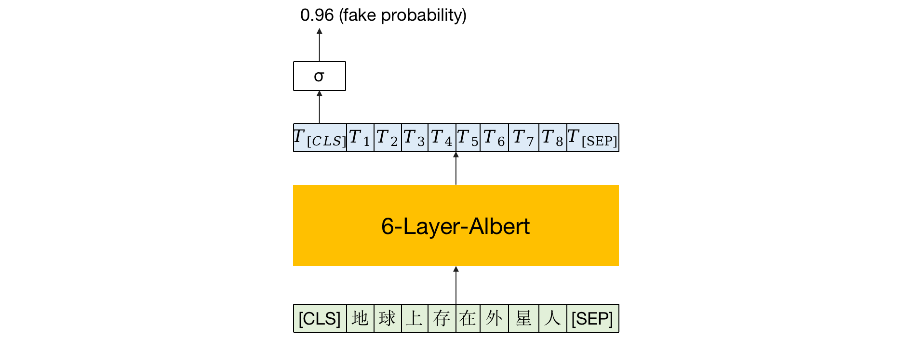

# 文本二分类鉴别伪科学问题

头条平台上有很多人可以自由上传文章视频，有很多人借此宣传伪科学内容来吸粉。我们希望通过一个文本分类任务鉴别出伪科学内容进行打压。

数据：平台中被人为审核过后被打压为虚假的作为正例，人为审核后不打压的作为负例。存在正负例不均衡问题（训练时将正例翻倍），训练数据不足（使用伪标签，用第一轮模型预测没有人审核的数据，把置信度高的打上标签作为训练数据）

写伪科学的人会根据打压情况不断调整自己的写作风格，因此需要不断获取新的数据更新模型

模型识别出的例子还会进行人为审核，因此该任务更注重召回率

## 数据来源

- 头条：图文、微头条（类似微博）、问答（类似知乎）

- 抖音：标题以及通过ocr（针对视频）和asr（针对音频）获取文字信息

## 存在问题及解决方案

训练数据距今时间较长，很多作者会针对之前的模型进行对抗，使得模型检测不出。需要收集新的数据进行训练。未来希望能形成自动化数据收集及定期训练和改进模型。

## 模型结构

使用6层Albert预训练模型作为baseline，输出的[CLS] token经过sigmoid函数作为虚假的概率。

## 工作流程

### 更新现有模型

1. 数据抓取和清洗：使用SQL在数据库中抓取数据，筛选出人工审核后进行打压的数据作为正例，全端全推的数据作为负例。
2. 数据增强：由于正例过少，采用正利double，负例亚采样的方式，保证正负例比例在1:5左右。
3. 构造数据集：使用最近一个月的数据为测试集，次近一个月的数据为验证集，其他数据为训练集。
4. 模型训练及验证：训练模型，使用验证集选区checkpoint并在测试集上进行测试。
5. 人工检验模型效果：将模型命中的数据进行人工标注，验证模型的打压率。

### 实现模型自动更新

将上述更新模型流程自动化，自动抓取数据，进行数据增强，训练模型，在相同的测试集下测试新旧模型的效果，效果有提升则自动更新线上模型。