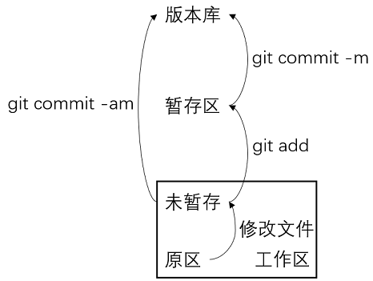
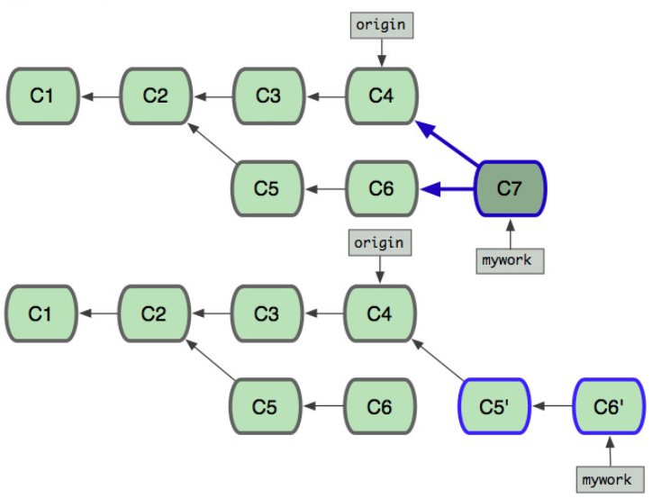

# git相关操作

```
https://www.liaoxuefeng.com/wiki/896043488029600
```

## 本地版本管理

`git init` 将当前目录变成git可以管理的目录(生成 .git)

`git add`、`git commit -m` 将文件添加到版本库

`git status` 查看版状态

+ 未add： untracked files(新文件)、changes not staged for commit
+ add但未commit： changes to be committed
+ committed： nothing to commit，working tree clean



`git diff` 查找文件的修改内容

`git reset --hard HEAD^ (HEAD~x)` 版本回退

+ `HEAD`表示当前版本，上一个版本是`HEAD^`，上上个版本是`HEAD^^`，也可以使用数字表示：往上100个版本`HEAD~100`
+ `--hard`
+ `HEAD^`也可以使用commit id代替

`git log` 查看提交历史

`git reflog` 查看历史命令

`git checkout --<file>` 丢弃工作区的修改(若暂存区有提交，则撤回到暂存区，否则撤回到版本库)，总之，就是让这个文件回到最近一次`git commit`或`git add`时的状态。命令中的`--`很重要，没有`--`，就变成了“切换到另一个分支”的命令。

`git reset HEAD <file>` 丢弃暂存区的修改，重新放回工作区

+ 场景1：当你改乱了工作区某个文件的内容，想直接丢弃工作区的修改时，用命令`git checkout -- file`。
+ 场景2：当你不但改乱了工作区某个文件的内容，还添加到了暂存区时，想丢弃修改，分两步，第一步用命令`git reset HEAD <file>`，就回到了场景1，第二步按场景1操作。

`git rm` 删除暂存区的文件

## 远程仓库

`ssh-keygen -t rsa -C "youremail@example.com"` 创建SSH Key

`git remote add origin git@github.com:...` 将本地仓库与远程仓库关联(若已有关联`git remote rm origin`)

`git push -u origin master` 将本地库内容推送到远程库(加了-u后，Git不但会把本地的`master`分支内容推送的远程新的`master`分支，还会把本地的`master`分支和远程的`master`分支关联起来，以后可以用git push代替git push origin master)

## 分支管理

`git branch <branch name>` 创建分支

`git checkout <branch name>`、`git switch` 切换分支

`git checkout -b <branch name>`、`git switch -c <branch name>` 创建并切换分支

`git branch` 查看当前所有分支

`git merge <branch name>` 快速合并分支，将`<branch name>`合并给当前分支

+ 合并分支时，加上`--no-ff`参数就可以用普通模式合并，合并后的历史有分支，能看出来曾经做过合并，而`fast forward`合并就看不出来曾经做过合并。
+ `git merge --no-ff -m "commit message" <branch name>`

`git branch -d <branch name>` 删除分支

git无法自动合并分支时，首先需要解决冲突，即把合并失败的文件手动编辑为我们希望的内容

`git log --graph` 查看分支合并图

`git stash save "save message"`储存当前工作现场(该操作后工作区是clean的)，执行存储时，添加备注，方便查找，只有git stash 也要可以的，但查找时不方便识别。

`git stash list` 查看stash了哪些存储

`git stash show` 显示做了哪些改动，默认show第一个存储,如果要显示其他存贮，后面加stash@{$num}，比如第二个 git stash show stash@{1}

`git stash show -p` 显示第一个存储的改动，如果想显示其他存存储，命令：git stash show stash@{$num} -p ，比如第二个：git stash show stash@{1} -p

`git stash apply` 应用某个存储,但不会把存储从存储列表中删除，默认使用第一个存储,即stash@{0}，如果要使用其他个，git stash apply stash@{$num} ， 比如第二个：git stash apply stash@{1} 

`git stash pop` 命令恢复之前缓存的工作目录，将缓存堆栈中的对应stash删除，并将对应修改应用到当前的工作目录下,默认为第一个stash,即stash@{0}，如果要应用并删除其他stash，命令：git stash pop stash@{$num} ，比如应用并删除第二个：git stash pop stash@{1}

`git stash drop stash@{\$num}` 丢弃stash@{\$num}存储，从列表中删除这个存储

`git stash clear` 删除所有缓存的stash

`git cherry-pick <commit_id>` 复制一个特定的修改提交到当前分支

**多人协作：**

`git clone` (只克隆master)

`git remote` 查看远程库的信息

`git remote -v` 查看远程库的详细信息

`git pull`

`git checkout -b <name> origin/<name>` clone远程除了master以外的其他分支

1. 首先，可以试图用`git push origin <branch-name>`推送自己的修改；
2. 如果推送失败，则因为远程分支比你的本地更新，需要先用`git pull`试图合并；
3. 如果合并有冲突，则解决冲突，并在本地提交；
4. 没有冲突或者解决掉冲突后，再用`git push origin <branch-name>`推送就能成功！

5. 如果`git pull`提示`no tracking information`，则说明本地分支和远程分支的链接关系没有创建，用命令`git branch --set-upstream-to <branch-name> origin/<branch-name>`。

`git rebase` 把本地未push的分叉提交历史整理成直线

```
git checkout master
git pull
git checkout local
git rebase -i HEAD~2  //合并提交 --- 2表示合并两个
git rebase master---->解决冲突--->git rebase --continue
git checkout master
git merge local
git push
```



**从github上clone某个文件夹**

```shell
# 创建一个空的本地仓库，同时将远程Git Server URL加入到Git Config文件中。
$ mkdir project_folder
$ cd project_folder
$ git init
$ git remote add -f origin <url>
# 在Config中允许使用Sparse Checkout模式
$ git config core.sparsecheckout true
# 将想Check Out的文件夹保存在.git/info/sparse-checkout
$ echo "<file_path>"  >> .git/info/sparse-checkout
$ git pull origin master
```

