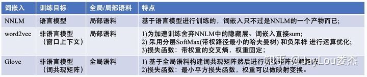

## NLP

### word2vec(CBOW&Skip-gram)和GloVe

word2vec哪种训练方式更好

word2vec是NNLM的一个较为典型的代表，其利用了DNN的方法来训练获取到词向量，而且词向量是中间产物，这个思路最早是Bengio提出，Google Brain提出的word2vec让词向量火了起来。而GloVe是采用词频统计信息，利用一些数学方法逐步优化得来，它没有神经网络的结构，所以词向量训练的速度相对更快。（这里当时不记得具体的公式推导了，原论文我倒是看过，但是当时记得不清了，实际上GloVe是词共现矩阵+类SVD的方法）

word2vec从宏观上描述了DNN的一个结构，从输入（大致带过分词，词表构建，one-hot等过程），到隐层，到输出层。然后详细讲了两种训练结构，即CBoW和Skip-Gram，但是当时这两种方法被我说反了。（当时并无觉察）讲完两种训练方法后，大致介绍了下训练时候词表大小过大，输出层过大的优化方法，即：**hierarchical softmax**和**negative sampling**。

#### CBOW(Continuous Bag-of-Words)

1 输入层：上下文单词的onehot. {假设单词向量空间dim为V，上下文单词个数为C}

2 所有onehot分别乘以共享的输入权重矩阵W. {V*N矩阵，N为自己设定的数，初始化权重矩阵W}*

*3 所得的向量 {因为是onehot所以为向量} 相加求平均作为隐层向量, size为1*N.

4 乘以输出权重矩阵W' {N*V}*

*5 得到向量 {1*V} 激活函数处理得到V-dim概率分布 {PS: 因为是onehot嘛，其中的每一维斗代表着一个单词}

6 概率最大的index所指示的单词为预测出的中间词（target word）与true label的onehot做比较，误差越小越好（根据误差更新权重矩阵）

所以，需要定义loss function（一般为交叉熵代价函数），采用梯度下降算法更新W和W'。训练完毕后，输入层的每个单词与矩阵W相乘得到的向量的就是我们想要的词向量（word embedding），这个矩阵（所有单词的word embedding）也叫做look up table（其实聪明的你已经看出来了，其实这个look up table就是矩阵W自身），也就是说，任何一个单词的onehot乘以这个矩阵都将得到自己的词向量。有了look up table就可以免去训练过程直接查表得到单词的词向量了。

#### Skip-Gram

[理解 Word2Vec 之 Skip-Gram 模型](https://zhuanlan.zhihu.com/p/27234078)

*下文中所有的Word2Vec都是指Skip-Gram模型*

Word2Vec模型实际上分为了两个部分，**第一部分为建立模型，第二部分是通过模型获取嵌入词向量。**Word2Vec的整个建模过程实际上与自编码器（auto-encoder）的思想很相似，即先基于训练数据构建一个神经网络，当这个模型训练好以后，我们并不会用这个训练好的模型处理新的任务，我们真正需要的是这个模型通过训练数据所学得的参数，例如隐层的权重矩阵——后面我们将会看到这些权重在Word2Vec中实际上就是我们试图去学习的“word vectors”。基于训练数据建模的过程，我们给它一个名字叫“Fake Task”，意味着建模并不是我们最终的目的。


**高效训练**

1. 将常见的单词组合（word pairs）或者词组作为单个“words”来处理。

2. 对高频次单词进行抽样来减少训练样本的个数。

   某个单词被留下的概率：$P(w_i)=(\sqrt\frac{Z(w_1)}{0.001}+1)\times\frac{0.001}{Z(w_i)}$，其中$Z(w_i)$是单词$w_i$出现的频率，0.001是一个超参数，文档中对这个参数的解释为“ threshold for configuring which higher-frequency words are randomly downsampled”。这个值越小意味着这个单词被保留下来的概率越小。

3. 对优化目标采用“negative sampling”方法，这样每个训练样本的训练只会更新一小部分的模型权重，从而降低计算负担。

   当使用负采样时，我们将随机选择一小部分的negative words（比如选5个negative words）来更新对应的权重。我们也会对我们的“positive” word进行权重更新。

   >  在论文中，作者指出指出对于小规模数据集，选择5-20个negative words会比较好，对于大规模数据集可以仅选择2-5个negative words。

   一个单词被选作negative sample的概率跟它出现的频次有关，出现频次越高的单词越容易被选作negative words。
   
4. hierarchical softmax

   和传统的神经网络输出不同的是，word2vec的hierarchical softmax结构是把输出层改成了一颗哈夫曼树，其中图中白色的叶子节点表示词汇表中所有的|V|个词,黑色节点表示非叶子节点,每一个叶子节点也就是每一个单词,都对应唯一的一条从root节点出发的路径。我们的目的是使的w=wO这条路径的概率最大，即: P(w=wO|wI)最大,假设最后输出的条件概率是W2最大，那么我只需要去更新从根结点到w2这一个叶子结点的路径上面节点的向量即可，而不需要更新所有的词的出现概率，这样大大的缩小了模型训练更新的时间。

   假设我们要计算W2叶子节点的概率，我们需要从根节点到叶子结点计算概率的乘积。我们知道，本模型替代的只是原始模型的softmax层，因此，某个非叶子节点的值即隐藏层到输出层的结果仍然是uj，我们对这个结果进行sigmoid之后，得到节点往左子树走的概率p，1-p则为往右子树走的概率。关于这棵树的训练方式比较复杂，但也是通过梯度下降等方法，这里不详述

#### GloVe

GloVe模型既使用了语料库的全局统计（overall statistics）特征，也使用了局部的上下文特征（即滑动窗口）。

[详解GloVe词向量模型](https://blog.csdn.net/buchidanhuang/article/details/98471741)

[通俗易懂理解——Glove算法原理](https://zhuanlan.zhihu.com/p/42073620)


#### FastText

一般情况下，使用fastText进行文本分类的同时也会产生词的embedding，即embedding是fastText分类的产物。除非你决定使用预训练的embedding来训练fastText分类模型，这另当别论。

**字符级别的n-gram**

word2vec把语料库中的每个单词当成原子的，它会为每个单词生成一个向量。这忽略了单词内部的形态特征，比如：“apple” 和“apples”，“达观数据”和“达观”，这两个例子中，两个单词都有较多公共字符，即它们的内部形态类似，但是在传统的word2vec中，这种单词内部形态信息因为它们被转换成不同的id丢失了。

**为了克服这个问题，fastText使用了字符级别的n-grams来表示一个单词。**对于单词“apple”，假设n的取值为3，则它的trigram有:

**“<ap”, “app”, “ppl”, “ple”, “le>”**

其中，<表示前缀，>表示后缀。于是，我们可以用这些trigram来表示“apple”这个单词，进一步，我们可以用这5个trigram的向量叠加来表示“apple”的词向量。

**这带来两点好处：**

1. 对于低频词生成的词向量效果会更好。因为它们的n-gram可以和其它词共享。

2. 对于训练词库之外的单词，仍然可以构建它们的词向量。我们可以叠加它们的字符级n-gram向量。

**不同的是，**CBOW的输入是目标单词的上下文，fastText的输入是多个单词及其n-gram特征，这些特征用来表示单个文档；CBOW的输入单词被onehot编码过，fastText的输入特征是被embedding过；CBOW的输出是目标词汇，fastText的输出是文档对应的类标。

**值得注意的是，fastText在输入时，将单词的字符级别的n-gram向量作为额外的特征；在输出时，fastText采用了分层Softmax，大大降低了模型训练时间。**这两个知识点在前文中已经讲过，这里不再赘述。

###                                                                                                                                                                                                                                                                                                                                                                                                                                                                                                                                                                             Subword

#### Byte Pair Encoding

BPE(字节对)编码或二元编码是一种简单的数据压缩形式，其中最常见的一对连续字节数据被替换为该数据中不存在的字节。 后期使用时需要一个替换表来重建原始数据。OpenAI GPT-2与Facebook RoBERTa均采用此方法构建subword vector。

- 优点: 可以有效地平衡词汇表大小和步数(编码句子所需的token数量)。
- 缺点: 基于贪婪和确定的符号替换，不能提供带概率的多个分片结果。

**算法**

1. 准备足够大的训练语料
2. 确定期望的subword词表大小
3. 将单词拆分为字符序列并在末尾添加后缀"</ w>"，统计单词频率。 本阶段的subword的粒度是字符。 例如，“ low”的频率为5，那么我们将其改写为"low</ w>"：5
4. 统计每一个连续字节对的出现频率，选择最高频者合并成新的subword
5. 重复第4步直到达到第2步设定的subword词表大小或下一个最高频的字节对出现频率为1

停止符"</ w>"的意义在于表示subword是词后缀。举例来说："st"字词不加"</ w>"可以出现在词首如"st ar"，加了"</ w>"表明改字词位于词尾，如"wide st</ w>"，二者意义截然不同。

每次合并后词表可能出现3种变化：

- +1，表明加入合并后的新字词，同时原来的2个子词还保留（2个字词不是完全同时连续出现）
- +0，表明加入合并后的新字词，同时原来的2个子词中一个保留，一个被消解（一个字词完全随着另一个字词的出现而紧跟着出现）
- -1，表明加入合并后的新字词，同时原来的2个子词都被消解（2个字词同时连续出现）

实际上，随着合并的次数增加，词表大小通常先增加后减小。

**编码和解码**

- 编码

在之前的算法中，我们已经得到了subword的词表，对该词表按照子词长度由大到小排序。编码时，对于每个单词，遍历排好序的子词词表寻找是否有token是当前单词的子字符串，如果有，则该token是表示单词的tokens之一。

我们从最长的token迭代到最短的token，尝试将每个单词中的子字符串替换为token。 最终，我们将迭代所有tokens，并将所有子字符串替换为tokens。 如果仍然有子字符串没被替换但所有token都已迭代完毕，则将剩余的子词替换为特殊token，如<unk>。

例子

```text
# 给定单词序列
[“the</w>”, “highest</w>”, “mountain</w>”]

# 假设已有排好序的subword词表
[“errrr</w>”, “tain</w>”, “moun”, “est</w>”, “high”, “the</w>”, “a</w>”]

# 迭代结果
"the</w>" -> ["the</w>"]
"highest</w>" -> ["high", "est</w>"]
"mountain</w>" -> ["moun", "tain</w>"]
```

编码的计算量很大。 在实践中，我们可以pre-tokenize所有单词，并在词典中保存单词tokenize的结果。 如果我们看到字典中不存在的未知单词。 我们应用上述编码方法对单词进行tokenize，然后将新单词的tokenization添加到字典中备用。

- 解码

将所有的tokens拼在一起。

例子：

```python
# 编码序列
[“the</w>”, “high”, “est</w>”, “moun”, “tain</w>”]

# 解码序列
“the</w> highest</w> mountain</w>”
```

#### WordPiece

Google的Bert模型在分词的时候使用的是WordPiece算法。与BPE算法类似，WordPiece算法也是每次从词表中选出两个子词合并成新的子词。与BPE的最大区别在于，如何选择两个子词进行合并：BPE选择频数最高的相邻子词合并，而WordPiece选择能够提升语言模型概率最大的相邻子词加入词表。

看到这里，你可能不清楚WordPiece是如何选取子词的。这里，通过形式化方法，能够清楚地理解WordPiece在合并这一步是如何作出选择的。假设句子$S=(t_1,t_2,...,t_n)$由n个子词组成，$t_i$表示子词，且假设各个子词之间是独立存在的，则句子$S$的语言模型似然值等价于所有子词概率的乘积：
$$
logP(S)=\sum_{i=1}^nlogP(t_i)
$$
假设把相邻位置的x和y两个子词进行合并，合并后产生的子词记为z，此时句子$S$似然值的变化可表示为：
$$
logP(t_z)-(logP(t_x)+logP(t_y))=log(\frac{P(t_z)}{p(t_x)p(t_y)})
$$
从上面的公式，很容易发现，似然值的变化就是两个子词之间的互信息。简而言之，WordPiece每次选择合并的两个子词，他们具有最大的互信息值，也就是两子词在语言模型上具有较强的关联性，它们经常在语料中以相邻方式同时出现。

#### Unigram Language Model

与WordPiece一样，Unigram Language Model(ULM)同样使用语言模型来挑选子词。不同之处在于，BPE和WordPiece算法的词表大小都是从小到大变化，属于增量法。而Unigram Language Model则是减量法,即先初始化一个大词表，根据评估准则不断丢弃词表，直到满足限定条件。ULM算法考虑了句子的不同分词可能，因而能够输出带概率的多个子词分段。

我们接下来看看ULM是如何操作的。

对于句子S，$\vec{x}=(x_1,x_2,...x_m)$为句子的一个分词结果，由m个子词组成。所以，当前分词下句子S的似然值可以表示为：
$$
P(\vec{x})=\prod_{i=1}^mP(x_i)
$$
对于句子S，挑选似然值最大的作为分词结果，则可以表示为
$$
x^*=arg\ \underset{\it{x\in U(x)}}{\rm{max}}P(\vec{x})
$$
这里$U(x)$包含了句子的所有分词结果。在实际应用中，词表大小有上万个，直接罗列所有可能的分词组合不具有操作性。针对这个问题，可通过维特比算法得到$x^*$来解决。

那怎么求解每个子词的概率$P(x_i)$呢？ULM通过EM算法来估计。假设当前词表V, 则M步最大化的对象是如下似然函数：
$$
L=\sum_{s=1}^{|D|}log(P(X^{(s)}))=\sum_{s=1}^{|D|}log(\sum_{x\in U(X^{(s)})}P(x))
$$
其中，|D|是语料库中语料数量。上述公式的一个直观理解是，将语料库中所有句子的所有分词组合形成的概率相加。

但是，初始时，词表V并不存在。因而，ULM算法采用不断迭代的方法来构造词表以及求解分词概率：

1. 初始时，建立一个足够大的词表。一般，可用语料中的所有字符加上常见的子字符串初始化词表，也可以通过BPE算法初始化。
2. 针对当前词表，用EM算法求解每个子词在语料上的概率。
3. 对于每个子词，计算当该子词被从词表中移除时，总的loss降低了多少，记为该子词的loss。
4. 将子词按照loss大小进行排序，丢弃一定比例loss最小的子词(比如20%)，保留下来的子词生成新的词表。这里需要注意的是，单字符不能被丢弃，这是为了避免OOV情况。
5. 重复步骤2到4，直到词表大小减少到设定范围。

可以看出，ULM会保留那些以较高频率出现在很多句子的分词结果中的子词，因为这些子词如果被丢弃，其损失会很大。

### Transformer、ELMo、GPT、Bert和XLNET

#### Attention

**3大优点**

1. 参数少: 模型复杂度跟CNN、RNN相比，复杂度更小，参数也更少。所以对算力的要求也就更小。
2. 速度快: Attention 解决了 RNN 不能并行计算的问题。Attention机制每一步计算不依赖于上一步的计算结果，因此可以和CNN一样并行处理。
3. 效果好: 在 Attention 机制引入之前，有一个问题大家一直很苦恼：长距离的信息会被弱化，就好像记忆能力弱的人，记不住过去的事情是一样的。Attention 是挑重点，就算文本比较长，也能从中间抓住重点，不丢失重要的信息。下图红色的预期就是被挑出来的重点。

[Transformer](https://hyc2026.github.io/#/Transformer/Transformer)

[PTMs：NLP预训练模型的全面总结](https://zhuanlan.zhihu.com/p/115014536)

#### 为什么 Bert 的三个 Embedding 可以进行相加

一种解释是空间维度很高，所以模型总能分开各个组分。

三个向量concat之后走一次全连接，等价于各自embedding之后相加。

[XLNet:运行机制及和Bert的异同比较](https://zhuanlan.zhihu.com/p/70257427)

### HMM和CRF

当时HMM的具体理论在准备阶段就大致地看了下，面试官很nice，没有很为难，理论的不记得那来实践的，就接着这个问题，问了HMM的几个要素，即：初始概率，状态转移矩阵，发射矩阵，这三个要素，然后我主要讲了下这三个要素的运算过程，提及了一下维特比算法。（这里当时准备的不充分，说的不是特别清楚，后来我去恶补了一下）

维特比算法其实是一种动态规划算法，动态规划算法通常用来解决什么问题，在HMM里是怎么使用的？
大致描述了下动态规划的最优解问题，然后结合HMM的迭代过程说了一些。（后来仔细看了下，感觉面试官应该还是想听到HMM的理论，因为HMM推导会用到它里面的假设，然后得到递推关系，就可以分解为子问题，利用维特比算法求解）

CRF 是**判别模型**，对问题的条件概率分布建模，而 HMM 是**生成模型**，对联合概率分布建模。

[序列标注](https://hyc2026.github.io/#/nlp/seq_label)

### RNN、LSTM、GRU、BiLSTM

lstm为什么是sigmoid函数和tanh函数，可否换成别的激活函数？

Sigmoid的输出在0-1之同，符合门控的物理定义，且当输入较大或较小时，其输出会非常接近1或0，从而保证该门开或关，在生成候选记亿时，使用**tanh函数，是因为其输出在-1-1之间，这与大多数场景下特征分布是0中心的吻合**。此外，**tanh函数在输入为0近相比 Sigmoid函数有更大的梯度，通常使模型收敛更快。**

#### RNN

$$
S_t=\sigma(W^i\cdot X+W^s\cdot S_{t-1})\\
O_t=\sigma(W^o\cdot S_t)
$$

#### LSTM


$$
f_t=\sigma(W_f\cdot [h_{t-1},X_t]+b_f)\\
i_t=\sigma(W_i\cdot [h_{t-1},X_t]+b_i)\\
o_t=\sigma(W_o\cdot [h_{t-1},X_t]+b_o)\\
\widetilde C_t=\tanh(W_c\cdot [h_{t-1},x_t]+b_c)\\
C_t = f_t*C_{t-1}+i_t*\widetilde C_t\\
h_t=o_t*\tanh(C_t)
$$

#### GRU


$$
z_t=\sigma(W_z\cdot [h_{t-1}, x_t])\\
r_t=\sigma(W_r\cdot [h_{t-1}, x_t])\\
\widetilde h_t=\tanh(W_h\cdot[r_t*h_{t-1},x_t])\\
h_t=(1-z_t)*h_{t-1}+z_t*\widetilde h_t 
$$

### 正则化

#### Dropout

Dropout可以作为训练深度神经网络的一种trick供选择。在每个训练批次中，通过忽略一定比例的特征检测器（让其隐层节点值为0），可以明显地减少过拟合现象。这种方式可以减少特征检测器（隐层节点）间的相互作用，检测器相互作用是指某些检测器依赖其他检测器才能发挥作用。

**具体过程：**

1. 首先随机（临时）删掉网络中一定比例的隐藏神经元，输入输出神经元保持不变

2. 然后把输入x通过修改后的网络前向传播，然后把得到的损失结果通过修改的网络反向传播。一小批训练样本执行完这个过程后，在没有被删除的神经元上按照随机梯度下降法更新对应的参数（w，b）。

3. 恢复被删掉的神经元（此时被删除的神经元保持原样，而没有被删除的神经元已经有所更新）

不断重复这一过程。

**作用：**

取平均的作用、减少神经元之间复杂的共适应关系

**实现**

dropout 有两种实现方式，**Vanilla Dropout** 和 **Inverted Dropout**


```python
class Dropout(InplaceFunction):
    ... ...
    @classmethod
    def forward(cls, ctx, input, p=0.5, train=False, inplace=False):
        ctx.p = p
        ctx.train = train
        
        if ctx.p == 0 or not ctx.train: # infer阶段保持不变
            return input
        
        output = input.clone()
        
        ctx.noise = cls._make_noise(input) # mask
        if ctx.p == 1:
            ctx.noise.fill_(0)
        else:
            ctx.noise.bernoulli_(1 - ctx.p).div_(1 - ctx.p) # 对mask做1/(1-p)倍放大
        ctx.noise = ctx.noise.expand_as(input)
        output.mul_(ctx.noise)
        
        return output
    
    @classmethod
    def backward(ctx, grad_output):
        if ctx.p > 0 and ctx.train:
            return grad_output * ctx.noise, None, None, None # 梯度和输入做同样的mask和放大
        else:
            return grad_output, None, None, None
```

#### L1和L2正则化：

我们所说的正则化，就是在原来的loss function的基础上，加上了一些正则化项或者称为模型复杂度惩罚项。

优化目标：
$$
min\ 1/N*\sum_{i=1}^N(y_i-w^Tx_i)^2
$$
L1正则
$$
min\ 1/N*\sum_{i=1}^N(y_i-w^Tx_i)^2 + C||w||_1
$$
L2正则
$$
min\ 1/N*\sum_{i=1}^N(y_i-w^Tx_i)^2 + C||w||_2^2
$$
结构风险最小化： 在经验风险最小化的基础上（也就是训练误差最小化），尽可能采用简单的模型，以此提高泛化预测精度

最终加入**L1**范数得到的解，一定是某个菱形和某条原函数等高线的切点。经过观察可以看到，几乎对于很多原函数等高曲线，和某个菱形相交的时候及其容易相交在坐标轴，也就是说最终的结果，解的某些维度及其容易是0，这也就是我们所说的L1更容易得到稀疏解（解向量中0比较多)的原因。

当加入**L2**正则化的时候，分析和L1正则化是类似的，也就是说我们仅仅是从菱形变成了圆形而已，同样还是求原曲线和圆形的切点作为最终解。当然与L1范数比，我们这样求的L2范数的，不容易交在坐标轴上，但是仍然比较靠近坐标轴**。**因此这也就是我们老说的，L2范数能让解比较小（靠近0），但是比较平滑（不等于0）。

**正则化之所以能够降低过拟合的原因在于，正则化是结构风险最小化的一种策略实现。**

**给loss function加上正则化项，能使得新得到的优化目标函数h = f+normal，需要在f和normal中做一个权衡（trade-off），如果还像原来只优化f的情况下，那可能得到一组解比较复杂，使得正则项normal比较大，那么h就不是最优的，因此可以看出加正则项能让解更加简单，符合奥卡姆剃刀理论，同时也比较符合在偏差和方差（方差表示模型的复杂度）分析中，通过降低模型复杂度，得到更小的泛化误差，降低过拟合程度。**

**L1正则化和L2正则化：**

**L1正则化就是在loss function后边所加正则项为L1范数，加上L1范数容易得到稀疏解（0比较多）。L2正则化就是loss function后边所加正则项为L2范数的平方，加上L2正则相比于L1正则来说，得到的解比较平滑（不是稀疏），但是同样能够保证解中接近于0（但不是等于0，所以相对平滑）的维度比较多，降低模型的复杂度。**

### 各种Loss

[各种Loss学习笔记](https://zhuanlan.zhihu.com/p/400011513)

### 优化器SGD和Adam

[深度学习优化方法总结比较](https://zhuanlan.zhihu.com/p/22252270)

### 激活函数

[深度学习领域最常用的10个激活函数](https://zhuanlan.zhihu.com/p/352668984)

[常用激活函数及其导数](https://zhuanlan.zhihu.com/p/371688024)

### 梯度消失和梯度爆炸

#### DNN


**所以，总结一下，为什么会发生梯度爆炸和消失：**

> 本质上是因为神经网络的更新方法，梯度消失是因为反向传播过程中对梯度的求解会产生sigmoid导数和参数的连乘，sigmoid导数的最大值为0.25，权重一般初始都在0，1之间，乘积小于1，多层的话就会有多个小于1的值连乘，导致靠近输入层的梯度几乎为0，得不到更新。梯度爆炸是也是同样的原因，只是如果初始权重大于1，或者更大一些，多个大于1的值连乘，将会很大或溢出，导致梯度更新过大，模型无法收敛。

**解决方案**

+ 预训练加微调
+ 梯度剪切
+ 正则
+ 改变激活函数
+ 残差结构
+ batch norm

#### RNN

**现在来解释一下，为什么说RNN和DNN的梯度消失问题含义不一样？**

1. **先来说DNN中的反向传播：**在上文的DNN反向传播中，我推导了两个权重的梯度，第一个梯度是直接连接着输出层的梯度，求解起来并没有梯度消失或爆炸的问题，因为它没有连乘，只需要计算一步。第二个梯度出现了连乘，也就是说越靠近输入层的权重，梯度消失或爆炸的问题越严重，可能就会消失会爆炸。**一句话总结一下，DNN中各个权重的梯度是独立的，该消失的就会消失，不会消失的就不会消失。**
2. **再来说RNN：**RNN的特殊性在于，它的权重是共享的。抛开W_o不谈，因为它在某时刻的梯度不会出现问题（某时刻并不依赖于前面的时刻），但是W_s和W_x就不一样了，每一时刻都由前面所有时刻共同决定，是一个相加的过程，这样的话就有个问题，当距离长了，计算最前面的导数时，最前面的导数就会消失或爆炸，但当前时刻整体的梯度并不会消失，因为它是求和的过程，当下的梯度总会在，只是前面的梯度没了，但是更新时，由于权值共享，所以整体的梯度还是会更新，**通常人们所说的梯度消失就是指的这个，指的是当下梯度更新时，用不到前面的信息了，因为距离长了，前面的梯度就会消失，也就是没有前面的信息了，但要知道，整体的梯度并不会消失，因为当下的梯度还在，并没有消失。**
3. **一句话概括：**RNN的梯度不会消失，RNN的梯度消失指的是当下梯度用不到前面的梯度了，但DNN靠近输入的权重的梯度是真的会消失。

“LSTM 能解决梯度消失/梯度爆炸”是对 LSTM 的经典误解。这里我先给出几个粗线条的结论，详细的回答以后有时间了再扩展：

1. 首先需要明确的是，RNN 中的梯度消失/梯度爆炸和普通的 MLP 或者深层 CNN 中梯度消失/梯度爆炸的含义不一样。MLP/CNN 中不同的层有不同的参数，各是各的梯度；而 RNN 中同样的权重在各个时间步共享，最终的梯度 g = 各个时间步的梯度 $g_t$ 的和。

2. 由 1 中所述的原因，**RNN 中总的梯度是不会消失的**。即便梯度越传越弱，那也只是远距离的梯度消失，由于近距离的梯度不会消失，所有梯度之和便不会消失。**RNN 所谓梯度消失的真正含义是，梯度被近距离梯度主导，导致模型难以学到远距离的依赖关系。**

3. **LSTM 中梯度的传播有很多条路径**，$c_{t-1}\rightarrow c_t=f_t\odot c_{t-1}+i_y\odot \hat c_t$ 这条路径上只有逐元素相乘和相加的操作，梯度流最稳定；但是其他路径（例如 $c_{t-1}\rightarrow h_{t-1}\rightarrow i_t\rightarrow c_t$上梯度流与普通 RNN 类似，照样会发生相同的权重矩阵反复连乘。

4. **LSTM 刚提出时没有遗忘门**，或者说相当于$f_t=1$ ，这时候在 直$c_{t-1}\rightarrow c_t$接相连的短路路径上，$\frac{\rm d\it l}{\rm d\it c_{t}}$可以无损地传递给 $\frac{\rm d\it l}{\rm d\it c_{t-1}}$，从而**这条路径**上的梯度畅通无阻，不会消失。类似于 ResNet 中的残差连接。

5. 但是在**其他路径**上，LSTM 的梯度流和普通 RNN 没有太大区别，依然会爆炸或者消失。由于总的远距离梯度 = 各条路径的远距离梯度之和，即便其他远距离路径梯度消失了，只要保证有一条远距离路径（就是上面说的那条高速公路）梯度不消失，总的远距离梯度就不会消失（正常梯度 + 消失梯度 = 正常梯度）。因此 LSTM 通过改善**一条路径**上的梯度问题拯救了**总体的远距离梯度**。

6. 同样，因为总的远距离梯度 = 各条路径的远距离梯度之和，高速公路上梯度流比较稳定，但其他路径上梯度有可能爆炸，此时总的远距离梯度 = 正常梯度 + 爆炸梯度 = 爆炸梯度，因此 **LSTM 仍然有可能发生梯度爆炸**。不过，由于 LSTM 的其他路径非常崎岖，和普通 RNN 相比多经过了很多次激活函数（导数都小于 1），因此 **LSTM 发生梯度爆炸的频率要低得多**。实践中梯度爆炸一般通过梯度裁剪来解决。

7. 对于现在常用的带遗忘门的 LSTM 来说，6 中的分析依然成立，而 5 分为两种情况：其一是遗忘门接近 1（例如模型初始化时会把 forget bias 设置成较大的正数，让遗忘门饱和），这时候远距离梯度不消失；其二是**遗忘门接近 0，但这时模型是故意阻断梯度流的，这不是 bug 而是 feature**（例如情感分析任务中有一条样本 “A，但是 B”，模型读到“但是”后选择把遗忘门设置成 0，遗忘掉内容 A，这是合理的）。当然，常常也存在 f 介于 [0, 1] 之间的情况，在这种情况下只能说 LSTM 改善（而非解决）了梯度消失的状况。

### 翻译和ner评价指标

## 语言模型

[综述：神经网络语言模型](https://zhuanlan.zhihu.com/p/109564205)

`FFNNLM`: FFNN的输入必须是固定长度，因此将前n-1个词作为预测下一个词的上下文。FFNNLM通过学习到每个词的分布式表示，来实现在连续空间上的建模。其中，词的表示只是LM用于提升其他NLP任务的副产品。CBOW和Skip-gram是基于FFNNLM提出的。

`RNNLM`

`LSTM-RNNLM`

**降低困惑度的技术**

字符感知模型

因子模型

双向模型

缓存机制

注意力机制

`ELMo`

`GPT`

`Bert`

### 预训练模型

[PTMs：NLP预训练模型的全面总结](https://zhuanlan.zhihu.com/p/115014536)

分布式表示相较于传统的独热编码（one-hot）表示具备更强的表示能力，而独热编码存在维度灾难和语义鸿沟（不能进行相似度计算）等问题。传统的分布式表示方法，如矩阵分解（SVD/LSA）、LDA等均是根据全局语料进行训练，是机器学习时代的产物。

PTMs的发展经历从浅层的词嵌入到深层编码两个阶段，按照这两个主要的发展阶段，我们归纳出PTMs两大范式：「浅层词嵌入」和「预训练编码器」。

**1、浅层词嵌入（** Non-Contextual Embeddings**）**

浅层词嵌入，这一类PTMs范式是我们通常所说的“词向量”，其主要特点是学习到的是上下文独立的静态词嵌入，其主要代表为NNLM[[2\]](https://zhuanlan.zhihu.com/p/115014536#ref_2)、word2vec（CBOW[[3\]](https://zhuanlan.zhihu.com/p/115014536#ref_3)、Skip-Gram[[3\]](https://zhuanlan.zhihu.com/p/115014536#ref_3)）、Glove[[4\]](https://zhuanlan.zhihu.com/p/115014536#ref_4)等。这一类词嵌入通常采取浅层网络进行训练，而应用于下游任务时，整个模型的其余部分仍需要从头开始学习。因此，对于这一范式的PTMs没有必要采取深层神经网络进行训练，采取浅层网络加速训练也可以产生好的词嵌入[[3\]](https://zhuanlan.zhihu.com/p/115014536#ref_3)。

浅层词嵌入的主要缺陷为：

- 词嵌入与上下文无关，每个单词的嵌入向量始终是相同，因此不能解决一词多义的问题。
- 通常会出现OOV问题，为了解决这个问题，相关文献提出了字符级表示或sub-word表示，如CharCNN[[5\]](https://zhuanlan.zhihu.com/p/115014536#ref_5) 、FastText[[6\]](https://zhuanlan.zhihu.com/p/115014536#ref_6) 和 Byte-Pair Encoding [[7\]](https://zhuanlan.zhihu.com/p/115014536#ref_7)。



图1给出了三种常见的浅层词嵌入之间的对比，Glove可以被看作是更换了目标函数和权重函数的全局word2vec。此外，相关文献也提出了句子和文档级别的嵌入方式，如 Skip-thought[[8\]](https://zhuanlan.zhihu.com/p/115014536#ref_8) 、Context2Vec[[9\]](https://zhuanlan.zhihu.com/p/115014536#ref_9) 等。

**2、预训练编码器（**Contextual Embeddings**）**

第二类PTMs范式为预训练编码器，主要目的是通过一个预训练的编码器能够输出上下文相关的词向量，解决一词多义的问题。这一类预训练编码器输出的向量称之为「上下文相关的词嵌入」。


图2给出了NLP各种编码器间的对比。PTMs中预训练编码器通常采用LSTM和Transformer（Transformer-XL），其中Transformer又依据其attention-mask方式分为Transformer-Encoder和Transformer-Decoder两部分。此外，Transformer也可看作是一种图神经网络GNN[[10\]](https://zhuanlan.zhihu.com/p/115014536#ref_10)。

这一类「预训练编码器」范式的PTMs主要代表有**ELMO**[[11\]](https://zhuanlan.zhihu.com/p/115014536#ref_11)、**GPT-1**[[12\]](https://zhuanlan.zhihu.com/p/115014536#ref_12)、**BERT**[[13\]](https://zhuanlan.zhihu.com/p/115014536#ref_13)、**XLNet**[[14\]](https://zhuanlan.zhihu.com/p/115014536#ref_14)等。

## 简历准备

1. 整体内容一定要跟岗位需求match，有的放矢。match的内容展开写，不match的一笔带过或者直接不写
2. 把最有信心在面试中谈起的经历所在的板块写在最前面（仅次于教育经历），并用配色突出这条经历

## 面试中的基础知识

> 方向不match的面试官喜欢考察**词向量和文本分类**相关的知识

**模型篇**

- SGNS/cBoW、FastText、ELMo等（从词向量引出）
- DSSM、DecAtt、ESIM等（从问答&匹配引出）
- HAN、DPCNN等（从分类引出）
- BiDAF、DrQA、QANet等（从MRC引出）
- CoVe、InferSent等（从迁移引出）
- MM、N-shortest等（从分词引出）
- Bi-LSTM-CRF等（从NER引出）
- LDA等主题模型（从文本表示引出）

**训练篇**

- point-wise、pair-wise和list-wise（匹配、ranking模型）
- 负采样、NCE
- 层级softmax方法，哈夫曼树的构建
- 不均衡问题的处理
- KL散度与交叉熵loss函数

**评价指标篇**

- F1-score
- PPL
- MRR、MAP

## TIPS

1. 一定不要错过提前批！一定不要错过提前批！一定不要错过提前批！不要相信错过提前批还有正式批的鬼话，很多核心部门的NLP岗的hc在提前批就用光了！
2. 提前批不要拖到末尾！尤其百度自然语言处理部的坑，面试当天就给口头offer，先占先得！
3. 阿里基本是远程面试，6轮面试都没编程题！简历内容准备好就可以直接投阿里了！
4. 内推之前千万不要把简历挂到腾讯校招系统，填上意向部门都没用，不match的其他部门很可能以迅雷不及掩耳之势强行捞起你的简历，然后你的腾讯之旅就举步维艰了（我跟另外俩小伙伴血的教训。。。）
5. 如果只是想找算法岗，但没有研究方向，没刷几篇paper，不过研发能力强，基础编程题解的快，工具用的熟，那就去投头条吧。（亲测它提前批的三轮技术面都没学术味儿，所以优势在对立面的小伙伴谨慎）