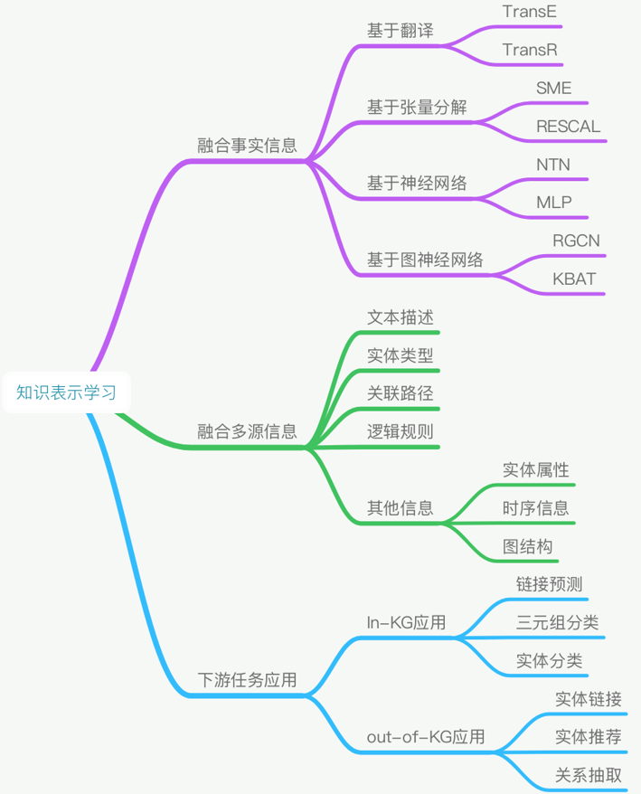

# 知识图谱

知识图谱(Knowledge Graph, KG)可以看作是一种辅助信息，它是一种有向异构图，节点表示实体，边表示实体间关系。一个KG通常包含多个形如(head, relation, tail)的三元组，表示头实体与尾实体存在某种关系。

## 知识图谱嵌入

知识图谱嵌入(Knowledge Graph Embedding, KGE)可以解决知识图谱作为复杂图结构难以直接利用的问题，KGE可以学习KG中实体关系的低维向量表示。

+ [TransE](Translating Embeddings for Modeling Multi-relational Data)将关系三元组中的关系项视作头实体和尾实体嵌入之间的转换，当三元组$(h,r,t)$成立时，$h_r\approx t$。
  $$
  f_r(h,t)=||h+r-t||_{l1/2}
  $$
  损失函数定义为：
  $$
  \mathcal{L}=\sum_{(h,l,t)\in S}\sum_{(h',l',t')\in S'_{(h,l,t)}}[\gamma +||h+r-t||_{l1/2}-||h'+r-t'||_{l1/2}]_+\\S'_{(h,l,t)}=\{(h',l,t)|h'\in E\}\cup\{(h,l,t')|t'\in E\}
  $$
  其中$[x]_+$​表示x中大于0的部分。
  
+ [TransH](Knowledge Graph Embedding by Translating on Hyperplanes)解决一对多、多对多关系，将关系建模为超平面上的平移向量，通过计算head和tail实体embedding在关系embedding上的投影，计算投影之间的关系。
  $$
  f_r(h,t)=||h_\bot+d_r-t_\bot||_2^2=||(h-w_r^\top hw_r)+d_r-(t-w_r^\top tw_r)||^2_2
  $$
  损失函数的定义与TransE类似，增加了对实体嵌入、关系平面及转移向量的约束：$\{e_i\}_{i=1}^{|R|}$，$\{(w_r,d_r)\}_{i=1}^{|R|}$
  $$
  \mathcal{L}=\sum_{(h,l,t)\in S}\sum_{(h',l',t')\in S'_{(h,l,t)}}[\gamma +f_r(h,t)-f_{r'}(h',t')]_++\{\sum_{e\in E}[||e||_2^2-1]_++\sum_{r\in R}[\frac{(w_r^\top d_r)^2}{||d_r||_2^2}-\epsilon^2]_+\}
  $$

+ [TransR](Learning Entity and Relation Embeddings for Knowledge Graph Completion)将实体和关系定义在不同的空间，将 head、tail embedding转换到relation embedding空间。对于每个关系r，定义一个投影矩阵$M_r\in R^{k\times d}$将实体从实体空间映射到关系空间：$h_r=hM_r$，$t_r=tM_r$
  $$
  f_r(h,t)=||h_r+r-t_r||_2^2
  $$
  损失函数：
  $$
  \mathcal{L}=\sum_{(h,l,t)\in S}\sum_{(h',l',t')\in S'_{(h,l,t)}}max(0,f_r(h,t)+\gamma-f_r(h',t'))
  $$

上述方法为每个关系学习一个向量表示，这样对于该关系下所有的实体对可能代表性不足(under-representative to fit all entity pairs under this relation)。基于聚类的TransR(Cluster-based TransR, CTransR)首先将输入实例分组，为每组学习一个关系向量$r_c$。
$$
f_r(h,t)=||h_{r,c}+r_c-t_{r,c}||_2^2+\alpha||r_c-r||^2_2
$$

## 知识图谱辅助推荐系统

知识图谱辅助推荐系统(Knowledge-Graph-Enhanced Recommender Systems)：给定用户集合、物品集合、用户参与标签和相关知识图谱，预测用户的点击概率。主要方法有：

+ 基于嵌入方法(Embedding-based methods)：首先用KGE的方法处理KG，得到实体、关系的embedding，利用推荐系统的方法得到物品、用户的embedding，设计一种模型来融合四类embedding。
+ 基于结构方法(Structure-based methods)：将KG和用户物品交互的图结构概括在一个统一的框架下，挖掘图结构信息。

### Deep Knowledge-aware Networks

`p15`

DKN: Deep knowledge-aware network for news recommendation.

### Multi-Task Feature Learning for KG-Enhanced RS

`p21`

Multi-Task Feature Learning for Knowledge Graph Enhanced Recommendation.

### RippleNet: Propagating User Preference in KGs

`p25`

RippleNet: Propagating User Preferences on the Knowledge Graph for Recommender Systems.

### Knowledge Graph Convolutional Networks

`p29`

Knowledge Graph Convolutional Networks for Recommender Systems.

Knowledge-aware Graph Neural Networks with Label Smoothness Regularization for Recommender Systems.

## 知识表征学习

表征学习的目的是将对象嵌入一个稠密的、低维的、实值的语义空间中。知识表征学习是表征学习的一个分支，其重点是将实体和关系嵌入知识图谱中。

最常见的表征学习方法是融合事实信息的方法，比如基于翻译、张量分解、神经网络和图神经网络的各种模型。但是这些模型并不善于处理大规模知识图谱中存在实体与关系长尾分布的问题，即很多实体数量极少甚至没有关系事实，从而导致的数据存在很严重的稀疏性。

### 融合文本和知识图谱

Aligning Knowledge and Text Embeddings by Entity Descriptions

`p40`

Representation Learning of Knowledge Graphs with Hierarchical Types

`p41`

**实体链接**任务的目标是把文本中的实体指称项，即实体名称，链接到知识库中对应的实体上。

`p43`

**实体推荐**任务的目标是根据给定的实体推荐一系列相关的实体

`p49`

**知识补全**，知识图谱补全(Knowledge Graph Completion, KGC)目前主要被抽象为一个预测问题，即预测出三元组中缺失的部分。

`p51`

基于翻译的知识表征学习方法是一种高效的方法，可以有效地使用实体和关系中的低维表示对知识图谱中的关系事实进行编码，从而缓解数据稀疏的问题，进而用于知识获取、融合和推理。

[TransE](Translating Embeddings for Modeling Multi-relational Data)将关系三元组中的关系项视作头实体和尾实体嵌入之间的转换，当三元组$(h,r,t)$成立时，$h_r\approx t$​。TransE在建模多对一、一对多和多对多关系时由于关系的复杂性，学习到的实体嵌入功能缺乏可辨别能力。[TransH](Knowledge Graph Embedding by Translating on Hyperplanes)将关系建模为超平面上的平移向量，并用法向量将实体投影到超平面上。[TransR](Learning Entity and Relation Embeddings for Knowledge Graph Completion)表征实体语义空间中的实体，并在涉及不同关系时使用特定于关系的转换矩阵将其投影到不同关系空间中。TransR的两个扩展：[TransD](Knowledge Graph Embedding via Dynamic Mapping Matrix)考虑了投影矩阵中实体的信息；[TransSpace](Knowledge Graph Completion with Adaptive Sparse Transfer Matrix)通过稀疏矩阵考虑关系的异质性和不平衡性。

TransE只考虑了实体之间的直接关系，[基于路径的TransE](Modeling Relation Paths for Representation Learning of Knowledge Bases)通过选择合理的关键路径，并用低维向量对其进行表示。(Composing relationships with translations)通过使用神网络在知识图谱中成功地考虑到关系路径，(Traversing Knowledge Graphs in Vector Space)将关系路径学习应用于基于知识图谱的问答。

以上讨论的大多数显存的只是表征学习方法只关注知识图谱的结构信息，而忽略了文本信息、类型信息和视觉信息等丰富的多源信息。这些交叉信息可以提供实体的补充信息，特别是对于关系事实较少的实体。针对文本信息，Wang等人(Knowledge Graph and Text Jointly Embedding)和Zhong等人(Aligning Knowledge and Text Embeddings by Entity Descriptions)提出将实体和单词通过与实体命名、描述和维基百科锚点对齐，共同嵌入统一的语义空间。Xie等人(Representation learning of knowledge graphs with entity descriptions)提出使用基于CBOW或CNN编码器的实体描述对实体进行表征。针对类型信息，Krompab等人(Type-Constrained Representation Learning in Knowledge Graphs)将类型信息作为每种关系的头为实体集的约束，来分辨属于同一类型的实体。不同于只将类型信息作为类型约束的是，Xie等人(Representation Learning of Knowledge Graphs with Hierarchical Types)通过设计投影矩阵的构造，利用层次型结构来提升TransR的性能。针对视觉信息，Xie等人(Image-embodied Knowledge Representation Learning)提出使用基于图像的知识表征学习方法，该方法通过对与实体相关的图像进行学习，从而将视觉信息考虑进来。

## 神经关系抽取

关系抽取旨在从纯文本元素中提取关系数据