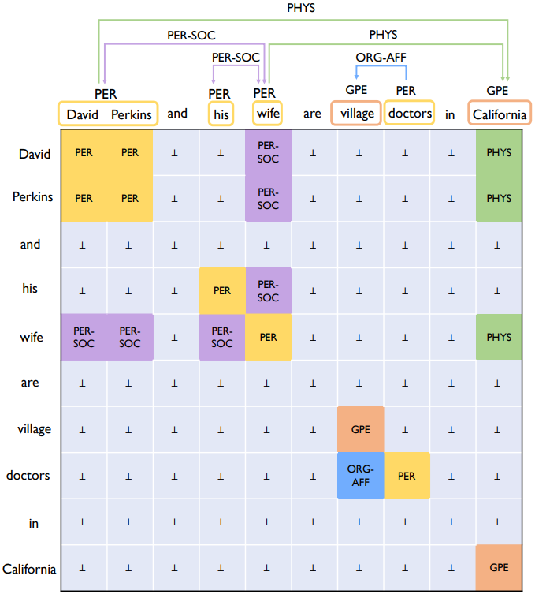
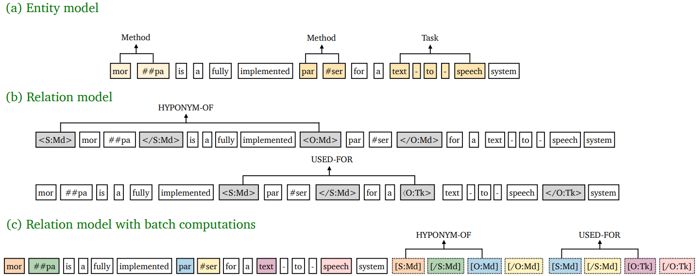
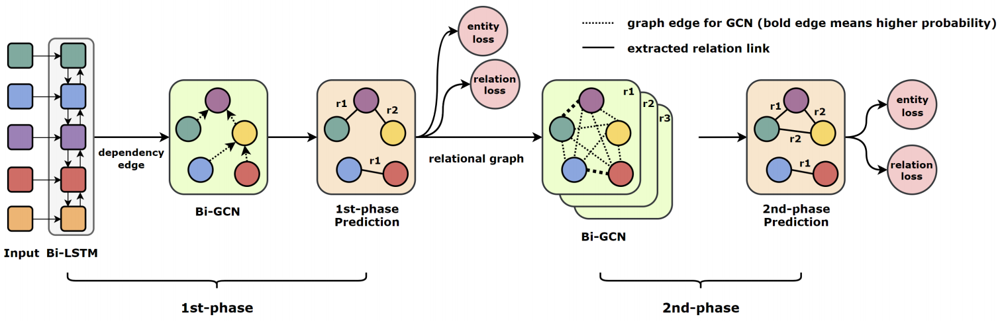

# 多重关系抽取

## CASREL

### Abstract

Instead of treating relations as discrete labels as in previous works, our new framework models relations as functions that map subjects to objects in a sentence, which naturally handles the overlapping problem. More precisely, we learn relation-specific taggers $f_r(s) \rightarrow o$​, each of which recognizes the possible object(s) of a given subject under a specific relation or returns no object.

该工作将关系抽取建模成主体到客体的映射，而不是像之前的工作使用离散的标签，这样可以解决关系重叠的问题。具体而言，对每个关系学习一个函数$f_r$作用给主体来识别主体对应关系的客体或没有客体。
$$
\prod_{j=1}^{|D|}[\prod_{(s,r,o)\in T_j}p((s,r,o)|x_j)]\\=\prod_{j=1}^{|D|}[\prod_{s\in T_j}p(s|x_j)\prod_{(r,o)\in T_j|s}p((r,o)|s,x_j)]\\=\prod_{j=1}^{|D|}[\prod_{s\in T_j}p(s|x_j)\prod_{r\in T_j|s}p_r(o|s,x_j)\prod_{r\in R-T_j|s}p_r(o_{\phi}|s,x_j)]
$$
we first run the subject tagger to find all possible subjects in the sentence, and then for each subject found, apply relation-specific object taggers to find all relevant relations and the corresponding objects.

首先抽取所有主体，然后对主体使用关系特定的对象标记器来寻找所有相关关系和对应客体。

### 主体提取器

主体提取器使用两个分类器来预测主体的起止位置：
$$
p^{start\_s}_i=\sigma(W_{start}x_i+b_{start})\\p^{end\_s}_i=\sigma(W_{end}x_i+b_{end})
$$
损失函数为：
$$
p_\theta(s|x)=\prod_{t\in\{start\_s,end\_s\}}\prod_{i=1}^L(p_i^t)^{I\{y_i^t=1\}}(1-p_i^t)^{I\{y_i^t=0\}}
$$

### 关系特定的客体提取器

关系特定的客体提取器为每个关系生成一个提取器，用于预测客体的起止位置·
$$
p_i^{start\_o}=\sigma(W_{start}^r(x_i+v_{sub}^k)+b^r_{start})\\p_i^{end\_o}=\sigma(W_{end}^r(x_i+v_{sub}^k)+b^r_{end})
$$
损失函数为：
$$
p_{\phi_r}(o|s,x)=\prod_{t\in\{start\_o,end\_o\}}\prod_{i=1}^L(p_i^t)^{I\{y_i^t=1\}}(1-p_i^t)^{I\{y_i^t=0\}}
$$
总损失为：
$$
J(\theta)=\sum_{j=1}^{|D|}[\sum_{S\in T_j}log\ p_\theta(s|x_j)+\sum_{r\in T_j|s}log\ p_{\phi_r}(o|s,x_j)+\sum_{t\in\{r\in R-T_j|s\}}log\ p_{\phi_r}(o_\phi|s,x_j)]
$$

## UNIRE

Many joint entity relation extraction models setup two separated label spaces for the two sub-tasks (i.e., entity detection and relation classification). We argue that this setting may hinder the information interaction between entities and relations. In this work, we propose to eliminate the different treatment on the two sub-tasks' label spaces. The input of our model is a table containing all word pairs from a sentence. Entities and relations are represented by squares and rectangles in the table. We apply a unified classifier to predict each cell's label, which unifies the learning of two sub-tasks. Our new input space is a two-dimensional table with each entry corresponding to a word pair in sentences.

The joint model assign labels to each cell from a unified label space (union of entity type set and relation type set).

## PURE

## GraphRel

