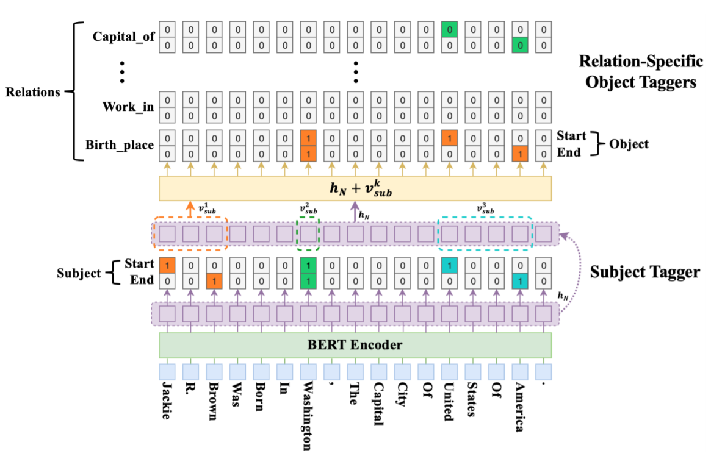

# 多重关系抽取

## CASREL

### Abstract

Instead of treating relations as discrete labels as in previous works, our new framework models relations as functions that map subjects to objects in a sentence, which naturally handles the overlapping problem. More precisely, we learn relation-specific taggers $f_r(s) \rightarrow o$​, each of which recognizes the possible object(s) of a given subject under a specific relation or returns no object.

该工作将关系抽取建模成主体到客体的映射，而不是像之前的工作使用离散的标签，这样可以解决关系重叠的问题。具体而言，对每个关系学习一个函数$f_r$作用给主体来识别主体对应关系的客体或没有客体。
$$
\prod_{j=1}^{|D|}[\prod_{(s,r,o)\in T_j}p((s,r,o)|x_j)]\\=\prod_{j=1}^{|D|}[\prod_{s\in T_j}p(s|x_j)\prod_{(r,o)\in T_j|s}p((r,o)|s,x_j)]\\=\prod_{j=1}^{|D|}[\prod_{s\in T_j}p(s|x_j)\prod_{r\in T_j|s}p_r(o|s,x_j)\prod_{r\in R-T_j|s}p_r(o_{\phi}|s,x_j)]
$$
we first run the subject tagger to find all possible subjects in the sentence, and then for each subject found, apply relation-specific object taggers to find all relevant relations and the corresponding objects.

首先抽取所有主体，然后对主体使用关系特定的对象标记器来寻找所有相关关系和对应客体。

### 主体提取器

主体提取器使用两个分类器来预测主体的起止位置：
$$
p^{start\_s}_i=\sigma(W_{start}x_i+b_{start})\\p^{end\_s}_i=\sigma(W_{end}x_i+b_{end})
$$
损失函数为：
$$
p_\theta(s|x)=\prod_{t\in\{start\_s,end\_s\}}\prod_{i=1}^L(p_i^t)^{I\{y_i^t=1\}}(1-p_i^t)^{I\{y_i^t=0\}}
$$

### 关系特定的客体提取器

关系特定的客体提取器为每个关系生成一个提取器，用于预测客体的起止位置·
$$
p_i^{start\_o}=\sigma(W_{start}^r(x_i+v_{sub}^k)+b^r_{start})\\p_i^{end\_o}=\sigma(W_{end}^r(x_i+v_{sub}^k)+b^r_{end})
$$
损失函数为：
$$
p_{\phi_r}(o|s,x)=\prod_{t\in\{start\_o,end\_o\}}\prod_{i=1}^L(p_i^t)^{I\{y_i^t=1\}}(1-p_i^t)^{I\{y_i^t=0\}}
$$
总损失为：
$$
J(\theta)=\sum_{j=1}^{|D|}[\sum_{S\in T_j}log\ p_\theta(s|x_j)+\sum_{r\in T_j|s}log\ p_{\phi_r}(o|s,x_j)+\sum_{t\in\{r\in R-T_j|s\}}log\ p_{\phi_r}(o_\phi|s,x_j)]
$$

## MrMep

### Abstract

First, we apply a binary CNN classifier for each relation, which identifies all possible relations maintained in the text, while retaining the target relation representation to aid entity pair recognition. Second, we perform a multi-head attention over the text and a triplet attention with the target relation interacting with every token of the text to precisely produce all possible entity pairs in a sequential manner. 

It first predicts all possible relations, then for each target relation, it uses a variant of the pointer network to generate boundaries (START/END positions) of all head and tail entities in a sequential manner, whereby the model generates all possible entity pairs as answers.

Extracting Multiple-Relations in One-Pass with Pre-Trained Transformers