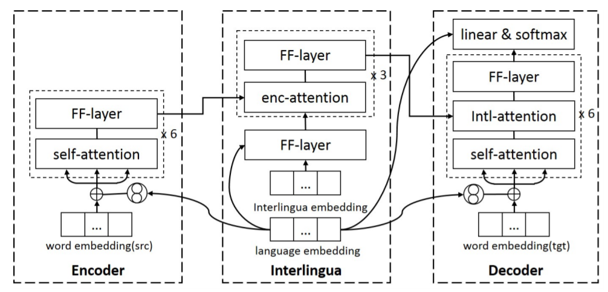

# 机器翻译

## 多语言机器翻译

多语言神经网络机器翻译(Multilingual neural machine translation, MNMT)采用独一的模型框架，可以减少一些部署或训练开销；并且统一训练一个模型会带来一些知识的共享。

编码器-中间语-解码器模型保持原来的编码器和解码器不变，在中间插了一个中间语模块，采用固定长度和固定内存。对输入先用编码器进行编码，再经过中间语模块获得更通用的一个表示，最后采用这个表示来解码输出。

### Language-aware Interlingua for Multilingual Neural Machine Translation

Encoder和Decoder采用和Transformer相同的结构，Interlingua是跨语言共享的，但使用特定的语言嵌入作为输入，因此称之为 语言感知中间语言(language-aware interlingua)。

中间语模块对于任何语言输入，都用一个共用的表示来表达。同时引入一些跟语言相关的特性给解码器去区分不同语言。通过该框架来协调语言的通用性和语言的特殊性。

损失函数为：
$$
\mathcal{L}=\mathcal{L}_{s2t}+\mathcal{L}_{t2s}+\mathcal{L}_{s2s}+\mathcal{L}_{t2t}+\mathcal{L}_{dist}
$$
一二项是翻译的条件概率，三四项希望中间语这个模块capture的信息不会丢失掉，第五项希望相同语义不同语言得到的中间语，即中间语模块给出的隐变量应该很接近。

### zero-shot translation

Iterative Domain-Repaired Back-Translation

`p91`