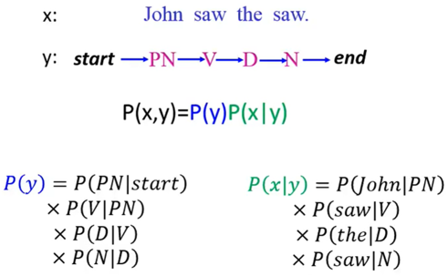
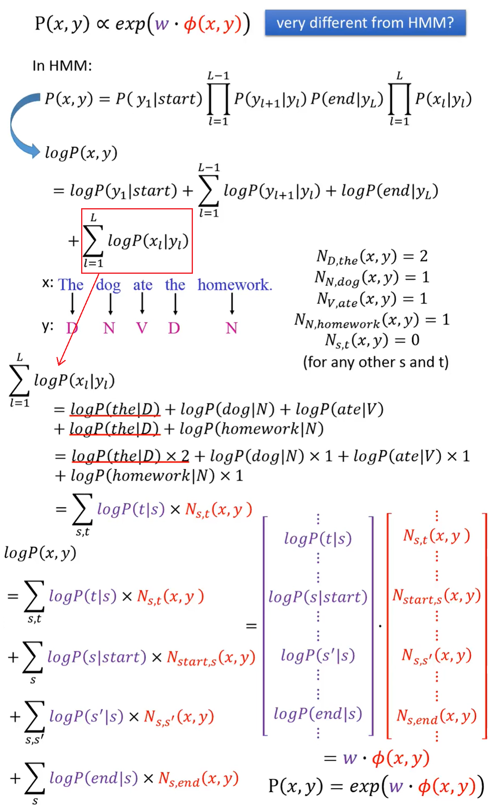
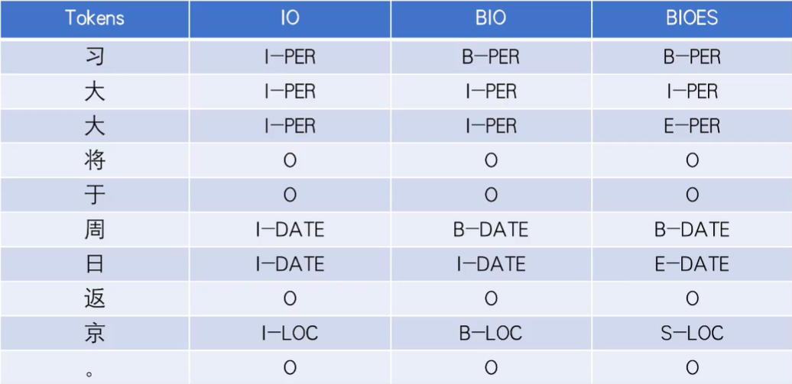
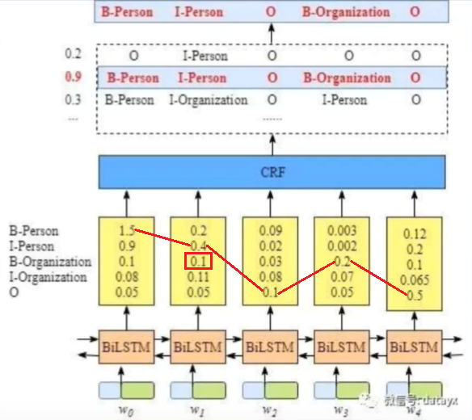
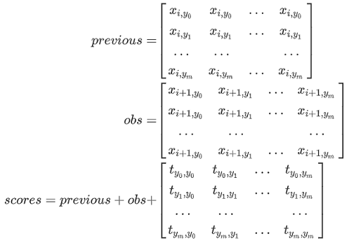

# 序列标注

## 隐马尔可夫模型进行词性标注

隐马尔可夫模型(HMM，Hidden Markov Model)



p(y)和p(x|y)可由给定的标注文本统计出结果。

### Inference

现给定一个x，寻找y，$y=arg\ max_{y\in Y}P(x,y)$。

假设y的序列长度为L，穷举y的话有$|S|^L$种可能，使用**Viterbi算法**可以获得$O(L|S|^2)$的时间复杂度。

## 条件随机场进行词性标注

条件随机场(CRF，Conditional Random Field)
$$
P(x,y)\propto exp(w·\phi(x,y))
$$
其中$\phi(x,y)$是特征函数，$w$是要学习的权重向量。
$$
p(y|x)=\frac{P(x,y)}{\sum_{y'}P(x,y')}=\frac{exp(w·\phi(x,y))}{\sum_{y'}exp(w·\phi(x,y'))}=\frac{exp(w·\phi(x,y))}{Z(x)}
$$
$\phi(x,y)$包括两个部分

1. 标记和单词之间的关系(对应HMM的p(x|y))
2. 标记之间的关系(对应HMM的p(y))

通过HMM推导CRF：




### 训练方法

对于给定的训练数据：$\{(x^1,\hat y^1),(x^2,\hat y^2),\dots(x^N,\hat y^N)\}$

寻找一个权重向量$w^*$使得目标函数$O(w)$最大
$$
w^*=arg\ max_w O(w)\\O(w)=\sum_{n=1}^NlogP(\hat y^n|x^n)=\sum_{n=1}^NO^n(w)\\logP(\hat y^n|x^n)=logP(x^n,\hat y^n)-log\sum_{y'}P(x^n,y')\\\frac{\partial O^n(w)}{\partial w_{s,t}}=N_{s,t}(x^n,\hat y^n)-\sum_{y'}P(y'|x^n)N_{s,t}(x^n,y')
$$
如果训练集中有单词t被标注为词性s，则增加$w_{s,t}$，否则减少$w_{s,t}$。

通过梯度下降法求出$w$
$$
\nabla O(w)=\phi(x^n,\hat y^n)-\sum_{y'}P(y'|x^n)\phi(x^n,y')
\\w\rightarrow w+\eta(\nabla O(w))
$$

### Inference

$y=arg\ max_{y\in Y}P(y|x)=arg\ max_{y\in Y}w·\phi(x,y)$，同样可使用Viterbi算法找出y。


序列标注的标签体系



IO不能区分连续实体

## Bi-LSTM+CRF

Bi-LSTM的输出结果可以取概率最大的作为标签序列，为什么引入CRF？

Bi-LSTM的预测结果之间可能存在不符合逻辑的结果，CRF层能够学习到句子前后的依赖，从而加入一些约束来保证最终预测结果有效。



**发射分数**，来自BiLSTM层的输出，上图黄色矩形内。用$x_{i,y_j}$代表发射分数，其中i是单词位置索引，yj是类别索引。
$$
x_{i=1,y_j=2}=x_{w_1,B-Organization}=0.1
$$
**转移分数**，来自CRF层可以学到的转移矩阵。转移矩阵是BiLSTM-CRF模型的一个参数，可以随机初始化然后在训练中更新。

路径分数=发射分数+转移分数：$score(y)=\sum_{i=0}^{n+1}P_{i,y_i}+\sum_{i=1}^{n+1}A_{y_{i-1},y_i}$

上图路径分数为：
$$
发射分数=x_{0,START}+x_{1,B-Person}+x_{2,I-Person}+x_{3,O}+x_{4,B-Organization}+x_{5,O}+x_{6,END}\\
转移分数=t_{START->B-Person}+t_{B-Person->I-Person}+t_{I-Person->O}+t_{o->B-Organization}+t_{B-Organization->O}+t_{O->END}
$$
CRF损失函数由两部分组成，真实路径分数和所有路径总分数。真实路径的分数占总路径的分数应尽可能大。

$$ P_{total}=P_1+P_2+\dots+P_N=e^{S_1}+e^{S_2}+\dots+e^{S_N}\\LogLossFunction\\=-log\frac{P_{RealPath}}{P_1+P_2+\dots+P_N}\\=-log\frac{e^{S_{RealPath}}}{e^{S_1}+e^{S_2}+\dots+e^{S_N}}\\=-(S_{RealPath}-log(e^{S_1}+e^{S_2}+\dots+e^{S_N}))$$

<font face="楷体">已知转移矩阵和发射矩阵，可以求路径得分</font>

<font face="楷体">计算真实路径的得分：每个节点记录之前所有结点到该节点路径的最大值</font>

<font face="楷体">计算所有路径的总得分：每个节点记录之前所有结点到该节点的路径总和</font>

<font face="楷体">真实路径的得分与所有路径的总得分的比值尽可能大，用该指标作为损失进行反向传播来更新转移矩阵和发射矩阵的值</font>

计算所有路径的总得分(Viterbi算法)：

```python
def log_sum_exp(vec):
    max_score = vec[0, argmax(vec)]
    max_score_broadcast = max_score.view(1, -1).expand(1, vec.size()[1])
    return max_score +  torch.log(torch.sum(torch.exp(vec - max_score_broadcast)))
```

定义两个矩阵previous和obs，其中previous表示第i步的m种状态，写成列向量进行横向扩展；obs表示第i+1步的m种状态，写成行向量进行纵向扩展。与转移矩阵相加之后获得了i到i+1状态的所有可能路径的得分，将末状态相同的得分**相加**(同一列)获得下一个状态的previous。计算最优路径是将**相加**改为**求最大值**。



```python
import torch
import torch.autograd as autograd
import torch.nn as nn
import torch.optim as optim

torch.manual_seed(1)

def argmax(vec):
    # return the argmax as a python int
    _, idx = torch.max(vec, 1)
    return idx.item()


def prepare_sequence(seq, to_ix):
    idxs = [to_ix[w] for w in seq]
    return torch.tensor(idxs, dtype=torch.long)


# Compute log sum exp in a numerically stable way for the forward algorithm
def log_sum_exp(vec):
    max_score = vec[0, argmax(vec)]
    max_score_broadcast = max_score.view(1, -1).expand(1, vec.size()[1])
    return max_score + torch.log(torch.sum(torch.exp(vec - max_score_broadcast)))

class BiLSTM_CRF(nn.Module):

    def __init__(self, vocab_size, tag_to_ix, embedding_dim, hidden_dim):
        super(BiLSTM_CRF, self).__init__()
        self.embedding_dim = embedding_dim  # word_embedding_dim
        self.hidden_dim = hidden_dim        # Bi-lstm hidden dim
        self.vocab_size = vocab_size
        self.tag_to_ix = tag_to_ix
        self.tagset_size = len(tag_to_ix)

        self.word_embeds = nn.Embedding(vocab_size, embedding_dim)
        self.lstm = nn.LSTM(embedding_dim, hidden_dim // 2, num_layers=1, bidirectional=True)

        # Maps the output of the LSTM into tag space.
        # 发射分数
        self.hidden2tag = nn.Linear(hidden_dim, self.tagset_size)

        # Matrix of transition parameters.  Entry i,j is the score of
        # transitioning *to* i *from* j.
        # 转移分数
        self.transitions = nn.Parameter(torch.randn(self.tagset_size, self.tagset_size))

        # These two statements enforce the constraint that we never transfer
        # to the start tag and we never transfer from the stop tag
        self.transitions.data[tag_to_ix[START_TAG], :] = -10000
        self.transitions.data[:, tag_to_ix[STOP_TAG]] = -10000

        self.hidden = self.init_hidden()

    def init_hidden(self):
        # 初始化LSTM参数
        return (torch.randn(2, 1, self.hidden_dim // 2), torch.randn(2, 1, self.hidden_dim // 2))

    def _get_lstm_features(self, sentence):
        # 通过LSTM提取特征
        self.hidden = self.init_hidden()
        embeds = self.word_embeds(sentence).view(len(sentence), 1, -1)
        lstm_out, self.hidden = self.lstm(embeds, self.hidden)
        lstm_out = lstm_out.view(len(sentence), self.hidden_dim)
        lstm_feats = self.hidden2tag(lstm_out)
        return lstm_feats

    def _score_sentence(self, feats, tags):
        # Gives the score of a provided tag sequence
        # 计算给定tag序列的分数，即一条路径的分数
        score = torch.zeros(1)
        tags = torch.cat([torch.tensor([self.tag_to_ix[START_TAG]], dtype=torch.long), tags])
        for i, feat in enumerate(feats):
            # 递推计算路径分数：转移分数 + 发射分数
            score = score + self.transitions[tags[i + 1], tags[i]] + feat[tags[i + 1]]
        score = score + self.transitions[self.tag_to_ix[STOP_TAG], tags[-1]]
        return score

    def _forward_alg(self, feats):
        # Do the forward algorithm to compute the partition function
        # 通过前向算法递推计算所有可能路径分数总和
        init_alphas = torch.full((1, self.tagset_size), -10000.)
        # START_TAG has all of the score.
        # 序列开始只可能是START_TAG
        init_alphas[0][self.tag_to_ix[START_TAG]] = 0.

        # Wrap in a variable so that we will get automatic backprop
        previous = init_alphas

        # Iterate through the sentence
        for obs in feats:
            alphas_t = []  # The forward tensors at this timestep

            # 遍历当前tag所能到达的所有tag
            for next_tag in range(self.tagset_size):
                # broadcast the emission score: it is the same regardless of
                # the previous tag
                emit_score = obs[next_tag].view(1, -1).expand(1, self.tagset_size)
                # the ith entry of trans_score is the score of transitioning to next_tag from i
                trans_score = self.transitions[next_tag].view(1, -1)
                # The ith entry of next_tag_var is the value for the
                # edge (i -> next_tag) before we do log-sum-exp
                next_tag_var = previous + trans_score + emit_score
                # The forward variable for this tag is log-sum-exp of all the scores.
                alphas_t.append(log_sum_exp(next_tag_var).view(1))
            previous = torch.cat(alphas_t).view(1, -1)
        terminal_var = previous + self.transitions[self.tag_to_ix[STOP_TAG]]
        alpha = log_sum_exp(terminal_var)
        return alpha

    def _viterbi_decode(self, feats):
        backpointers = []

        # Initialize the viterbi variables in log space
        init_vvars = torch.full((1, self.tagset_size), -10000.)
        init_vvars[0][self.tag_to_ix[START_TAG]] = 0

        # forward_var at step i holds the viterbi variables for step i-1
        forward_var = init_vvars
        for feat in feats:
            bptrs_t = []  # holds the backpointers for this step
            viterbivars_t = []  # holds the viterbi variables for this step

            for next_tag in range(self.tagset_size):
                # next_tag_var[i] holds the viterbi variable for tag i at the
                # previous step, plus the score of transitioning
                # from tag i to next_tag.
                # We don't include the emission scores here because the max
                # does not depend on them (we add them in below)
                next_tag_var = forward_var + self.transitions[next_tag]
                best_tag_id = argmax(next_tag_var)
                bptrs_t.append(best_tag_id)
                viterbivars_t.append(next_tag_var[0][best_tag_id].view(1))
            # Now add in the emission scores, and assign forward_var to the set
            # of viterbi variables we just computed
            forward_var = (torch.cat(viterbivars_t) + feat).view(1, -1)
            backpointers.append(bptrs_t)

        # Transition to STOP_TAG
        terminal_var = forward_var + self.transitions[self.tag_to_ix[STOP_TAG]]
        best_tag_id = argmax(terminal_var)
        best_path_score = terminal_var[0][best_tag_id]

        # Follow the back pointers to decode the best path.
        best_path = [best_tag_id]
        for bptrs_t in reversed(backpointers):
            best_tag_id = bptrs_t[best_tag_id]
            best_path.append(best_tag_id)
        # Pop off the start tag (we dont want to return that to the caller)
        start = best_path.pop()
        assert start == self.tag_to_ix[START_TAG]  # Sanity check
        best_path.reverse()
        return best_path_score, best_path 

    def neg_log_likelihood(self, sentence, tags):
        # CRF损失函数由两部分组成，真实路径的分数和所有路径的总分数
        # 真实路径的分数应该是所有路径中分数最高的
        feats = self._get_lstm_features(sentence)
        forward_score = self._forward_alg(feats)
        gold_score = self._score_sentence(feats, tags)
        return forward_score - gold_score

    def forward(self, sentence):  # dont confuse this with _forward_alg above.
        # Get the emission scores from the BiLSTM
        lstm_feats = self._get_lstm_features(sentence)

        # Find the best path, given the features.
        score, tag_seq = self._viterbi_decode(lstm_feats)
        return score, tag_seq


if __name__ == '__main__':
    START_TAG = "<START>"
    STOP_TAG = "<STOP>"
    EMBEDDING_DIM = 5
    HIDDEN_DIM = 4

    # Make up some training data
    training_data = [(
        "the wall street journal reported today that apple corporation made money".split(),
        "B I I I O O O B I O O".split()
    ), (
        "georgia tech is a university in georgia".split(),
        "B I O O O O B".split()
    )]

    word_to_ix = {}
    for sentence, tags in training_data:
        for word in sentence:
            if word not in word_to_ix:
                word_to_ix[word] = len(word_to_ix)

    tag_to_ix = {"B": 0, "I": 1, "O": 2, START_TAG: 3, STOP_TAG: 4}

    model = BiLSTM_CRF(len(word_to_ix), tag_to_ix, EMBEDDING_DIM, HIDDEN_DIM)
    optimizer = optim.SGD(model.parameters(), lr=0.01, weight_decay=1e-4)

    # Check predictions before training
    with torch.no_grad():
        precheck_sent = prepare_sequence(training_data[0][0], word_to_ix)
        precheck_tags = torch.tensor([tag_to_ix[t] for t in training_data[0][1]], dtype=torch.long)
        print(model(precheck_sent))

    # Make sure prepare_sequence from earlier in the LSTM section is loaded
    for epoch in range( 300):  # again, normally you would NOT do 300 epochs, it is toy data
        for sentence, tags in training_data:
            # Step 1. Remember that Pytorch accumulates gradients.
            # We need to clear them out before each instance
            model.zero_grad()

            # Step 2. Get our inputs ready for the network, that is,
            # turn them into Tensors of word indices.
            sentence_in = prepare_sequence(sentence, word_to_ix)
            targets = torch.tensor([tag_to_ix[t] for t in tags], dtype=torch.long)

            # Step 3. Run our forward pass.
            loss = model.neg_log_likelihood(sentence_in, targets)

            # Step 4. Compute the loss, gradients, and update the parameters by
            # calling optimizer.step()
            loss.backward()
            optimizer.step()

    # Check predictions after training
    with torch.no_grad():
        precheck_sent = prepare_sequence(training_data[0][0], word_to_ix)
        print(model(precheck_sent))
    # We got it!
```

```
https://www.bilibili.com/video/BV1K54y117yD
```

```pdf
/nlp/Bilstm-crf.pdf
```

