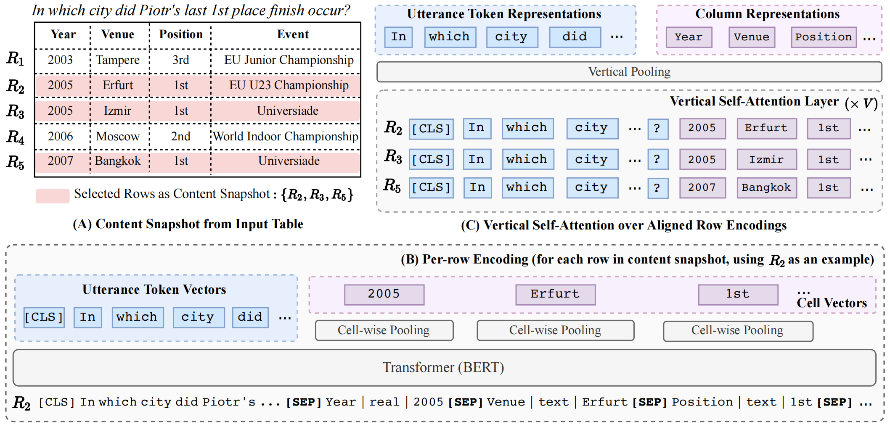
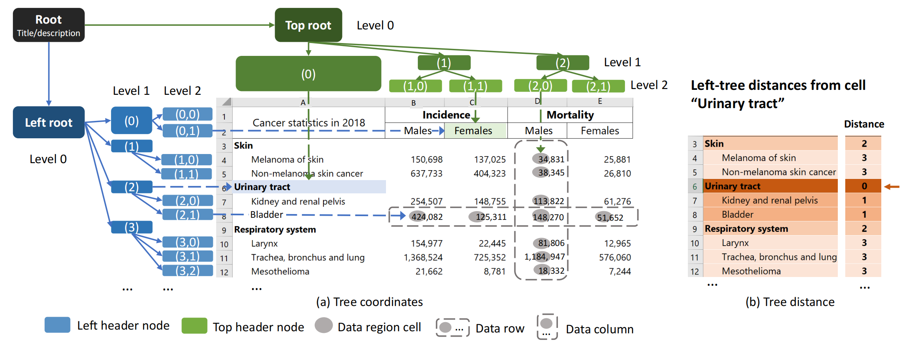
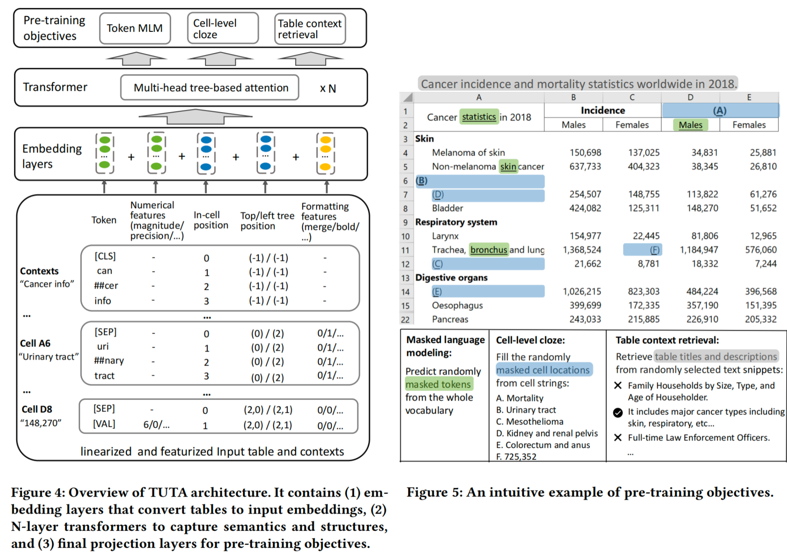
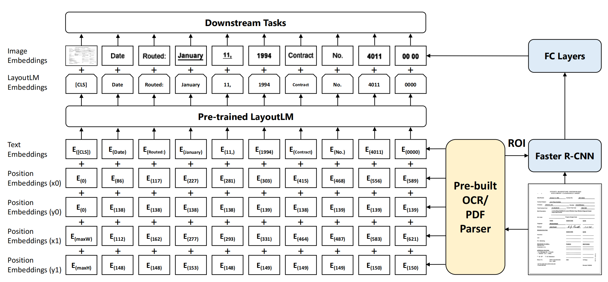
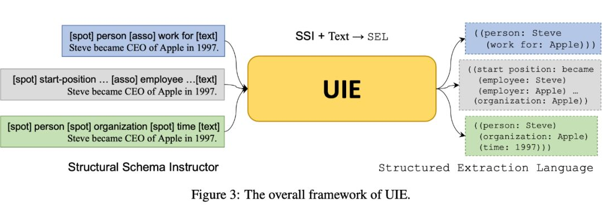
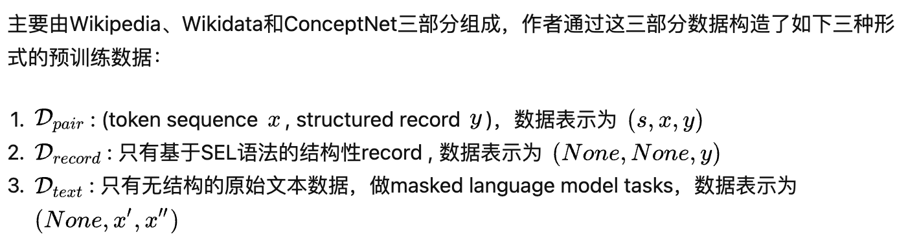
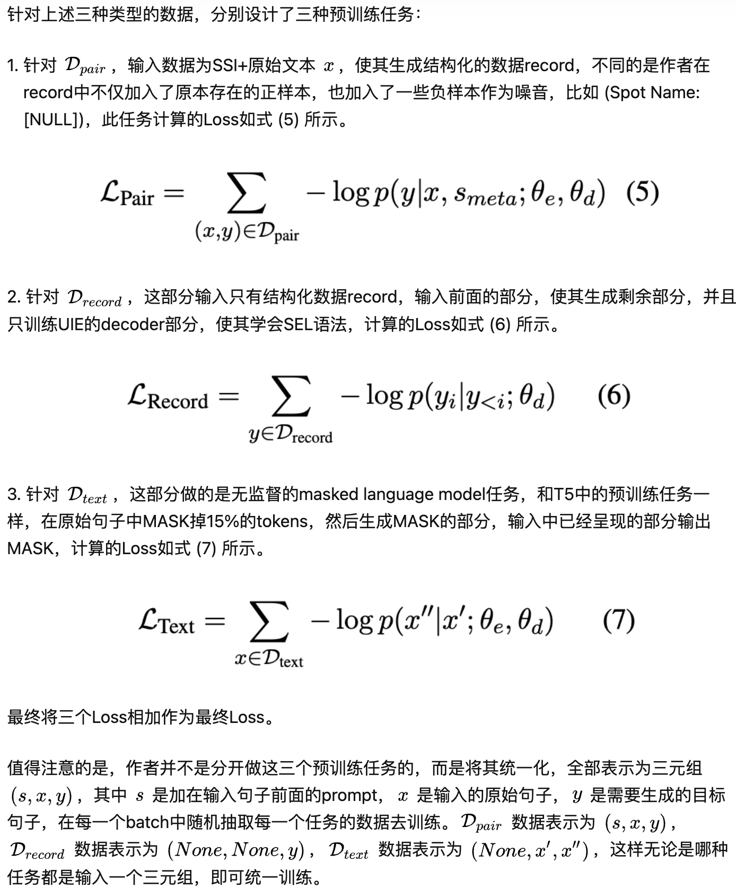

## Pre-Train Model

### TaBERT

TaBERT将表的结构线性化了，使其可以作为BERT的输入。为了处理大的表格TaBERT提出了content snapshots，这是一种对与输入语句最相关的表的子集进行编码的方法。最后使用vertival attention机制，以在不同行的`单元格表示cell representation`之间共享信息。

**Content Snapshots**的生成是基于输入语句和行内容的相关性，即选择与输入语句具有最高n-gram重复率的前k行。(A)

**Row Linearization**, (B)中描绘了R2的线性化，包括输入语句，`列和单元格值的拼接`。每个`列和单元格值的拼接`由列的名称和数据类型及其实际值表示，并用竖线分隔。输入语句和`列和单元格值的拼接`及`列和单元格值的拼接`之间由[SEP]分隔。

**Vertical Self-Attention Mechanism**为了生成vertical attention的输入，首先为每个单元格<i, j>计算一个长度固定的初始向量，这个向量是通过`列和单元格值的拼接`的Transformer输出再做mean-pooling生成的。然后将输入语句的向量表示与单元格向量拼接起来作为vertical attention的输入。这种垂直的自我关注机制使模型能够聚合Content Snapshots不同行的信息，从而允许TaBERT捕获对单元格值的跨行依赖关系。

**Masked Column Prediction (MCP)** 鼓励模型从上下文中恢复屏蔽列的名称和数据类型等信息。

**Cell Value Recovery (CVR)**确保在额外的垂直自我关注层之后，内容快照中代表性单元格值的信息得以保留。

### TUTA(Table Understanding with Tree-based Attention)

**bi-dimensional coordinate tree** 描述表的空间和层次信息

1. Tree=based position

   有两棵树：top tree和left tree。在top/left tree中的点的位置可以通过它到top/left tree root的路径来获得。

   `<A6>`的左坐标是(2)，`<A8>`是`<A6>`的子节点，其左坐标是(2,1)

2. Tree-based distance

   两个cell之间的距离由top/left tree之和确定

   `<A6>`和`<C2>`之间的距离为：左$(2)\rightarrow(left\ root)\rightarrow(0)\rightarrow(0,1)$+上$(0)\rightarrow(top\ root)\rightarrow(1)\rightarrow(1,1)$

3. Tree extraction

   检测表格中的表头区域[Semantic
   structure extraction for spreadsheet tables with a multi-task learning architecture]，从表头提取层次结构

#### 在通用表格语料库上构建一个专用词汇表，以便更好地编码现实世界表格中的常见标记

#### 引入基于树的位置嵌入，以合并单元位置和标题层次结构

#### 提出一种结构感知注意机制，以促进结构相邻上下文间的语义流动

#### 3个预训练任务学习token，cell和table级的表示：

**Masked language modeling (MLM)** 

**Cell-level Cloze (CLC)** 

**Table context retrieval (TCR)** 

**tree-based attention and position embedding** 更好地捕捉空间和层次信息

### LayoutLM

LayoytLM模型集合了文档布局信息(Document Layout Information)和视觉信息(Visual Information)，即2-D Position Embedding和Image Embedding

预训练任务：

Masked Visual-Language Model

Multi-label Document Classification

### UIE

统一建模信息抽取任务

**统一信息抽取任务输出结构的结构化抽取语言SEL**

(1) Spot Name: 指目标信息片段的类别，在实体抽取中指实体类别，在事件抽取中可以指事件类型和论元类别。(2) Info Span: Spotting操作的输出，即原句子中的目标信息片段。 (3) Asso Name: 指两个信息片段之间的关系类型，也就是Associating操作的输出。每个信息抽取任务都可以统一的用SEL语法描述

**指导模型做特定任务的结构化模式指导器SSI**

第一个蓝色部分是关系抽取，它的SSI格式是: [spot] 实体类别 [asso] 关系类别 [text]，这种形式可以告诉模型哪些做spotting操作，哪些做associating操作。第二个灰色部分是事件抽取，SSI格式是: [spot] 事件类别 [asso] 论元类别 [text]。第三个绿色部分是实体识别，SSI格式是: [spot] 实体类别 [text]。

预训练数据

### UNIFIEDSKG

构建了个统一的skg框架

新测试集：2022年5月的数据

旧数据训练的模型：p/r/f 0.60/0.54/0.57

新数据训练的模型(两倍正例+两倍额外100条数据)：p/r/f 0.71/0.63/0.67

model2-17400 0.71/0.63/0.67

TUTA：基于树的位置嵌入和注意力机制，并通过三个预训练任务学习token、cell和table级别的表示（主要针对结构化和半结构化的表格）

LayoutLM：将文档布局信息和视觉信息融入词嵌入中，两个预训练任务Masked Visual-Language Model和Multi-label Document Classification（主要针对图片中的表格）

UIE：通过统一信息抽取任务输出结构的结构化抽取语言SEL和指导模型做特定任务的结构化模式指导器SSI 来统一建模信息抽取任务，并针对pair，record和test设计了三种预训练任务（主要针对非结构化的文本）

UNIFIEDSKG：构建了个统一的skg框架，针对21个字任务的统一建模（主要针对结构化的表格）

