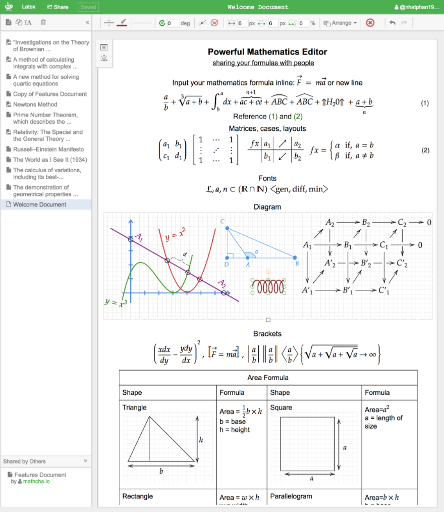
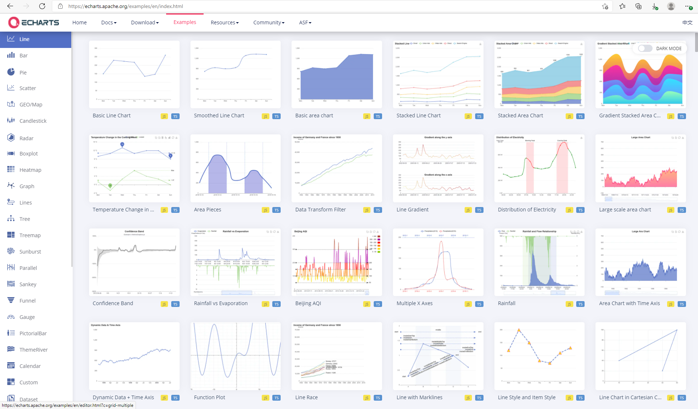

# 常用工具

## Latex相关
手写公式转Latex代码: [Matcha](https://www.mathcha.io/)

手写公式转Latex代码: [detexify](http://detexify.kirelabs.org/classify.html)

LaTex数学公式编辑的语法参考: [grammar reference](https://math.meta.stackexchange.com/questions/5020/mathjax-basic-tutorial-and-quick-reference)

表格转Latex代码: [TablesGenerator](https://www.tablesgenerator.com/)

图表模板: [echarts](https://echarts.apache.org/examples/en/index.html)

